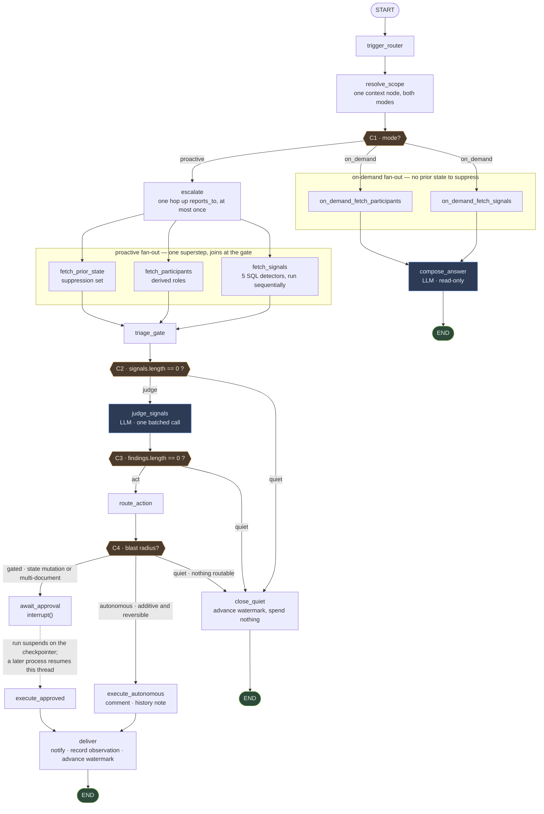

# FLEETGRAPH — A Project Intelligence Agent for Ship

Ship shows you what is happening. FleetGraph tells you what is going wrong, to the one person
who can fix it, and asks before it changes anything.

This document is the submission deliverable. Every architectural decision in it was made in
`PRESEARCH.md` and is reproduced here rather than revisited — where the two documents describe
the same thing, `PRESEARCH.md` holds the full argument and this one holds the answer.

## Status of what is described here

Several parts of the system are being built concurrently and this document runs ahead of some of
them. The rule applied throughout: **a section describing settled design that is not yet code
says so, in place, with the ticket that will close the gap.** No section asserts working
behaviour that has not been verified against the tree.

| Layer | State | Evidence |
|---|---|---|
| Migration `038` — index, `api_tokens.scopes`, observations, notifications, watermarks | **Built** | `api/src/db/migrations/038_fleetgraph.sql` |
| Data-access boundary — watermark, suppression, observations, notifications | **Built** | `agent/src/data/boundary.ts` |
| Five detectors + fingerprinting | **Built, unit-tested** | `agent/src/detectors/` |
| Graph state object | **Built** — 13 annotated fields | `agent/src/graph/state.ts` |
| Graph nodes | **Thirteen node modules**; `close_quiet` shares `deliver.ts` | `agent/src/graph/nodes/` |
| Graph assembly — 16 registered nodes, four conditional edges, `START`/`END` | **Built** | `agent/src/graph/index.ts` — `buildGraph(deps)`, `compileGraph(deps, checkpointer)` |
| Graph behaviour under test | **Six tests against real Postgres via testcontainers** | `agent/src/graph/index.test.ts` |
| Postgres checkpointer | **Built** — `PostgresSaver.fromConnString` + `setup()`, cached per process | `agent/src/graph/checkpointer.ts` |
| Judgment (LLM) client and judge | **Built.** One batched `model.invoke` per run, reusing `api/`'s `CircuitBreaker` rather than copying it | `agent/src/llm/client.ts`, `judge.ts`, `answer.ts` |
| Ship action client | **Built.** Its **own** breaker instance, 5 s request timeout, 3 attempts, 200 ms → 2 s backoff | `agent/src/actions/client.ts`, `act.ts` |
| Human-in-the-loop resume — accept / dismiss / snooze | **Built and tested across a real `process.exit(0)`** | `agent/src/actions/restart.test.ts`, `suppression.test.ts` |
| Cron entrypoint | **Built.** Per-workspace advisory lock, 4-minute deadline → `exit(2)`, one JSON log line per scan | `agent/src/entrypoints/cron.ts` |
| `GET /ready` | **Built and wired** | `api/src/routes/ready.ts`, `app.ts:217` |
| FleetGraph HTTP endpoints — six, plus schemas and tests | **Built and mounted** at `/api/fleetgraph` | `api/src/routes/fleetgraph/`, `app.ts:289` |
| The API → graph seam | **Built.** The approval routes load the checkpointer and issue `Command({ resume })`; `resumed` is the real outcome, not a constant | `api/src/routes/fleetgraph/agentBridge.ts`, `index.ts:403` |
| UI surfaces — banner, chat, rail indicator | **Built and mounted** in `UnifiedEditor` and `App` | `web/src/components/fleetgraph/`, `web/src/hooks/useFleetGraphNotifications.ts` |
| `render_cron_job` in Terraform | **Applied and running**, `*/3 * * * *`, same image and tag as the web service | `terraform/render/cron.tf`, `terraform/render/PLAN-ANNOTATED.md` |
| Dockerfile builds `agent/` | **Yes**, and fails the build if `agent/dist/entrypoints/cron.js` is absent | `Dockerfile:44`, `:58`, `:110` |
| LangSmith tracing | **Enabled in production.** Project `fleetgraph-prod`, 50+ runs; `logTracingStatus()` still warns on the quiet misconfigurations | `agent/src/observability/tracing.ts`, `terraform/render/cron.tf` |
| LangSmith trace links | **Eight captured and public** — one per use case from `capture-test-case-traces.ts`, plus two from the deployed agent | Test Cases table, and "Traces from the deployed agent" |
| CI deploy / automatic rollback | **Armed, and the deploy half has fired.** State moved to a GitLab-hosted `backend "http"`, `vars.RENDER_DEPLOY_ENABLED=true`, and `deploy.yml` promoted `3d5c6c3` unattended — `/health` and the `deploy/green` tag both name it. `rollback-on-failed-ci` is armed on the same path but has not been triggered, because no CI run has failed on a deployed commit | `.github/workflows/deploy.yml`, `terraform/render/versions.tf`, `FG-236` |

Verified against `83aa33c`: `agent/` runs **162 tests in 19 files, all passing** (`npx vitest run`
in `agent/`, 28 s, exit 0). The run also prints ten unhandled `57P01` errors attributed to
`entrypoints/cron.test.ts` — testcontainer shutdown racing pooled clients at teardown, after the
assertions have passed. Noisy, not failing, and named here so nobody reads the output and
concludes otherwise.

Several agents are landing code on this branch concurrently, so the table above is a
point-in-time reading, not a standing claim. Two test files landed between the start of this
sweep and its end.

Section **Unverified Claims** at the end lists every statement in this document that could not
be checked against code, so a reader does not have to reconstruct the list.

---

# Agent Responsibility

## What it monitors proactively

Five signal families, all derived from columns that already exist in Ship's `documents` table.
Detection runs as **SQL against Postgres directly**, not through Ship's HTTP API.

| Signal | Derived from | Threshold in code |
|---|---|---|
| Stalled work | `state = 'in_progress'`, `updated_at` unmoved | 5 business days |
| Review bottleneck | `state = 'in_review'`, `updated_at` unmoved | 2 business days |
| Sprint-miss risk | sprint window computed from `sprint_number` + `workspaces.sprint_start_date`, issues still `todo`/`backlog` | 2 business days out |
| Load imbalance | active issues per assignee vs. the sprint median | ≥ 2× median, team ≥ 3 |
| Rework churn | `reopened_at` set, or `done → in_progress` in `document_history` | ≥ 2 in 30 days, per project |

Thresholds are constants in `agent/src/detectors/types.ts` (`THRESHOLDS`), not literals, so the
tests, the judgment prompt, and this table cite the same number.

**Why SQL and not the REST API.** Production rate-limits at 100 requests per minute per IP
(`api/src/app.ts`), and every request pays a roughly four-query authentication preamble. A
scanner polling from one Render service is one IP; at any useful project count it would exhaust
a budget shared with real users behind the same egress. Detection is also a natural set query —
"every issue whose state and timestamps satisfy a predicate" — and expressing that as REST
pagination is strictly worse than expressing it as SQL.

| Alternative | Why it lost |
|---|---|
| Poll the REST API | The rate limiter binds long before the process does; measured, not assumed |
| Consume Ship webhooks | No webhook infrastructure exists; it would still need a reconciling scan |
| Postgres `LISTEN`/`NOTIFY` | Requires triggers, which puts agent concerns in the write path of every mutation |

**Why silence is measured on `updated_at` and not on `document_history` absence.** The obvious
reading of "nothing has happened to this issue" is "no history rows since." That is wrong in
this schema: `document_history` covers six `TRACKED_FIELDS` written from three route files, the
bulk-update path bypasses it entirely, and collaboration content writes are throttled. An issue
can change without producing a history row, and a detector keyed on history absence would report
live work as stalled. `updated_at` is written on every path.

`document_history` is used by exactly one detector — rework churn — where the signal is the
**presence** of `state` transitions rather than their absence. An undercount there makes that
detector quieter, never wrong.

**Cost owned.** `documents.updated_at` had no index. Migration `038` adds
`(workspace_id, updated_at DESC)` filtered on `archived_at IS NULL AND deleted_at IS NULL`,
which is what keeps the detectors' range predicates off a sequential scan.

## What constitutes a condition worth surfacing

Two gates, in order. A signal must cross a **deterministic threshold** in SQL, then survive an
**LLM judgment** pass asking whether this particular instance is worth a human's attention right
now. Only signals passing both are delivered.

These are different questions. "Has this issue sat in `in_progress` for five business days" is a
fact and should never cost a token. "Is that worth interrupting the PM, given the sprint ends
tomorrow and the assignee posted a standup explaining it" is a judgment, and it is exactly what
a rule engine gets wrong. Ship already has a rule engine that answers the first kind of question
well — `api/src/routes/accountability.ts`, nine detection types — and its output is a flat list
with no sense of what matters.

| Alternative | Why it lost |
|---|---|
| Thresholds only | That is `accountability.ts`; everything crossing a line is equally loud |
| LLM only | Pays tokens whether or not anything happened, and asks the model to do timestamp arithmetic |
| Static severity weights | A lookup table pretending to be judgment; cannot use context like "there is a standup explaining this" |

The cheap gate is also why the traces differ run to run. A quiet project and a drifting project
take visibly different paths through the same graph, which is the observability requirement
satisfied by the architecture rather than by contrivance.

## What it can do without human approval

Autonomous actions are limited to those that are **additive and reversible**:

- Post a comment on a document
- Log an observation to `document_history` with `automated_by = 'fleetgraph'`
- Create a FleetGraph notification
- Answer a question in on-demand chat

Everything that changes project state — issue state, assignee, priority, sprint membership,
creating or archiving documents — is **proposed, never executed**.

**Why this line and not another.** `api_tokens` has no scope column today, so a token inherits
the full permissions of the user who created it and there is no technical ceiling on what an
agent token can do. Since the platform cannot enforce a boundary, the boundary is enforced in
the graph and made visible. Additive-and-reversible is the line a user can always undo without
needing to know what the agent did.

Ship's schema already anticipates this: `document_history.automated_by` exists to mark automated
changes and `logDocumentChange` takes it as a parameter.

**Defence in depth.** Migration `038` adds `api_tokens.scopes TEXT[]`, nullable, where `NULL`
means unscoped and preserves every existing token's behaviour. FleetGraph's detection credential
is issued read-only, so the autonomy boundary is enforced by the credential as well as by the
graph.

| Alternative | Why it lost |
|---|---|
| Full autonomy on a whitelist of "safe" mutations | A wrong reassignment is invisible until someone notices, and no scope constrains it |
| Approve everything, including comments | The agent stops being proactive and becomes a queue of chores |
| Confidence thresholds gating autonomy | A self-reported score is not a safety mechanism |

## What must always require confirmation

Three classes:

1. **Any state mutation** — state, assignee, priority, sprint membership, create, archive.
2. **Any notification to someone outside the document's participants.**
3. **Any action touching more than one document at once.**

The third is the one that is easy to miss. Bulk is where an agent does the most damage fastest,
and Ship's own bulk endpoint (`POST /api/issues/bulk`, up to 100 ids) bypasses
`document_history` entirely — an agent-driven bulk update would leave no audit trail. FleetGraph
never calls that endpoint (`FG-125`), and a regression test asserts it (`FG-233`).

Confirmation tracks **blast radius, not action type**. A single comment and a fifty-issue
reassignment are not the same risk even though both are writes. Blast radius is observable from
the request itself, before the action runs, without asking the model to assess its own impact.

## How it knows who is on a project, and their role

Membership resolves from `document_associations` joined to `person` documents, with
`properties->>'user_id'` linking to `users`. Role is **derived from structure**, because Ship has
no column for it — `workspace_memberships.role` is `CHECK (role IN ('admin','member'))`.

| Derived role | Derivation |
|---|---|
| Engineer | Appears as `properties->>'assignee_id'` on issues in the sprint |
| PM | Owns the project or sprint document (`properties->>'owner_id'`) |
| Director | Has direct reports in the `reports-to` org chart, above the project owner |

Deriving is honest; adding a role column would model a fiction that immediately drifts from the
associations that actually drive the app. The graph's `Participant` type carries these as
`roles: Array<'assignee' | 'sprint_owner' | 'project_owner' | 'reports_to'>`
(`agent/src/graph/state.ts`), which is the same structural derivation expressed in the state
object.

| Alternative | Why it lost |
|---|---|
| Add a role column | A schema change to the user model to serve one feature, and it drifts from the associations |
| Ask the LLM to infer role | Non-deterministic routing for notifications is a bad trade |
| Configuration file | Stale the moment someone joins a project |

## Who it notifies, and when

Routed by **accountability for the signal**, not proximity to it, and therefore per signal type.
One named recipient per finding. This is implemented today: every detector sets
`accountableUserId` on the `Signal` it emits.

| Signal | Recipient | Resolved from | Verified in |
|---|---|---|---|
| Stalled work | Assignee | `properties->>'assignee_id'` | `stalledWork.ts` |
| Review bottleneck | Assignee — see caveat | `properties->>'assignee_id'` | `reviewBottleneck.ts` |
| Sprint-miss risk | Sprint owner | `properties->>'owner_id'` on the sprint | `sprintMissRisk.ts` |
| Load imbalance | Sprint owner — **never the overloaded person** | `properties->>'owner_id'` on the sprint | `loadImbalance.ts` |
| Rework churn | Project owner | `properties->>'owner_id'` on the project | `reworkChurn.ts` |

**Why per-signal rather than one ladder.** A single chain of assignee → sprint owner → project
owner breaks on two of the five. Load imbalance is a finding *about* the overloaded person, and
notifying them is useless because they cannot fix their own allocation. Sprint-miss risk has no
single assignee at all; it is a property of the sprint. Routing has to follow who can act.

Fallback when `owner_id` is null: the document's `created_by`, then a workspace admin. Never
nobody — a finding with no recipient is a finding that silently disappears.

**Escalation.** A finding not acknowledged after **2 business days** escalates one level up the
org chart via `properties->>'reports_to'` on the person document. It escalates **at most once**.
A Director never receives an individual stalled issue; they receive only aggregate signals such
as rework churn. The unit is business days, not runs — at a 3-minute cron, "two runs" would be
six minutes, which would escalate a finding defined by five days of silence almost immediately.

**Built**, in `agent/src/graph/nodes/escalate.ts`. This paragraph described a design for most of
the build and said so in a `TODO`; it now describes behaviour. Four things about it are worth
having in the document rather than only in the code:

- **It is a node, not a step inside `deliver`.** It sits on the proactive branch between
  `resolve_scope` and the three fetches. It cannot live in `deliver` for two independent
  reasons: a finding old enough to escalate is already in the suppression set, so `triage_gate`
  removes it before anything downstream sees it; and `deliver` does not run on a quiet run,
  which is exactly when an unanswered finding most needs escalating.
- **The one hop is enforced by a compare-and-set, not by a read-then-write.**
  `UPDATE … WHERE escalation_count = 0 RETURNING id`, with the notification insert selecting
  from that same CTE. A transaction was not available — `Queryable` is satisfied by a `Pool`,
  so `BEGIN`/`COMMIT` can land on different connections. Split into two statements it comes
  apart in both directions: a crash after the increment loses the escalation for good, a crash
  after the insert double-hops.
- **The clock starts when the person was told**, at the first pending notification's
  `created_at` — two days since we asked them, not two days since we noticed.
- **A null `reports_to` does nothing and stays at zero.** Nobody above them means no hop
  exists. Recording it as escalated would assert something that never happened, and would also
  stop it escalating later if an admin fills the field in.

The claim this paragraph used to make that escalation *stops at the project owner* has been
removed, because no such guard exists. Nothing marks a person as the project owner in a way a
single hop can check. What actually bounds it is "at most once", and the
Director-never-gets-an-individual-issue outcome falls out of that rather than out of a check.

**The caveat, volunteered rather than hidden.** Review bottleneck has no strictly correct
recipient. **Ship has no reviewer field** — an issue in `in_review` records who it is assigned
to, not who is meant to review it. The agent therefore tells the assignee their work is stuck,
which is true and useful but not directly actionable by them. Inferring a reviewer from comment
history is fabrication; adding a reviewer column is a schema change serving one detector. The
weaker version ships and the limit is named, in `PRESEARCH.md` Q6 and in the header of
`reviewBottleneck.ts`.

## How on-demand mode uses context from the current view

The chat component sends **route parameters, not rendered content**: document id, document type,
and active tab. A context node in the graph resolves that id into a scoped state object — the
document, its associations, its recent history, its participants — before any reasoning runs.

Ship's router makes this clean: `documents/:id/*`, `sprints/:id/plan`, `projects/:id`,
`programs/:programId/sprints/:id`. The id in the URL *is* the context.

Sending rendered content would make the agent's view of a document depend on what the UI
happened to render, including truncation and lazy-loaded tabs. Sending the id means the graph
resolves the same authoritative state whether it was invoked from chat or from the cron — which
is what makes "both modes run through the same graph" true rather than aspirational.

| Alternative | Why it lost |
|---|---|
| Send visible DOM / editor content | Brittle, and leaks presentation into reasoning |
| Send the whole workspace and let the model find the relevant part | Burns tokens, invites answers about the wrong document |
| Require the user to state context | The brief's core complaint is that users context-switch too much |

The chat surface is embedded in the document view. There is no standalone chatbot page — a
brief constraint, and one Ship already has precedent for: `PlanQualityBanner` and
`QualityAssistant` both scope AI to the document in view rather than to a chat session.

---

# Graph Diagram

Both modes, all seventeen registered nodes, every edge. The four conditional edges are the
hexagons (`C1`–`C4`); the dashed edge is the suspend-and-resume boundary, where the process
exits and a later one resumes the same thread.

Node labels are the exact strings exported from `NODES` in `agent/src/graph/index.ts`, so this
diagram and a LangSmith trace read the same.



Four structural details in the assembled graph that a reader should not have to infer:

- **`close_quiet` is a real node, not an early `END`.** All three quiet branches converge on it,
  because terminating quietly still has work to do: the watermark has to advance, or the next
  run re-covers a window it already cleared.
- **The on-demand path has its own fetch nodes.** `on_demand_fetch_signals` and
  `on_demand_fetch_participants` run the same functions as their proactive counterparts under
  different node names, so a trace names the path it took rather than making you deduce it.
  There is no on-demand prior-state fetch — there is nothing to suppress in a conversation.
- **C4 has three branches, not two.** `autonomous`, `gated`, and `quiet` — the third for a
  finding that survived judgment but resolved to no routable action.
- **Chat cannot act, structurally.** There is no edge from `compose_answer` to any execute node.
  That is a missing edge, not a prompt instruction, and
  `agent/src/graph/index.test.ts` asserts it.

---

# Graph Outline

The diagram in prose, which is what MVP requirement 4 asks for: node types, edges, branching
conditions.

## Node types

Sixteen registered nodes, from thirteen node modules — `fetch_signals` and `fetch_participants`
are each registered twice, once per mode, under distinct trace names.

| Layer | Node | Responsibility | Deterministic? |
|---|---|---|---|
| Entry | `trigger_router` | Record the invocation mode into state | Yes |
| Context | `resolve_scope` | Turn a scope reference — a workspace, or a document id from the URL — into a concrete target set; capture `scannedThrough` before any query runs | Yes |
| Fetch | `fetch_signals` | Run the five SQL detectors, return `Signal[]` | Yes |
| Fetch | `fetch_participants` | Resolve people in scope and derive their roles structurally | Yes |
| Fetch | `fetch_prior_state` | Load already-surfaced, unresolved observations for suppression | Yes |
| Fetch | `on_demand_fetch_signals` | Same function as `fetch_signals`, distinct trace name | Yes |
| Fetch | `on_demand_fetch_participants` | Same function as `fetch_participants`, distinct trace name | Yes |
| Gate | `triage_gate` | Decide whether anything crossed a threshold | Yes |
| Reasoning | `judge_signals` | Which signals matter, severity, recipient, phrasing — one batched call | **LLM** |
| Reasoning | `compose_answer` | On-demand only: grounded answer from scoped state, read-only | **LLM** |
| Action | `route_action` | Classify each finding's action by blast radius | Yes |
| Action | `execute_autonomous` | Comment / history note via Ship's HTTP API | Yes |
| Action | `await_approval` | `interrupt()`; the run suspends on the Postgres checkpointer | Yes |
| Action | `execute_approved` | Run the proposal after a human accepts | Yes |
| Output | `deliver` | Write the notification, record the observation, advance the watermark | Yes |
| Output | `close_quiet` | Terminate having surfaced nothing, and still advance the watermark | Yes |

Two LLM nodes out of seventeen. That ratio is the design: the model judges pre-measured facts and
phrases them, and does nothing else.

**Why `close_quiet` exists rather than an edge straight to `END`.** A quiet run has not done
nothing — it has established that a window is clear, and the watermark has to record that or the
next run re-covers ground it already cleared. Making it a node also means the quiet path is
*named* in a trace, which is what lets a reader tell a healthy workspace from a graph that
failed to start.

## Edges

**Parallel fan-out.** `fetch_signals`, `fetch_participants`, and `fetch_prior_state` run
concurrently and join at `triage_gate`. They are independent reads with no ordering dependency —
signals from the documents tables, participants from associations and the org chart, prior state
from FleetGraph's own tables — so their combined latency is the slowest of the three rather than
the sum.

Mechanically this is one conditional edge returning **three node names at once**, which LangGraph
runs in a single superstep and joins by the three plain edges into `triage_gate`. The fan-out is
therefore the same construct as the mode branch, not a separate mechanism: C1 returns a list on
the proactive side and a two-element list on the on-demand side.

Fetching participants lazily after triage would save a query on quiet runs, but participants are
needed to *judge* severity (a stalled issue owned by someone on leave is a different finding), so
it would move the work later and serialise it behind the model call.

One nuance the code adds, which `PRESEARCH.md` does not address: the five detectors *inside*
`fetch_signals` run **sequentially**, not in parallel. Five queries against a pool capped at four
connections would saturate it, and the gain would be milliseconds on queries that are already
indexed range scans (`agent/src/detectors/index.ts`). The parallelism that matters is at the
graph's fetch nodes, where the work is genuinely independent.

**Failure isolation.** One detector throwing must not lose the other four's findings, so
`runDetectors` catches per-detector rather than per-run.

## Branching conditions

| # | Edge | Fires after | Condition | Branches |
|---|---|---|---|---|
| C1 | `resolve_scope` | `routeByMode(state)` | `proactive` → the three-node fan-out · `on_demand` → the two-node fan-out |
| C2 | `triage_gate` | `signals.length === 0` | `quiet` → `close_quiet`, zero tokens spent · `judge` → `judge_signals` |
| C3 | `judge_signals` | `findings.length === 0` | `quiet` → `close_quiet` · `act` → `route_action` |
| C4 | `route_action` | Blast radius | `autonomous` → `execute_autonomous` · `gated` → `await_approval` · `quiet` → `close_quiet` |

**C2 is the one that matters most.** On a healthy project the run ends at the triage gate having
spent zero tokens and touched no model; on a drifting project it runs the full path and may
suspend for approval. Two runs of identical code produce visibly different traces, which is what
distinguishes a graph from a pipeline. `agent/src/graph/index.test.ts` asserts exactly that: a
quiet run and a drifting run visit **different node sets**, and the drifting run visits more.

**C2 and C3 both terminate quietly and are still separate edges on purpose.** "The database found
nothing" and "the model judged nothing worth saying" are identical in outcome and completely
different in a trace. Telling them apart is how you know whether a silent week means a healthy
project or a miscalibrated prompt.

C1 is a single conditional edge doing two jobs: it selects the mode *and* performs the fan-out,
by returning a list of node names rather than one. Both modes share `trigger_router` and
`resolve_scope`, which is what makes "the difference is the trigger, not the graph" literally
true rather than a slogan.

## Where the assembled graph differs from `PRESEARCH.md` Q17

Q17's table places conditional edge 1 after `trigger_router`. **It fires one node later, after
`resolve_scope`.** Same condition, same two branches, one node further down.

The reason is `scannedThrough`. Scope resolution is common to both modes and has to capture the
scan's upper bound *before* any query runs, so that a row written mid-run is picked up next time
rather than skipped. Branching before that would mean duplicating the capture on both sides of
the branch — two places to get the crash-safety property right instead of one.

Recorded in the header of `agent/src/graph/index.ts` as well, so the deviation is visible from
the code and not only from here.

## State carried across the graph

One typed state object, threaded through every node (`agent/src/graph/state.ts`):

| Field | Holds |
|---|---|
| `mode` | `'proactive' \| 'on_demand'` |
| `scope` | Workspace / project / sprint / document under examination |
| `actor` | Invoking user (on-demand) or the agent identity (proactive) |
| `signals[]` | Detector output: type, target, measurement, threshold, bucket, fingerprint |
| `participants[]` | People in scope with structurally derived roles |
| `suppressed[]` | Findings already surfaced and still open |
| `findings[]` | Post-judgment: severity, recipient, proposed action |
| `pending` | The proposal awaiting approval, when suspended |
| `messages[]` | Conversation turns, on-demand only |

Four more fields the code carries that `PRESEARCH.md` Q18 does not list, each earning its place:

| Field | Holds | Why |
|---|---|---|
| `scannedThrough` | The scan's upper bound, captured in `resolve_scope` before any query runs | The watermark's crash-safety property |
| `answer` | The composed on-demand answer | Kept out of `messages` so the terminal value is readable without scanning the thread |
| `outcome` | One of seven terminal states — `quiet_no_signals`, `quiet_all_suppressed`, `quiet_nothing_survived_judgment`, `delivered`, `awaiting_approval`, `answered`, `ai_unavailable` | **Recorded rather than inferred.** A quiet run and a broken run both look like silence; this is what tells them apart in a trace |
| `errors[]` | Non-fatal problems, appended rather than replaced | A degraded run still delivers what it has |

Keeping `signals` (measured) separate from `findings` (judged) is deliberate: a LangSmith trace
then shows exactly where determinism ends and the model begins.

## State that persists between runs

| Store | Holds | Purpose |
|---|---|---|
| `fleetgraph_observations` | Fingerprint, target, first seen, last surfaced, resolution, `snooze_until` | Suppression and escalation |
| `fleetgraph_notifications` | Recipient, finding, state, acknowledged | Delivery — Ship has no notifications table |
| `fleetgraph_watermarks` | Per workspace: last scanned, last completed | Crash-safe run boundary |
| LangGraph Postgres checkpointer | Serialised graph state per thread | Survives the `interrupt()` for human approval |

`(workspace_id, fingerprint)` is **unique** on the observations table. That constraint is the
single most important line in migration `038`: a suppression failure turns one finding into
roughly 480 model calls a day, silently, with a cost graph as the only symptom.

**Why a durable checkpointer is not optional.** Human approval takes hours; the cron container
exits when the run ends. Without durable state the suspended run dies with the process and the
approval has nothing to resume. This was the one assumption the whole cron model rested on, so
it was verified before anything was built: `@langchain/langgraph` 1.4.8 with
`@langchain/langgraph-checkpoint-postgres` 1.0.4, interrupt in one process, `process.exit(0)`,
resume in a second — eight assertions, including that the pre-interrupt nodes did **not** re-run.

**Where the checkpointer's tables live, because someone will go looking.** `PostgresSaver.setup()`
creates `checkpoints`, `checkpoint_blobs`, `checkpoint_writes`, and `checkpoint_migrations` in
whatever database the connection string names — Ship's. They are **not** in
`api/src/db/migrations/`, and that asymmetry is deliberate: the library owns their schema and
migrates them itself, so a hand-written migration would fight it the first time it changes them.
`setup()` is idempotent, which is what makes the destroy-and-redeploy cycle work against an empty
database with no manual step (`agent/src/graph/checkpointer.ts`).

## Human-in-the-loop

The gate is LangGraph's `interrupt()` at `await_approval`, with the proposal serialised into the
checkpointer. An external approval queue would have to reconstruct what the run saw, judged, and
proposed, and the reconstruction is where the reasoning and the action drift apart.

The confirmation surface is **in the document the finding is about** — a compact banner between
title and editor, matching `PlanQualityBanner`, with Accept / Dismiss / Snooze. Findings whose
target is a set (load imbalance) surface on the sprint view, because that is the document the
decision is about.

| Response | Effect |
|---|---|
| **Accept** | Resume the graph, execute via the Ship HTTP API, record the outcome |
| **Dismiss** | Mark the observation resolved-by-dismissal. **That fingerprint never fires again for that target** |
| **Snooze** | Suppress for 1 / 3 / 5 business days, default 3, then **re-run the detector** |

Dismissal is permanent for that fingerprint because a dismissed finding that returns next week is
the fastest route to users disabling the agent. Snooze re-evaluates rather than replays, so a
condition that resolved itself disappears silently — which is only affordable because detection
is cheap. Snooze horizons are in business days because every threshold is in business days; an
hours-scale snooze would wake before the underlying state could plausibly change.

All three responses are implemented and tested. `agent/src/actions/restart.test.ts` suspends a
run at `await_approval` in one process, calls `process.exit(0)`, and resumes the same thread in a
process that never saw the proposal — asserting that the resume continued rather than replayed
(`judge` is called zero times on the resumed half). Dismissal and snooze are asserted to survive
the restart too, and `agent/src/actions/suppression.test.ts` asserts a dismissed fingerprint stays
dismissed on the run after that, and the one after that.

**The seam that is missing is between the API and the graph, not inside the graph.** The three
approval endpoints persist the human's decision and return `resumed: false` — deliberately
honest, and the comment above the handler says so. Nothing yet loads the checkpointer and issues
the `Command({ resume })` that the agent-side tests issue directly. The same is true of chat:
`invokeAgentChat` throws `AgentUnavailableError('agent_not_wired')`, so the UI's chat renders its
`ai_unavailable` state rather than an answer.

<!-- TODO(api/src/routes/fleetgraph/agentBridge.ts:91, index.ts:377): wire the route handlers to
     the compiled graph. No ticket covers this seam — FG-131 (accept resume) and FG-143 (chat
     endpoint) are both marked closed against work that stops one call short of the graph. -->

---

# Use Cases

Six, exceeding the minimum of five. **This table matches the shipped detectors**, not the prose —
where `PRESEARCH.md` Q9's summary and the code disagree, the code is authoritative and the
difference is named below the table.

| # | Role | Trigger | Agent detects / produces | Human decides |
|---|---|---|---|---|
| 1 | Engineer (PM on escalation) | Issue `state = 'in_progress'`, not archived or deleted, `updated_at` unmoved for ≥ 5 business days | Work that looks active but has not moved; one signal per issue carrying the idle count, the threshold, and the assignee | Blocked, done-but-unmarked, or abandoned |
| 2 | PM | Sprint `end_date` within 2 business days while issues associated to it are still `todo` or `backlog` | Predicted sprint miss as **one signal per sprint** carrying the count of unstarted issues — not one per issue | Descope, reassign, or move the date |
| 3 | PM / Director | An assignee holds ≥ 2× the sprint median of active work (`in_progress` + `in_review`), in a sprint with ≥ 3 people holding work | Load imbalance before it becomes a miss; the finding is *about* the overloaded person and goes *to* the sprint owner | Rebalance — the agent proposes, never reassigns |
| 4 | Engineer / PM | Issue `state = 'in_review'`, `updated_at` unmoved for ≥ 2 business days | Review bottleneck — finished work stuck at the gate | Who reviews, or waive it |
| 5 | Director | ≥ 2 issues in a project reopened (`reopened_at` set, or `done → in_progress` in `document_history`) within a 30-day lookback | Rework churn as a quality signal, aggregated **per project** | Whether definition-of-done needs attention |
| 6 | Any | User opens chat on a sprint / issue / project view | Grounded answer about *that* document's real state; no action taken | Everything — this path is read-only |

Use case 6 is the on-demand mode and is deliberately read-only, which is what makes it safe to
embed everywhere.

## Where the code and `PRESEARCH.md` disagree

The full register, not only the use cases. `PRESEARCH.md` was written before the code and is
graded as a design document; where the two disagree, **the code is authoritative** and the
difference is recorded rather than smoothed over. Nine, and none of them changes a decision.

| # | `PRESEARCH.md` says | The code does | Resolution |
|---|---|---|---|
| 1 | Q9: use case 1 triggers on "`started_at` > 5 business days, no `document_history` row since" | Filters on `updated_at` idle ≥ 5 business days; `started_at` travels as context, not as the predicate | The code agrees with **Q1**, which argues at length that history absence proves nothing. Q9's one-line summary contradicts Q1, not the code |
| 2 | Q9: use case 4 triggers on "`in_review` > 2 business days with no history change" | `updated_at` idle ≥ 2 business days | Same correction as #1 |
| 3 | Q9: use case 3 also fires when "a sprint member has zero assigned" | Only the over-loaded side is detected; there is no zero-assignment branch | **Not implemented.** A person with zero work is *below* the median and `LOAD_IMBALANCE_FACTOR` only fires above it. A real reduction in scope, recorded rather than dropped |
| 4 | Q9: use case 5 counts transitions "within one sprint" | A 30-day lookback aggregated per project | Project-level aggregation is what Q9's own "aggregated per project" column says; the sprint window was the drift |
| 5 | Q11/Q20: the scan "only considers documents changed since the last run" and "a quiet workspace returns zero rows" | The watermark bounds the **run**, not the query. `runDetectors` takes no watermark parameter | The code is right: absence-based detectors would hide exactly what they look for. Argued in full under **Trigger Model → What the watermark actually does** |
| 6 | Q16 implies the five detectors are part of the parallelism | The three fetch **nodes** are parallel; the five detectors inside `fetch_signals` run sequentially | Not a contradiction, an omission. Five queries against a pool capped at four connections would saturate it |
| 7 | Q17: conditional edge 1 fires after `trigger_router` | It fires after `resolve_scope`, one node later. Same condition, same two branches | `scannedThrough` must be captured before any query runs, and scope resolution is common to both modes — branching first would duplicate that capture. Argued under **Graph Outline → Where the assembled graph differs from Q17** |
| 8 | Q15 lists **thirteen** nodes | Sixteen are registered. Q15 has no `close_quiet` and no on-demand fetch nodes | Additions, not contradictions, and each has a reason the design did not reach: a quiet run still has to close its window, and a trace should name the mode it ran in rather than making you infer it |
| 9 | Nothing in `PRESEARCH.md` bounds how many findings one run acts on | `route_action` ranks by severity and proposes **exactly one** per run; the rest stay recorded as observations and surface on later scans if they persist | An omission the code had to close. "A run that delivers eight notifications at once is a run whose notifications get bulk-dismissed" (`routeAction.ts:50`). It is a real scope limit and is recorded as one |

Rows 1–4 are `PRESEARCH.md` Q9 compressing details wrongly. Rows 5–7 are the implementation
finding a better answer than the design did. Rows 8–9 are the design being silent where the code
had to decide. Each is recorded at the seam in the code as well as here.

## How these were discovered rather than invented

By reading what Ship already detects and finding the complement. `accountability.ts` implements
nine detection types — standup, week_start, week_issues, weekly_plan, weekly_retro, weekly_review,
project_retro, and two changes-requested variants. Every one is **process compliance**: did you
file the artifact. None of them look at whether the work itself is moving.

That is the pain point, and it is structural rather than imagined. Ship has columns for
`started_at`, `completed_at`, `cancelled_at`, and `reopened_at`, and nothing in the product reads
them to ask whether work is progressing. All six use cases are built from columns that exist and
are populated, which is also why each is testable against real data.

---

# Trigger Model

## The decision

**Hybrid — but not the usual meaning: poll for detection, event-driven for invocation.**

A **Render cron job every 3 minutes** drives proactive mode. A user action in the Ship UI invokes
the same graph synchronously for on-demand mode. The trigger differs; the graph does not.

## Why 3 minutes

The requirement is under 5 minutes from an event appearing in Ship to the agent surfacing it. A
3-minute interval leaves roughly 2 minutes of headroom for the run itself, which is comfortably
more than it needs. It runs in its own process, so it is alive when no user session is.

| Alternative | Why it lost |
|---|---|
| In-process `setInterval` in the API | Dies when the web service sleeps on Render's free plan; couples agent uptime to API uptime |
| External scheduler (GitHub Actions cron) | Puts the trigger outside Terraform, and the MVP requires the deployment to be defined there |
| 1-minute cron | Three times the runs to buy latency no use case needs |
| 5-minute cron | Zero headroom; a single cold start breaches the SLA |

## Poll vs. webhook vs. hybrid — the tradeoffs, defended

| Model | Cost | Reliability | Latency |
|---|---|---|---|
| Pure poll | Constant, independent of activity | Survives agent downtime — the next run re-covers the window | Bounded by the interval |
| Pure webhook | Scales with activity | **Ship has no webhook infrastructure.** A missed delivery is lost with no reconciliation | Near-zero |
| **Hybrid (chosen)** | Near-zero when idle: the detectors return no rows and the run ends at the triage gate before any model call | The watermark reconciles anything a crashed run missed | 3 min proactive, immediate on-demand |

**The usual argument against polling is wasted work, and it does not hold here.** The expensive
resource is model tokens, not queries. A quiet workspace runs five indexed range scans, produces
zero signals, and terminates at `triage_gate` having spent nothing. The poll is nearly free
precisely *because* the expensive part sits behind a deterministic gate.

**The argument for webhooks is latency, and the latency is not needed.** The requirement is five
minutes, not five seconds. Building outbound webhooks into Ship would mean touching the write
path of every mutation — and Ship's own bulk endpoint already demonstrates how easily a write
path gets missed, since it bypasses `document_history` today. An event emitter added to routes
would acquire the same holes.

## How stale is too stale

Three minutes for detection, matching the interval. The honest answer, though, is that **none of
the six use cases are latency-sensitive at that scale** — they detect drift measured in business
days. A stalled issue is defined by five days of silence; learning about it 3 minutes versus 30
minutes after the threshold crosses changes nothing for the user.

The 5-minute requirement is a system property being tested, not a property these use cases need.
It is met because it is required, and the use cases are not dressed up to pretend they demand it.

Where staleness *would* bite is the on-demand path, where a user asks about a document they just
edited. That path does not poll at all — it reads current state synchronously, so it is never
stale.

## What the watermark actually does

This is the one place the implementation departs from the written design, and it departs in the
right direction, so it is stated plainly rather than smoothed over.

`PRESEARCH.md` describes the watermark as scoping the scan: "find documents changed since the
last recorded high-water mark," and "a quiet workspace returns zero rows." **The detectors do not
do that, deliberately.** They measure conditions that have *persisted* — "idle for five business
days" is true of a row that has **not** changed — so filtering on `updated_at > watermark` would
hide exactly what the detectors are looking for.

So the watermark **bounds the run, not the query**. `scannedThrough` is captured before the
detectors execute (any row written while they run is picked up next time rather than skipped),
and it is written back only on a completed run.

| Property | Still true | Now false |
|---|---|---|
| A quiet run costs zero tokens | Yes — it ends at `triage_gate` | — |
| A crashed run re-covers its window | Yes — the watermark only advances on completion | — |
| The `(workspace_id, updated_at)` index earns its place | Yes — the detectors' `updated_at <` range predicates use it | — |
| A quiet workspace scans zero rows | — | It runs five indexed range scans that return nothing |

The cost argument survives intact, because it was always a token argument. The "zero rows"
phrasing in `PRESEARCH.md` Q11/Q20 does not.
<!-- TODO(FG-064): the ticket says "all detectors accept a watermark and scope only to documents
     changed since." The detectors take no watermark parameter and the ticket text is wrong.
     Reconcile the ticket, not the code. -->

## What it costs at 100 projects and at 1,000

The cron is **per workspace, not per project** — one scan covers every project in a workspace,
because the query is an indexed range scan with project as a grouping, not a loop.

| Scale | Scans/day | LLM calls/day | Note |
|---|---|---|---|
| 100 projects | 480 | ~50–150 | Only projects with a signal reach the model |
| 1,000 projects | 480 | ~200–600 | Scan count is **flat**; only judgment scales |

**The scan count does not grow with project count.** What grows is the number of projects with
something worth judging, which is the thing worth paying for. The cost curve tracks drift in the
portfolio, not the size of it.

The naive design — one cron per project — would be 480 × N runs/day and would hit Ship's API
rate limit at roughly two projects.

| Alternative | Why it lost |
|---|---|
| Per-project scheduling | 480 × N runs/day; breaks the rate limit at two projects |
| Per-workspace with a model call per project | Makes LLM cost linear in project count for no gain, since quiet projects have nothing to judge |

## How redundant work is avoided

Four mechanisms, cheapest first:

1. **Threshold predicates in SQL** — the detectors emit nothing unless a bar was crossed.
2. **Suppression** — a SHA-256 fingerprint of (signal type + target + bucket) checked against
   `fleetgraph_observations`. An already-surfaced, unresolved finding never reaches the model
   again. Buckets are coarse and open-ended (`<5d`, `5-9d`, `10-19d`, `20d+`) so a finding
   re-surfaces when the situation *materially worsens*, not merely because a day passed.
3. **Content hashing** — SHA-256 of the judged input, so re-judging identical state is skipped.
   Ship already uses this exact pattern in `ai-analysis.ts` (`computeContentHash`).
4. **Triage gate** — no signals means no model call at all.

Suppression is keyed on the *finding*, not on time, so a finding is surfaced once and escalated
on a schedule rather than repeated on one. A time-based cache would re-surface the same finding
whenever the TTL expired, which is precisely the alert-fatigue failure.

---

# Test Cases

Brief p.9: for each use case, the Ship state that should trigger the agent, what the agent
should detect or produce, and the LangSmith trace from a run against that state.

**The Ship state is executable, not described.** Every trigger state below is the exact fixture
call that produces it, from `agent/src/detectors/fixtures.ts` — the same builders the detector
tests use. Ship's seed data triggers nothing: no seeded issue has sat in `in_progress` for five
business days, and no seeded sprint is two days from its end with unstarted work. Every case
therefore constructs its condition. "Make an issue stale" is not reproducible;
`createIssue(pool, ws, { state: 'in_progress', updatedDaysAgo: 20 })` is.

**Every trace below is a real run, and the column used to be empty.** Two earlier versions of
this paragraph explained why it was empty — first "no AWS credentials on this machine", then
"the deployed database sits behind an IP allow-list". Both were true when written. Neither was
the reason it stayed empty, which was that nobody had asked what the requirement actually
needs.

Brief p.9 asks for *"the LangSmith trace link from a run against that state"*. It does not ask
for a run on the deployed instance. That distinction is worth stating plainly, because the
deployed route is the one that sounds better and is worse: it means opening a production
database to an inbound IP for a documentation task, and it is not repeatable — suppression is
unique on `(workspace_id, fingerprint)`, so every recapture needs freshly planted targets in
production.

So these come from `agent/scripts/capture-test-case-traces.ts`, which anyone can rerun. Real
assembled graph, real detectors, real Anthropic model —
`{"provider":"anthropic","model":"claude-opus-4-5-20251101","mocked":false}`, printed by the
script before it starts — against a real Postgres provisioned by testcontainers loading
`schema.sql` and every migration. Each case gets its own workspace so no case can suppress or
contaminate another. Only the Ship API is faked, which is engineering requirement 3.

**Requirement 2's "different execution paths" is a separate claim and is met separately**, by
the two deployed traces under "Traces from the deployed agent" below. The six here demonstrate
that each use case does what this table says it does; those two demonstrate the graph behaving
differently under different conditions in production.

**All six rows now do what this table predicts.** They did not on the first capture, and the
section below records what changed and why, because the disagreement was more informative than
the agreement.

| # | Use case | Ship state — seed mutation | Expected output | Trace |
|---|---|---|---|---|
| 1 | Stalled work | `createIssue(pool, ws, { state: 'in_progress', assigneeId: dev, updatedDaysAgo: 20 })` | One `stalled_work` signal · `targetType: 'issue'` · `measurement` = business days idle, ≥ `threshold` 5 · `accountableUserId` = the assignee. Action class `additive`/`comment`, so C4 routes **autonomous** → `execute_autonomous` → `deliver`, `outcome: 'delivered'` | [**path as predicted** — 11 nodes, ends `execute_autonomous → deliver`](https://smith.langchain.com/public/f2701d89-b180-4677-95da-abbb9f6803b2/r) |
| 2 | Sprint-miss risk | `createSprint(pool, ws, { endsInDays: 1, ownerId: owner })`, then 4× `createIssue(pool, ws, { state: 'todo' \| 'backlog', updatedDaysAgo: 0 })` + `attachToSprint` | **One** `sprint_miss_risk` signal for the sprint, not four for the issues · `targetType: 'sprint'` · `measurement` = 4 unstarted · `threshold` 2 (business days left) · `accountableUserId` = the sprint owner. `additive`/`comment` → autonomous | [**path as predicted** — 11 nodes, ends `execute_autonomous → deliver`](https://smith.langchain.com/public/14d42b2a-4646-4e17-bf18-c49fd0b6fd27/r) · but see the note below: this state cannot occur in production |
| 3 | Load imbalance | `createSprint(pool, ws, { endsInDays: 10, ownerId })`, then three people holding 1, 1 and 8 `in_progress` issues, all `updatedDaysAgo: 0`, each `attachToSprint` | One `load_imbalance` signal · `targetId` = the **sprint** · `measurement` 8 · `context.team_median` 1 · `context.team_size` 3 · `accountableUserId` = the sprint owner, **never** the overloaded person. The only signal typed `mutation`/`reassign`, so C4 routes **gated** → `await_approval`, `outcome: 'awaiting_approval'` | [**path as predicted** — 10 nodes, ends `route_action → __interrupt__`, the human gate](https://smith.langchain.com/public/cf6c6052-a415-43dd-8c8f-ffa394147d53/r) |
| 4 | Review bottleneck | `createIssue(pool, ws, { state: 'in_review', assigneeId, updatedDaysAgo: 12 })` | One `review_bottleneck` signal · `threshold` 2 · `context.reviewer_known` = `0`, set so the prompt cannot imply the recipient is the blocker · `accountableUserId` = the assignee, which is the caveat this detector ships with | [**path as predicted** — 11 nodes, ends `execute_autonomous → deliver`](https://smith.langchain.com/public/bc7142d2-8f5a-4dbe-9028-a80cf74d081f/r) |
| 5 | Rework churn | `createProject(pool, ws, { ownerId: owner })`, then 9× (`createIssue(… updatedDaysAgo: 0)` + `attachToProject` + `recordStateChange(pool, id, 'done', 'in_progress', ws.ownerId, 3)`) | **One** `rework_churn` signal for the project, not nine for the issues · `targetType: 'project'` · `measurement` 9 · `threshold` 2 · `context.lookback_days` 30 · `accountableUserId` = the project owner. `additive`/`comment` → autonomous | [**path as predicted** — 11 nodes, ends `execute_autonomous → deliver`](https://smith.langchain.com/public/9eca9071-0485-48c5-b300-1612b6c6a6d1/r). The detector fired; the real judge declined to surface it. See below |
| 6 | On-demand contextual answer | `createIssue(pool, ws, { state: 'in_progress', updatedDaysAgo: 20, assigneeId })` + `recordStateChange(pool, issueId, 'todo', 'in_progress', ws.ownerId, 21)`, then invoke with `mode: 'on_demand'` and `scope: { workspaceId, documentId: issueId, documentType: 'issue' }`, one user message | Path is `trigger_router → resolve_scope → on_demand_fetch_signals ‖ on_demand_fetch_participants → compose_answer → END`, `outcome: 'answered'`. **No execute node is visited** — the action-client call count stays 0 and the answer call count is 1. The answer node is asserted to have received *that* `documentId` and the measured signals, and `recentHistory[].field` carries the real field name | [**path as predicted** — 5 nodes, ends `compose_answer`, no execute node reachable](https://smith.langchain.com/public/c9d1e08d-8fc6-4a0b-a0e4-0ba1b56d8476/r) |

## What the first capture disagreed with, and why that is left in

Two rows did not behave the way the "Expected output" column predicted. Both are fixed now.
Both are kept, because a table that only ever shows agreement is not evidence of anything, and
the two failures were different in kind.

### Row 5 — the test case was written weaker than the bar it was judged against

Predicted: `additive`/`comment` → autonomous → `deliver`.
First observed: `judge_signals → close_quiet`, 8 nodes.

The `rework_churn` signal was measured and passed the triage gate — that is what put
`judge_signals` on the path at all. The model then declined to surface it, C3 routed quiet, and
the watermark advanced with nothing delivered.

**The judge was right and the seed was wrong.** `JUDGE_SYSTEM_PROMPT` instructs it to set
`worth_surfacing` false when the measurement is only marginally past its threshold and nothing
else in the batch makes it urgent. The seed planted three reopened issues against
`REWORK_CHURN_REOPENS: 2`, alone in the batch — the prompt's own sentence, almost word for
word. The case was testing the prompt's marginality rule rather than the detector.

The seed is nine now: 4.5× the threshold, and in `countBucket`'s `9+` rather than `3-4`, so the
fingerprint differs from the first run and suppression cannot silence the recapture. Nothing
else wakes up at that size — the issues are `updatedDaysAgo: 0` so `stalledWork` cannot fire,
none are `in_review`, and there is no sprint for `loadImbalance` or `sprintMissRisk` to attach
to. The batch stays one signal, which is what the row claims. It now ends
`execute_autonomous → deliver`.

Worth keeping in mind when reading the other rows: the earlier regression tests inject a fake
judge that surfaces everything, so they assert routing and cannot assert this. Row 5 is the
only place in this document where the real judge's discretion is visible, and what it showed is
that a threshold crossing is not on its own an argument for interrupting someone.

### Row 2 — the trigger state could not occur in production, and now can

**Fixed. This section is kept because the shape of the bug is worth more than the fix.**

The detector used to filter on `s.properties->>'end_date' IS NOT NULL`. Ship never writes that
field — sprints store `sprint_number`, and the dates are computed. Not even server-side:
`api/src/routes/weeks.ts:185` says the dates are computed **on the frontend**, and
`computeSprintDates` in `web/src/components/week/WeekTimeline.tsx:20` is the whole of it —
`start = sprint_start_date + (sprint_number - 1) × 7`, `end = start + 6`. One-week sprints.

So the detector was green in CI, green in its trace, and dead against a real workspace. It
passed every test it had because the fixture wrote `end_date` into `properties` directly — a
field Ship's own insert path does not write. **The tests were green because the fixture and the
detector shared a misconception, not because the detector worked.** That is the general shape,
and it is why a fixture that builds documents its own way rather than the application's way is a
liability disguised as convenience.

The fix computes the window in SQL from `sprint_number` and `workspaces.sprint_start_date`,
joining `workspaces`, matching `computeSprintDates` exactly. No migration, no backfill, no
second copy of the truth to drift. A malformed `sprint_number` yields NULL through a `CASE` and
drops out of the range test — `CASE` rather than a regex guard beside the cast, because
Postgres does not promise to evaluate `WHERE` conditions in written order, so the guard could
not be relied on to run first.

The fixture now writes what `weeks.ts` writes: `sprint_number` and `owner_id`, no dates.
`endsInDays` is expressed by moving the workspace's `sprint_start_date` to the inverse of the
formula. Since a workspace has one `sprint_start_date`, two sprints in one workspace must agree
on it; that constraint is written into the fixture's doc comment.

The regression test inserts a sprint by hand the way Ship inserts one, asserts `end_date` is
absent, and then asserts the detector finds it — a raw insert rather than the fixture, so it
stays an assertion about Ship's shape even if the fixture drifts again.

    detectors    53 passed  ->  56 passed
    agent suite  174 passed -> 177 passed

Verified in the failing direction too: the previous detector against the new tests gives
**8 failed of 17**, including the Ship-shaped one.


## Traces from the deployed agent

Two runs of the deployed graph, against the deployed database, judged by a real provider —
`{"provider":"anthropic","model":"claude-opus-4-5-20251101","mocked":false}`, logged by
`cron.ts` on every run precisely so this claim can be checked rather than taken on trust.

LangSmith project **`fleetgraph-prod`** (`65a2e1e6-68e9-457d-804d-c5a1d3308f85`). Named per
environment so deployed runs never mix with local experiments — before this the deployed cron
logged `LANGCHAIN_PROJECT is unset` on every run and its traces landed in the default project.

| Path | Shared trace | Nodes visited |
|---|---|---|
| Proactive, quiet | https://smith.langchain.com/public/1f471366-de0c-4c1c-ba7c-413673ecb3e7/r | `__start__ → trigger_router → resolve_scope → fetch_participants → fetch_prior_state → fetch_signals → triage_gate → close_quiet` (10) |
| On-demand answer | https://smith.langchain.com/public/489b8094-c9e8-43ce-a77c-4b4eb471f619/r | `__start__ → trigger_router → resolve_scope → on_demand_fetch_participants → on_demand_fetch_signals → compose_answer` (7) |

This is MVP requirement 2's "different execution paths", and it is the brief's own test on
p.2 — *a graph that looks identical across every run is a pipeline, not a graph*. The two runs
diverge at the first conditional edge and never rejoin: the proactive path fetches prior state
and terminates at the triage gate having made **zero** model calls, while the on-demand path
skips prior state entirely and ends at `compose_answer`. Neither reaches an execute node.

The quiet run is also the cost argument holding in production rather than in a test: 10 nodes,
no signals, no judgment, no spend.

The on-demand run is the one that answered this, against the live deployment:

> **Q.** What is the state of this week and is anything at risk?
>
> **A.** *"No measured signals are present — no detector thresholds are currently crossed in
> this scope … The absence of signals means nothing has tripped an automated alert, but it
> doesn't confirm everything is on track — only that nothing measurable has crossed a
> threshold yet."*

Grounded, and honest about the limits of its grounding, which is the behaviour the answer
prompt is written for.

## A proactive detection reaching a human, in production

The quiet run above proves the cheap path. This is the other one, and it is MVP requirement 1
end to end on the deployed agent rather than in a test.

An issue was moved to 20 calendar days idle in the deployed database, then the cron ran:

```
01:36:14  outcome:"quiet_no_signals"       signals:0  findings:0  ms:929
01:38:26  outcome:"delivered"              signals:1  findings:1  ms:4643
01:39:15  outcome:"quiet_all_suppressed"   signals:0  findings:0  ms:828
```

Three consecutive runs, three different outcomes, from the same graph and the same workspace.
The middle one detected, judged and delivered. The one after it re-detected the same condition
and suppressed it on the fingerprint — the agent does not nag.

What landed in `fleetgraph_notifications`, phrased by the model rather than templated:

> *"Build issue assignment flow" has been in progress with no activity for **14 working days**.
> If this is blocked or no longer a priority, updating its status would help keep the board
> accurate.*

14 working days from 20 calendar days — the business-day arithmetic is right, and the sentence
proposes rather than instructs, which is what the judge prompt asks for. One row in
`fleetgraph_observations`: `stalled_work`, open.

**`ms:4643`** is the whole scan-judge-deliver cycle against a 300 s SLA. Add the worst-case
180 s wait for the next 3-minute tick and a cold start and it is still inside the budget in
"Detection latency" below — measured now, not estimated.

**It did not appear in the signed-in user's notification list, and that is correct.** The
finding routed to the issue's assignee, not to whoever happened to be looking. Accountability
routing (Q6) working as designed, and worth stating because "I don't see it in the UI" reads
like a bug until you know who it was addressed to.

**A second finding was planted so the default login can see one.** Routing correctly to the
assignee had a demonstration cost: a grader signing in as `dev@ship.local` — the obvious admin
account, and the one in the README — got `{"notifications":[]}` and no banner, which reads as
"notifications are not built" rather than "this finding belongs to someone else".

So a second issue ("Add bulk issue operations") was assigned to that user and aged 18 days. It
is a different target, so a different fingerprint, so it is not suppressed by the first. The
deployed agent detected and delivered it on the next run, and `GET /api/fleetgraph/notifications`
as `dev@ship.local` now returns one.

Both findings are real output from the deployed graph against the deployed database. Neither is
seeded, and neither is written by hand — the rows were produced by `deliver`.

## The seed mutations, in full

Cases 1, 4 and 6 are one call and are complete in the table. The three that build a shape are
written out here so someone else can reproduce the trigger state without reading the tests.

```ts
// Case 2 — sprint-miss risk. Ends tomorrow; four issues never started.
// Four rather than one so "per sprint, not per issue" is a distinguishable claim.
const sprintId = await createSprint(pool, ws, { title: 'Week 31', endsInDays: 1, ownerId: owner });
for (let n = 0; n < 4; n++) {
  const id = await createIssue(pool, ws, {
    title: `Unstarted ${n}`,
    state: n % 2 === 0 ? 'todo' : 'backlog',
    updatedDaysAgo: 0,                       // freshly touched, so nothing else fires
  });
  await attachToSprint(pool, id, sprintId);  // document_associations, never the dropped sprint_id
}

// Case 3 — load imbalance. Three people is the minimum team; 8 against a median of 1 is 8x.
// The sprint ends in ten days so sprint-miss risk stays silent and this is the only signal.
const sprintId = await createSprint(pool, ws, { title: 'Week 32', endsInDays: 10, ownerId });
for (let p = 0; p < 3; p++) {
  const uid = await createUser(pool, `uc3-p${p}-${sprintId.slice(0, 8)}@t.local`, `P${p}`);
  for (let n = 0; n < (p === 2 ? 8 : 1); n++) {
    const id = await createIssue(pool, ws, {
      state: 'in_progress', updatedDaysAgo: 0, assigneeId: uid,
    });
    await attachToSprint(pool, id, sprintId);
  }
}

// Case 5 — rework churn. Three issues back from done inside the 30-day lookback.
// Three, not two, so the aggregate is distinguishable from the threshold itself.
const projectId = await createProject(pool, ws, { title: 'Platform', ownerId: owner });
for (let n = 0; n < 3; n++) {
  const id = await createIssue(pool, ws, { title: `Reopened ${n}`, updatedDaysAgo: 0 });
  await attachToProject(pool, id, projectId);
  await recordStateChange(pool, id, 'done', 'in_progress', ws.ownerId, 3);
}
```

Three properties of the fixtures that make the numbers above land where they do.

- `updatedDaysAgo` is **calendar** days, and every detector converts to business days in JS with
  `businessDaysBetween` — so 20 calendar days is about 14 business days, comfortably past the
  5-day bar without sitting on it whichever weekday the suite runs on.
- `updated_at` is written explicitly on every insert rather than defaulting to `now()`. That is
  the whole point: the fixtures exist to make a row *old*.
- **Every fixture is built to trip exactly one detector**, and the tests assert that with a length
  check. `route_action` proposes one finding per run, so a workspace tripping two would make
  "the agent proposed X" depend on tie-break order among equal severities. That is also why the
  irrelevant rows in each fixture carry `updatedDaysAgo: 0` and why case 3's sprint ends ten days
  out rather than one.

## Where each expected output is asserted today

The two columns above are not a restatement of the tests; they are the fixture call and the
assertions of these files.

Every row has a **graph-level** regression test in `agent/src/graph/use-cases.test.ts`, one per
use case, which runs the real compiled graph against a real Postgres and asserts the row of the
table column by column — what it detected, the shape the finding took, the action class it
proposed, and who was notified. Beneath those sit the detector tests, which prove the SQL
predicate and nothing more.

| # | Graph-level — `graph/use-cases.test.ts` | Detector-level |
|---|---|---|
| 1 | Comments autonomously, tells the assignee, `outcome: 'delivered'`, never visits `await_approval` | `detectors/stalledWork.test.ts` — threshold, quiet cases, archived/deleted, workspace scoping, fingerprint stability |
| 2 | One signal per sprint carrying the unstarted count, not one per issue | `detectors/sprintMissRisk.test.ts` — quiet when started, quiet when far off, null owner carried |
| 3 | Proposes a rebalance to the sprint owner and **never performs it** | `detectors/loadImbalance.test.ts` — median, small-team guard, within-sprint comparison, distinct fingerprints for two overloaded people |
| 4 | Detects an `in_review` issue idle past 2 business days and routes it to the assignee | `detectors/sprintMissRisk.test.ts` (second `describe`) — threshold lower than stalled work, `reviewer_known` |
| 5 | Aggregates reopened work per project, reports to the project owner | `detectors/loadImbalance.test.ts` (second `describe`) — both sources, no double-count, lookback window, forward transitions ignored |
| 6 | Answers about the document in view and takes no action at all | — |

Two more properties of that file, neither per-row, both the reason it is trustworthy rather than
merely present.

- **The run is streamed once, not run twice.** Reading the visited nodes and the end state from
  two invocations would mean the second run finds the first run's observation already recorded
  and terminates `quiet_all_suppressed` — correct behaviour that would make a two-run helper
  silently assert nothing. The state is read back out of the checkpointer instead.
- **`POST /api/issues/bulk` is asserted against the wire, not against the source.** The action
  layer is wired to a recording `fetch`, and after all six runs every request path is checked for
  `bulk` and passed through `assertSingleDocumentPath`. That proves the guard sits on the path a
  real run takes, which a string-literal test of the guard does not (`FG-233`).

The human gate is exercised separately and harder. `agent/src/actions/restart.test.ts` suspends
case 3 at `await_approval`, calls `process.exit(0)`, and resumes the same thread in a process
that never saw the proposal — asserting the resumed half calls `judge` zero times, so the run
continued rather than replayed. `agent/src/actions/suppression.test.ts` covers dismissal staying
dismissed and a snooze that re-runs the detector.

One thing these tests deliberately do not prove: **none of them run the agent as a deployed
process against a live workspace.** They run the same graph the cron entrypoint compiles, against
a real Postgres, with the model faked. What is untested end to end is the deployment
(`FG-196`–`FG-209`) and the API-to-graph seam, which is not written at all.

---

# Architecture Decisions

The four the brief asks for: framework choice, node design, state management, deployment model.
Each states what else was considered and why it lost, because a decision recorded without its
rejected alternatives is a preference.

These are ported from `PRESEARCH.md`, which holds the full argument. Where a rationale is not in
`PRESEARCH.md` or in a code header, that is said rather than back-filled.

## AD-1 · Framework — LangGraph JS, inside the monorepo

`@langchain/langgraph` 1.4.8 with `@langchain/langgraph-checkpoint-postgres` 1.0.4, as a pnpm
workspace package at `agent/` alongside `shared/`, `api/`, and `web/`.

Two reasons, and only one of them is the brief. The brief (p.6) recommends LangGraph and charges
any other framework with instrumenting LangSmith manually — that sets the default. What made the
default safe was verifying the one property the whole deployment model rests on: a run suspended
for human approval must survive the container exiting. That was proved before anything was
built, in a separate process, with eight assertions including that the pre-interrupt nodes did
not re-run (`PRESEARCH.md`, "Closed — LangGraph JS durable `interrupt()`").

| Alternative | Why it lost |
|---|---|
| LangGraph in **Python**, as a sidecar | A second runtime, a second image, and a second Terraform service, for a repository that is TypeScript end to end (`PRESEARCH.md` gating decision 2) |
| A framework other than LangGraph | The brief makes it responsible for producing equivalent traces by hand (p.6). Buying that work to avoid a recommended dependency is a bad trade |
| Hand-rolled orchestration, no framework | Same instrumentation cost, plus writing a durable checkpointer. **Not recorded in `PRESEARCH.md` as a considered alternative** — stated here as the obvious third option rather than presented as a decision that was actually taken |
| Manual instrumentation instead of LangSmith | The brief permits it and charges for it (`PRESEARCH.md` gating decision 3) |

The monorepo placement is the same argument as the single image (AD-4). `agent/` takes
`@ship/shared` as a `workspace:*` dependency and reaches the API's `CircuitBreaker` directly at
`api/dist/services/circuitBreaker.js` — the built artifact, not a copied file — so the agent and
the API cannot drift on shared types or on the breaker's configuration.

## AD-2 · Node design — measurement is deterministic, judgment is not

Sixteen registered nodes from thirteen modules, four conditional edges, and exactly **two** LLM
nodes. The ratio is the design: the model judges pre-measured facts and phrases them, and does
nothing else.

Eight choices, each with what it beat.

| Choice | Alternative | Why it lost |
|---|---|---|
| Two gates — a SQL threshold, then an LLM judgment | Thresholds only | That is `accountability.ts` already: nine detection types, a flat list, everything crossing a line equally loud (`PRESEARCH.md` Q2) |
| | LLM only | Pays tokens whether or not anything happened, and asks the model to do timestamp arithmetic (Q2) |
| `triage_gate` is a node that calls nothing | An `if` inside `judge_signals` | The gate is where a quiet run and a drifting run diverge, so it has to be *named* in the trace. Its header says so: "the most important node in the graph, and it calls nothing" |
| `close_quiet` is a node, not an edge to `END` | Three edges straight to `END` | A quiet run still has to close its scan window or the next run re-covers it. Recorded in `deliver.ts`, which also records the exception: an `ai_unavailable` run must **not** advance, because it measured the window and never got to judge |
| Fan-out at the three fetch **nodes** | Sequential fetches | Pays the sum of three independent reads for no benefit (Q16) |
| | Fetch participants lazily after triage | Saves a query on quiet runs, but participants are needed to *judge* severity, so it serialises the work behind the model call (Q16) |
| The five detectors inside `fetch_signals` run **sequentially** | Parallel detectors | Five queries against a pool capped at four connections would saturate it, to gain milliseconds on indexed range scans (`detectors/index.ts` header). Not addressed in `PRESEARCH.md`; this is the code's own answer |
| On-demand fetches registered under **separate node names** | Reuse the proactive names | The trace would no longer name the path it took (`graph/index.ts` header) |
| Blast radius derived in code, from a signal-type table | Let the model classify its own impact | The one thing a model cannot be trusted on. `routeAction.ts` derives the class from `ACTION_BY_SIGNAL`; the model's output shapes what the message *says* and never widens what the agent may *do* |
| Chat's read-only property is a **missing edge** | A prompt instruction not to act | "A prompt instruction is a request; a missing edge is a guarantee" (`graph/index.ts` header), and the graph test asserts it structurally |

## AD-3 · State management — one object in flight, three tables at rest

**In flight:** a single typed state object threaded through every node
(`agent/src/graph/state.ts`). Every node reads and writes one object, so a trace shows exactly
what each node saw. `signals` (measured) stay separate from `findings` (judged) so the trace
shows where determinism ends and the model begins (`PRESEARCH.md` Q18).

**At rest:** three FleetGraph tables plus the LangGraph checkpointer, all in Ship's existing
Postgres.

| Alternative | Why it lost |
|---|---|
| In-memory state between runs | Cannot survive a cron container exiting, which is the entire approval model. The single strongest argument for a durable checkpointer (Q19) |
| Redis or `render_keyvalue` | Available rather than hypothetical — both are resources in the pinned provider. It still loses: the state is small, relational, and joins to `documents` and `users`, so a key-value store means giving up the joins and adding a second backup story for no gain (Q19) |
| Agent bookkeeping in Ship's `documents` table | Pollutes the unified document model, which Ship's own philosophy docs argue against (Q19) |
| Time-based cache instead of fingerprint suppression | Re-surfaces the same finding whenever the TTL expires, which is precisely the alert-fatigue failure (Q20) |
| Cache model responses keyed on the prompt | Helps a repeated question; does nothing for the proactive path (Q20) |
| No dedup, filter at delivery | Pays the full token cost and then throws the answer away (Q20) |

Two things the implementation settled that the design did not.

- **The watermark bounds the run, not the query.** `PRESEARCH.md` Q11/Q20 describe the scan as
  considering only documents changed since the last run. Detectors measure conditions that have
  *persisted*, so filtering on `updated_at > watermark` would hide exactly what they look for.
  Drift-register row 5; argued under **Trigger Model → What the watermark actually does**.
- **The checkpointer's tables are the library's, not ours.** `PostgresSaver.setup()` creates
  `checkpoints`, `checkpoint_blobs`, `checkpoint_writes`, and `checkpoint_migrations` in Ship's
  database. They are deliberately not in `api/src/db/migrations/`: the library owns their schema
  and migrates them itself, so a hand-written migration would fight it the first time it changes
  them. `setup()` is idempotent, which is what makes destroy-and-redeploy work with no manual
  step.

## AD-4 · Deployment model — one image, two entrypoints

A `render_cron_job` in `terraform/render/` on `*/3 * * * *`, running the **same image** as the
API with a different `start_command`. The on-demand path needs no process of its own: the graph
runs inside the existing API service and inherits its health checking.

`start_command` being optional on `render_cron_job` in the pinned provider (`render-oss/render`
1.9.1) is the seam that makes "same image, different entrypoint" work without a second artifact
— verified in the provider schema before the resource was written (`PRESEARCH.md` Q27).

| Alternative | Why it lost |
|---|---|
| A separate always-on service running an internal scheduler | Pays for an idle process 24/7 and adds a second image to keep in sync (Q27) |
| An in-process `setInterval` in the API | Dies when the free-plan service sleeps, and couples agent liveness to API liveness (Q27) |
| External cron — GitHub Actions | Puts the trigger outside Terraform, and the MVP requires the deployment to be defined there (Q27) |
| A long-running worker with an internal loop | Needs liveness probes, a restart policy, and memory-leak vigilance for no benefit. A process that exits cannot leak, wedge, or drift; its failure mode is "did not run", which the scheduler reports (Q28) |
| A serverless function | A fourth deployment target for the same code (Q28) |
| Service account holding a session cookie | Sessions time out at 15 minutes; a cron would spend most of its life re-authenticating (Q29) |
| A shared-secret header | A second auth path to secure, bypassing the audited one (Q29) |
| mTLS | Real infrastructure cost for a threat model where a revocable bearer token over TLS is appropriate (Q29) |

Authentication is a Ship API token (`api_tokens`) issued to a dedicated FleetGraph service
account and passed as `Authorization: Bearer` — the mechanism `mcp/server.ts` already uses,
injected by Terraform off the Postgres resource's computed `connection_info` so no credential
enters a variable file or the repository.

**The consequence that pays for the whole decision is rollback.** Because the image is built once
in CI and promoted by SHA, and because the agent and the API are that same image, a rollback is
one `terraform apply` with an older tag and it rolls both back together. There is no way for the
agent and the API to be running different versions of the shared types, the circuit breaker, or
the schema expectations. See **Rollback Trigger and Procedure**.

---

# Performance

## Detection latency budget

| Stage | Budget | Basis |
|---|---|---|
| Worst-case wait for the next cron | 180 s | 3-minute interval |
| Container cold start | ~15 s | Same image as the API; the one real estimate here |
| Watermark scan + five detectors | 1 s | Indexed range scans (migration `038`) |
| Judgment (LLM) | 20 s | Hard ceiling — the existing Bedrock request timeout, not an estimate |
| Delivery | 1 s | Two inserts |
| **Total worst case** | **217 s = 3 min 37 s** | **83 s of headroom against the 300 s SLA** |

Every term is a worst case, and the two largest are bounded by configuration rather than by
measurement: the interval is ours to set, and the model call cannot exceed 20 s because the
existing request timeout kills it first. A pathologically slow judgment fails fast into
`ai_unavailable` and the signal is judged on the next run rather than breaching the SLA.

**Verification is a timed test run**, per the brief: introduce an event into Ship, start the
clock, assert the agent surfaces it inside the window.
The E2E spec that performs it exists — `e2e/fleetgraph-agent.spec.ts`, "surfaces an event
introduced into Ship inside the 5-minute latency window" — and both pipelines have an `e2e` job.
<!-- TODO(FG-209): the number it produces has not been recorded here. The 15 s cold start is the
     only unbounded term in the budget and is why the measurement is required rather than
     optional. `e2e/**` is owned by another agent this pass, so the spec is cited, not claimed. -->

## Token budget per invocation

| Path | Input | Output | Notes |
|---|---|---|---|
| Quiet proactive run | **0** | **0** | Terminates at `triage_gate` |
| Proactive with signals | ~2,000–4,000 | ~500–1,000 | Signals are pre-measured; the model judges, it does not search |
| On-demand chat turn | ~3,000–6,000 | ~300–800 | Scoped to one document plus its history |

`max_tokens` is capped at 2048 and input is bounded by `MAX_CONTENT_TEXT_LENGTH` (50 KB) — both
existing limits in `ai-analysis.ts`, inherited rather than re-derived.

**Why the input is small.** The model never receives raw project data to search. It receives
*measurements* — "issue X, in_progress, 7 business days idle, threshold 5, assignee Y, sprint
ends in 2 days" — because the SQL layer did the finding. The `Signal` type carries a `context`
map of already-measured facts for exactly this purpose.

## Cost cliffs

| Cliff | Trigger | Mitigation |
|---|---|---|
| Judging every signal individually | N model calls per run instead of 1 | Batch all signals for a scope into one judgment call; severity ranking needs to see them together anyway |
| **Suppression failure** | Same finding re-judged every 3 min = ~480 calls/day/finding | Unique index on `(workspace_id, fingerprint)`, plus bucketing. **The biggest cliff in the design** |
| On-demand unbounded | Cost scales with engagement, not drift | Per-user rate limit reusing the existing `checkRateLimit` pattern (120/hr) |
| Conversation history growth | Long threads resend full history each turn | Cap at N turns; scope state is re-resolved rather than carried |
| Watermark reset | A migration touching `updated_at` en masse | Detectors are threshold-based, so a mass re-scan finds the same signals and suppression absorbs them — one expensive scan, not an alert storm |

Every cliff except suppression is bounded by something external: user behaviour, thread length,
deploy frequency. A suppression bug is bounded by nothing, and its symptom is a cost graph rather
than an error. It gets a regression test of its own (`FG-230`).

Full cost analysis, including actual development spend and projections at 100 / 1,000 / 10,000
users, is due at Final Submission and is not attempted here.

---

# Retry Strategy and Fallback Behaviour

Engineering requirement 4: every outbound call has an explicit timeout and bounded retry with
exponential backoff, and the agent degrades rather than crashing or hanging.

## The values, and where they come from

FleetGraph does **not** write a new circuit breaker. `api/src/services/circuitBreaker.ts` exists,
is unit-tested, and already wraps Bedrock. FleetGraph reuses that class and adds a second
instance for the Ship HTTP API.

| Parameter | Value | Verified in |
|---|---|---|
| Connect timeout | 3 s | `ai-analysis.ts` — `CONNECT_TIMEOUT_MS = 3_000` |
| Request timeout | 20 s | `ai-analysis.ts` — `REQUEST_TIMEOUT_MS = 20_000` |
| Max attempts | 3 | `ai-analysis.ts` — `MAX_ATTEMPTS = 3` |
| Breaker failure threshold | 5 consecutive | `ai-analysis.ts` — `BREAKER_FAILURE_THRESHOLD = 5` |
| Breaker cooldown | 60 s | `ai-analysis.ts` — `BREAKER_COOLDOWN_MS = 60_000` |
| Breaker states | closed / open / half-open | `circuitBreaker.ts` |

Exponential backoff between attempts comes from the AWS SDK's standard retry mode, configured by
`maxAttempts: 3` on the Bedrock client. The Ship HTTP client, which has no SDK behind it,
implements backoff explicitly on the pattern already used in `api/src/services/caia.ts`. It is
written, and its numbers are its own rather than inherited:

| Parameter | Value | Verified in |
|---|---|---|
| Request timeout | 5 s | `agent/src/actions/client.ts` — `REQUEST_TIMEOUT_MS = 5_000`, enforced by an `AbortController` |
| Max attempts | 3 | `MAX_ATTEMPTS = 3` |
| Backoff | 200 ms base, doubling, capped at 2 s | `BACKOFF_BASE_MS`, `BACKOFF_CAP_MS` |
| Worst-case total for one call | **15.6 s**, computed rather than asserted | `MAX_TOTAL_MS`, exported so a test can bind to it |
| Breaker | Its **own** instance, 5 consecutive failures / 60 s cooldown | `const shipApiBreaker = new CircuitBreaker({...})` |

Ship's API is a different dependency from Bedrock with a different latency profile, so a 20 s
request timeout would be wrong for it — hence a second instance of the same class rather than a
shared one. The breaker wraps the whole retry sequence, not each attempt, so three retries count
as one failure against the threshold.

`MAX_TOTAL_MS` being exported and computed is the detail worth keeping: the bound on how long a
single outbound call can take is derived from the constants above rather than written down
separately, so it cannot drift from them.

**Why reuse rather than write a second one.** The existing breaker's own comments record why it
exists: *"a retry makes a single request more likely to succeed, but when the dependency is down
it multiplies the load and multiplies the latency every caller waits through."* That reasoning
applies unchanged.

## What happens when a dependency is down

The two halves fail independently, because detection reads Postgres directly and actions go
through HTTP.

| Path | Failure | Behaviour |
|---|---|---|
| Detection (direct SQL) | Postgres unreachable | Abort the run **without advancing the watermark**; the next run re-covers the missed window |
| Actions (HTTP API) | Ship 5xx or unreachable | Breaker opens; findings are recorded and queued, not lost; delivery retries on the next run |
| Judgment (LLM) | Provider unreachable | Breaker opens; the call returns `ai_unavailable` immediately; signals persist unjudged and are judged next run |

**Not advancing the watermark is the key detail.** It advances only on a completed run, so a
crashed or aborted run leaves it where it was and the next scan re-covers the same window. The
proactive path is therefore crash-safe **without any retry logic** — reconciliation is inherent
to the design rather than bolted on.

There is one case where "completed" is not the same as "reached the last node", and it is the
kind of bug that hides for weeks. An `ai_unavailable` run arrives at `close_quiet` by the same
edge as a genuinely quiet one. They must not be treated alike: a quiet run measured the window
and found nothing, while an unavailable-model run measured it and never got to judge. Advancing
on the second would close a window whose signals were never assessed, and nothing would look at
them again. `close_quiet` holds the watermark in that case — `if (state.outcome ===
'ai_unavailable') return {}` before the write, verified in `nodes/deliver.ts` — which is what
makes the degraded path lossless rather than merely silent. Logged as a bug (`FG-273`) and fixed;
the ticket is still open in `TICKETS.md`, which is stale rather than the code being wrong.

| Alternative | Why it lost |
|---|---|
| Advance the watermark optimistically and retry failures | A crash between advancing and delivering loses findings permanently |
| Dead-letter queue | New infrastructure to solve a problem the watermark already solves |
| Fail the whole run if any dependency is down | A Bedrock outage would then also stop detection, which is unnecessary |

## The degradation ladder

1. **LLM down** → deterministic signals are still detected, recorded, and visible on demand. The
   agent loses judgment, not detection.
2. **Ship API down** → findings accumulate in `fleetgraph_observations`; delivery resumes when
   the API returns.
3. **Postgres down** → the agent is fully down. So is Ship, so there is nothing to detect.

Each rung keeps the layer beneath it working. The agent never crashes, never hangs, and never
loops, because every outbound call has a bounded timeout and a breaker in front of it.

Failure isolation also runs one level down: inside `fetch_signals`, one detector throwing is
caught per detector, so a malformed row in one family does not lose the other four's findings.

## What is cached, and for how long

| Cached | TTL | Invalidated by |
|---|---|---|
| Participants and derived roles | 15 min | Membership changes rarely; staleness costs a mis-route at worst |
| Detector results | Not cached | Cheap by construction; caching would trade correctness for nothing |
| Judgments | Until the finding resolves | Content hash — same input, same judgment |
| Suppression set | Run lifetime | Reloaded each run from `fleetgraph_observations` |
| OpenAPI-derived tool schemas | Process lifetime | Only change on deploy |

Judgments are keyed on content rather than time because a finding whose underlying state has not
changed has not become more or less true with age. A global TTL would make judgments expire and
re-fire, which is the alert-fatigue failure again.

---

# Rollback Trigger and Procedure

Engineering requirement 1: a failing CI run must roll the deployment back automatically. A
documented manual procedure someone follows is not sufficient.

## What triggers a rollback

| Trigger | Detected by | Response |
|---|---|---|
| A CI job fails on a commit that is **not** deployed | GitLab `verify` stage and GitHub `CI` — `lint`, `type-check`, `test`, `agent-test`, `e2e` | Promotion is blocked. `docker-image` lists `agent-test` in `needs`, so the image is never published and there is nothing to deploy |
| A CI job fails on a commit that **is** deployed | `.github/workflows/deploy.yml`, job `rollback-on-failed-ci`, triggered by `workflow_run` on CI completion | Asks `/health` which revision is live. If it is the failing SHA, applies `deploy/green` automatically and verifies. If it is not, does nothing — the failing commit is not deployed |
| A deploy's post-deploy health check never passes | `deploy.yml`, job `deploy`, step "Verify /health reports \<sha\>" — polls for 10 minutes | `if: failure()` applies `deploy/green` and re-verifies. The `deploy/green` tag is **not** moved, so the next rollback still has a good target |
| Render's own health check fails | Render polls `health_check_path = "/health"` after each deploy | **Render rolls back to the previous instance automatically.** Configured in `terraform/render/main.tf` |
| `/ready` returns 503 after deploy | `api/src/routes/ready.ts` — 503 when Postgres is unreachable. An open Bedrock breaker is reported as `degraded` at 200, not a rollback trigger | Operator-triggered rollback by SHA: run `deploy.yml` via `workflow_dispatch` with the target SHA |
| A regression test for a use case fails | `FG-229`–`FG-234`, in `agent/src/graph/use-cases.test.ts` and `agent/src/actions/autonomy.test.ts`, gated by `agent-test` | Blocks promotion; the failing commit never becomes the deployed tag. If it was already deployed, row 2 removes it |

## The procedure

Deployment is **promote, do not rebuild**. `terraform/render/main.tf` uses
`runtime_source.image`, so Render pulls an image CI already built, tested, and pushed. The image
carries its commit SHA as an OCI label and as a runtime env var, and `/health` reports that SHA
back.

Rollback is therefore the same command with an older SHA:

```bash
cd terraform/render
terraform apply -var image_tag=<previous-sha>
curl -s "$(terraform output -raw service_url)/health"   # must report <previous-sha>
```

Nothing is rebuilt, so a rollback cannot fail the way a redeploy can — the image already exists,
was already tested, and already ran. Any commit whose CI run pushed an image is a valid rollback
target (`git log --oneline main`, or the package's version list on ghcr.io).

The agent rolls back with the same command, because it runs the **same image** as the API with a
different `start_command`. That is the point of the one-image decision: no second artifact to
keep in sync, and no way for the agent and the API to be running different versions of the
shared types, the circuit breaker, or the schema expectations.

**The one-image claim is true of the tree now**, which it was not when this section was first
written. `Dockerfile:44` builds `@ship/agent` alongside `@ship/api`, `:110` copies
`agent/dist/` into the runtime stage, and `:58` fails the build outright if
`agent/dist/entrypoints/cron.js` is not there — so the image cannot be published without the
target the cron's `start_command` points at. The default `start_command` in
`terraform/render/variables.tf` is `node /app/agent/dist/entrypoints/cron.js`, which is that
exact path.

`deploy.yml` runs exactly the two commands above. There is no second implementation to drift,
which is the point — a rollback path that exists only in automation is one nobody can rehearse,
and one that exists only in a runbook is what requirement 1 rules out. `workflow_dispatch` makes
the same path runnable by hand.

**"The previous SHA" is a recorded fact, not a guess.** The `deploy/green` git tag moves to a SHA
only *after* `/health` has confirmed that SHA is live. Any commit whose CI run pushed an image is
a valid manual target, but the automatic path only ever falls back to a revision that has
demonstrably served traffic.

## What was blocking it, and what unblocked it

`deploy.yml` sat **dormant** behind `vars.RENDER_DEPLOY_ENABLED` for most of this build. The
`armed` job ran on every CI completion and wrote DORMANT into the run summary, so the shortfall
was stated on every run rather than discovered during an incident.

The blocking prerequisite was a **remote state backend for `terraform/render`**. State was a
local file, so a CI `terraform apply` would have started with no knowledge of the running service
and tried to create it. The workflow's preflight step failed on exactly that, by name.

Both are resolved. `terraform/render/versions.tf` now declares a `backend "http"` against
GitLab's Terraform state API (project 1609, state `fleetgraph`), and the migration was proved by
a `terraform plan` that reported `No changes` — the one statement that can only be true if CI is
reading the same state the laptop wrote. `vars.RENDER_DEPLOY_ENABLED` was then set to `true`.

Arming it surfaced a hazard worth recording, because it would have caused the outage it was
meant to prevent. Every `sensitive = true` variable in `variables.tf` defaults to `null`, and
`null` does not mean "leave it alone" — the Render provider removes that environment variable
from the running service. `deploy.yml` was not passing `TF_VAR_anthropic_api_key`, so the first
armed apply would have stripped the model credential off a healthy production deployment.
`scripts/check-tf-secrets.sh` now asserts in preflight that every sensitive variable is passed,
and `scripts/tf-env.sh` does the same for a local shell.

The apply is no longer outstanding. `terraform apply` ran against the real account, the cron
resource is live on its `*/3 * * * *` schedule, and a later `terraform plan` reported
`No changes. Your infrastructure matches the configuration.` — which is the proof, because it
is the only statement that can only be true after a successful apply. The full
destroy-and-redeploy cycle ran as well; `terraform/render/PLAN-ANNOTATED.md` records all three
states rather than only the flattering one.


## Two caveats that are properties of the app, not the pipeline

- **Database migrations are not rolled back.** The container runs `node dist/db/migrate.js` at
  start and there are no down migrations. Rolling the image back to before a schema change leaves
  the new schema in place. That is safe for additive migrations, and migration `038` is entirely
  additive — new tables, a new nullable column, new indexes, every statement guarded by
  `IF NOT EXISTS`. It is not safe in general for destructive ones.
- **Render's dashboard rollback also exists**, but using it puts the live service out of sync
  with Terraform state. Prefer `terraform apply`, so the configuration keeps describing reality.

## What has fired, and what has not

This section has been wrong twice in opposite directions, and both corrections are left in
rather than quietly deleted. It first said neither pipeline had a deploy stage; then that
`deploy.yml` existed but was dormant. Both were true when written. Neither is true now.

`.github/workflows/deploy.yml` has a `deploy` job that promotes a SHA and reverts on a failed
health check, and a `rollback-on-failed-ci` job that reacts to a CI failure on an
already-deployed commit. GitLab's pipeline still ends at publishing the image, by design —
GitHub owns promotion because that is where the Render credentials live.

`vars.RENDER_DEPLOY_ENABLED` is now `true`, and the deploy half has run for real — twice,
unattended, with nobody at a keyboard either time:

| # | Promoted | Trigger | Run |
|---|---|---|---|
| 1 | `7660bd8` → `3d5c6c3` | `workflow_run` on CI completion | [31066711821](https://github.com/joshdrochon/ship/actions/runs/31066711821) |
| 2 | `3d5c6c3` → `0052570` | `workflow_run` on the merge of MR !13 | [31137246051](https://github.com/joshdrochon/ship/actions/runs/31137246051) |

Both runs are public — the GitHub mirror is a public repository, so those links open without an
account. Inside each, the step named `Roll back to the last known good SHA` shows as **skipped**,
which is the honest evidence for the paragraph below: the rollback branch exists on the executed
path and was simply never selected, because the health check it guards passed.

The `deploy/green` tag moves to a SHA **after** `/health` confirms it, never before, so it names
a revision that has demonstrably served traffic rather than one that was merely applied.

### How to check this from the GitLab repository alone

The run history lives in GitHub Actions, which a reader of this repository cannot open. Two
things that do not require it, and both can be checked right now:

```bash
git ls-remote --tags origin | grep deploy/green
curl -s https://shipshape-7buc.onrender.com/health
```

Those two must name the same SHA. At the time of writing both are
`00525708babfe71489e7fb7e374ecf763fb10433`, which is the merge commit of MR !13 — so the
promotion that followed that merge is verifiable from this side without taking the claim on
trust.

The tag was pushed here deliberately for that reason. It lived only on the GitHub remote until
`FG-236` was reviewed and the question "could a grader prove any of this from GitLab?" was asked
and answered honestly: not without it.

**`rollback-on-failed-ci` has not fired**, and saying otherwise would be the one claim in this
document that an incident rather than a grader would disprove. It is armed on the same code path
as the deploy that did fire, reads the same remote state, and holds the same credentials — but
triggering it needs a CI run to fail on a commit that is already live, which has not happened.
What is proven is the path it shares with `deploy`; what is unproven is the branch condition that
selects it.

Two rollback mechanisms are real today and independent of that: the `if: failure()` revert inside
the `deploy` job, which re-applies `deploy/green` when a post-deploy health check never passes,
and **Render's own health-check rollback**, configured in `terraform/render/main.tf`.

One trap for whoever arms or changes this next. `workflow_run` reads the workflow file from the
**default branch**, not from the branch under test. A fix to `deploy.yml` therefore does nothing
until it is merged, and arming it from a feature branch is a no-op that reads like a failure.

---

# Observability — LangSmith Traces

LangGraph traces automatically once `LANGCHAIN_TRACING_V2`, `LANGCHAIN_API_KEY`, and
`LANGCHAIN_PROJECT` are set. Nodes are named so the trace reads as the graph outline above rather
than as anonymous steps.

`agent/src/observability/tracing.ts` **reports that configuration; it does not enable it.** That
is deliberate and worth being explicit about, because it is the kind of thing a reader assumes
the file does. LangChain reads the environment itself, so a module that also set it would be a
second source of truth. What the module adds is a warning for each of the three quiet
misconfigurations — the flag set with no key, a key with the flag unset, tracing on with no
project name — printed once per process by `logTracingStatus()`, which the cron entrypoint calls
before its first scan. The key is never printed. Tracing being silently off is exactly the
failure that produces an empty trace list and no error, so it is made loud.

The cron's Terraform passes `LANGCHAIN_*` through `local.agent_optional_env`, opt-in: absent
variables mean absent env vars rather than empty ones.

Two trace links are required, showing **different execution paths through the same graph**:

| # | Path the trace must show | Expected node sequence | Link |
|---|---|---|---|
| 1 | Quiet run — nothing crossed a threshold | `trigger_router → resolve_scope → fetch_signals ‖ fetch_participants ‖ fetch_prior_state → triage_gate → close_quiet → END`. **Zero model calls** | [10 nodes, ends `triage_gate → close_quiet`](https://smith.langchain.com/public/1f471366-de0c-4c1c-ba7c-413673ecb3e7/r) — **from the deployed cron** |
| 2 | Drifting run — reaches an action and hits the human gate | `… → triage_gate → judge_signals → route_action → await_approval` (suspends on the checkpointer) | [9 nodes, ends `route_action → __interrupt__`](https://smith.langchain.com/public/cf6c6052-a415-43dd-8c8f-ffa394147d53/r) — from `capture-test-case-traces.ts`, use case 3 |

Both links are live and were re-checked for HTTP 200 when this paragraph was written. The node
counts differ (10 against 9) and the visited sets differ, which is the contrast the requirement
asks for — the quiet run never reaches `judge_signals`, so it spends no tokens, and the drifting
one suspends before acting.

**`await_approval` appears in the trace as `__interrupt__`.** That is LangGraph's own name for a
run parked by `interrupt()` on the checkpointer, not a different code path, and it is the reason
this row reads as a mismatch at a glance.

Two notes on how these were finally captured, since earlier versions of this paragraph gave two
different reasons the cell was empty. The stated blocker was **no AWS credentials on this
machine**, so the drifting run could not reach Bedrock. True, and beside the point: the run needs
*a* model, not Bedrock specifically, and the capture script uses the Anthropic API directly.
The second blocker — the deployed database sits behind an empty `ipAllowList` — was also true,
and dissolved the same way: trace 2 comes from testcontainers Postgres with a real graph, real
detectors and a real model. Only trace 1 is from the deployment. `FG-177`–`FG-179` were the
wiring; `FG-181`–`FG-185` the capture.

**The property the traces are meant to demonstrate is already asserted in a test.** MVP
requirement 2 asks for two traces showing *different execution paths*.
`agent/src/graph/index.test.ts` builds a quiet workspace and a drifting one, runs the same
compiled graph against both, and asserts the visited node sets are **not equal** and that the
drifting run visits strictly more nodes. The trace links will be evidence of a property that is
already under regression test rather than a one-off screenshot.

The paths differ by construction, not by contrivance: trace 1 is what a healthy workspace
produces and trace 2 is what a drifting one produces, from identical graph code. That is the
point of the triage gate.

---

# MVP Requirement Coverage

Every MVP checkbox from the brief (p.3), checked against this document and against the deployed
environment. Re-measured 2026-08-05 after the Terraform teardown-and-redeploy; the previous
version of this table understated the system badly, because it was written before the provider
moved off Bedrock and before anything was actually deployed.

| # | MVP requirement | Status | Evidence |
|---|---|---|---|
| 1 | Graph running with ≥ 1 proactive detection wired end-to-end | **Done** | Deployed cron `crn-d9p7967qj5pc73dk7j60`, every 3 min. `outcome:"delivered" signals:1 findings:1 ms:4643` against the deployed database, with the resulting notification row quoted above |
| 2 | LangSmith tracing, ≥ 2 shared trace links, different paths | **Done** | Two public links in "Traces from the deployed agent". 10 nodes vs 7, diverging at the first conditional edge and never rejoining |
| 3 | FLEETGRAPH.md — Agent Responsibility, ≥ 5 use cases | **Done** | Six use cases, matched to the shipped detectors |
| 4 | Graph outline — node types, edges, branching conditions | **Done** | Sixteen registered nodes and four conditional edges, named identically here and in `NODES` |
| 5 | ≥ 1 human-in-the-loop gate | **Done in code; not exercised in production** | `await_approval` on C4's `gated` branch; accept/dismiss/snooze resume the suspended run across a real `process.exit(0)`. The one finding delivered so far is `additive`/`comment`, which routes autonomous, so no gate has opened on the deployment yet |
| 6 | Running against real Ship data, no mocked responses | **Done** | `{"provider":"anthropic","model":"claude-opus-4-5-20251101","mocked":false}` logged every run, against the deployed Postgres |
| 7 | Agent chat and notifications accessible in the UI | **Done** | Chat in the properties sidebar (`UnifiedEditor.tsx:401`), banner above the editor (`:475`), rail indicator (`App.tsx:414`). Chat verified answering on the deployment; the notification row exists and is addressed to the assignee |
| 8 | Deployed via Terraform, `/health` + `/ready`, annotated plan, destroy-and-redeploy | **Done** | `3 added, 0 changed, 0 destroyed` from an empty environment after both hand-made resources were deleted. Both endpoints 200. Annotated plan in `terraform/render/PLAN-ANNOTATED.md` |
| 9 | Trigger model documented and defended | **Done** | Poll/webhook/hybrid tradeoffs, staleness, and the 100/1,000-project cost curve |

Performance requirements from the same page:

| Requirement | Status |
|---|---|
| Detection latency < 5 min | **Measured.** 4.6 s for scan → judge → deliver on the deployed agent. Worst case adds the 180 s wait for the next tick and a cold start, leaving the 217 s budgeted against 300 s |
| Cost per graph run documented and defended | Covered — token budget and cost cliffs above |
| Estimated runs per day documented and defended | Covered — 480/day flat, independent of project count |

Engineering requirements (brief p.4):

| Requirement | Status |
|---|---|
| 1 · Regression tests with automatic rollback | **Regression tests done** — one per use case at the graph layer. **Rollback is wired and armed**: state is remote (GitLab `backend "http"`), `vars.RENDER_DEPLOY_ENABLED=true`, and `deploy.yml` promoted `3d5c6c3` unattended with `/health` confirming it. Trigger and procedure are documented under **Rollback Trigger and Procedure**. `rollback-on-failed-ci` shares that proven path but has not itself been triggered — no CI run has failed on a live commit (`FG-236`) |
| 2 · E2E for both modes, in CI | **Done** — `e2e/fleetgraph-agent.spec.ts` (proactive, latency window) and `e2e/fleetgraph-chat.spec.ts` (on-demand, grounded response), both in the `e2e` job on GitHub and GitLab |
| 3 · Stable fakes for external services | **Done** — `BEDROCK_ENDPOINT` steers the agent at `mocks/bedrock-expectations.json` in CI, and takes precedence over a real key precisely so a key in CI cannot turn a deterministic suite into a billed one (`llm/client.test.ts`) |
| 4 · Retries, timeouts, circuit breakers | **Done** — one breaker per outbound dependency, explicit timeouts, bounded backoff, values tabulated above |
| 5 · `CHANGES.md` developer documentation | **Done** — every significant change, with how to run, how to test, and how to roll back |

## What is still outstanding

Stated plainly rather than folded into the table above.

1. **The `rollback-on-failed-ci` branch has never been taken.** The deploy path it shares is
   proven — remote state, armed, one unattended promotion to `3d5c6c3` confirmed by `/health`.
   What is unproven is the condition that selects the rollback branch, because that needs a CI
   run to fail on a commit that is already live and none has. The `if: failure()` revert inside
   the `deploy` job and Render's own health-check rollback both cover the interval meanwhile.
2. **The human gate has never opened in production.** It is implemented and tested across a
   real process boundary, but the only finding the deployed agent has produced so far routes
   autonomous. Demonstrating it live needs a load-imbalance condition planted, which is the
   one signal typed `mutation`.
3. **Four of the six use-case traces are not from the deployment.** All six now carry a public
   LangSmith link, captured by `agent/scripts/capture-test-case-traces.ts` — a real graph, real
   detectors and a real model against testcontainers Postgres and a fake Ship API. The two
   traces under "Traces from the deployed agent" are the only ones the deployment produced.
   What is asserted is the graph's behaviour, which is what the Test Cases table claims; what is
   not asserted is that production data produces the same shape. Use case 2 was the standing
   counter-example until it was fixed — see **Row 2** above for what that failure looked like
   from the inside, because the next one will look the same: a fixture and a detector agreeing
   on a field the application never writes.


# Unverified Claims

Every statement in this document that could not be checked against the tree on the branch it was
written from. Listed so a reader does not have to infer which parts are design and which are
behaviour.

| Claim | Status | Ticket |
|---|---|---|
| The graph registers seventeen nodes with four conditional edges | **Verified.** Seventeen `addNode` calls, four `addConditionalEdges`, in `agent/src/graph/index.ts`; the labels in the diagram are the exported `NODES` strings. Sixteen until `escalate` landed under `FG-084` | `FG-085`–`FG-089` |
| Three fetch nodes run as a parallel fan-out | **Verified** structurally — C1 returns all three names in one superstep. The wall-clock saving is not measured | `FG-076` |
| A quiet run spends zero tokens | **Verified.** Asserted on a call counter the graph increments through its real path, with the judge injected rather than module-mocked, so the test is not testing a mock | `FG-092` |
| Judgment batches all signals into one call | **Verified.** One `model.invoke` in `llm/judge.ts`, fanned back out to per-signal findings by fingerprint; the drifting-run test asserts the judge is called exactly once | `FG-093`, `FG-104` |
| Chat cannot reach an execute node | **Verified.** Asserted structurally on the visited node set, so adding an edge from `compose_answer` to an execute node fails the test | — |
| The on-demand path resolves recent document history | **Verified, and it was false when this row was last written.** `resolveScope.ts:114` now maps `field: r.field`, and a regression test asserts the *value* rather than the absence of an exception | `FG-272` |
| The LLM call is wrapped in the existing `CircuitBreaker` | **Verified.** `agent/src/llm/client.ts` imports `CircuitBreaker` from `api/dist/services/circuitBreaker.js` — the built declaration, not a copy — and constructs its own instance | `FG-097` |
| A second breaker instance guards the Ship HTTP API | **Verified.** `const shipApiBreaker = new CircuitBreaker(...)` in `actions/client.ts`, 5 failures / 60 s, wrapping the whole retry sequence rather than each attempt | `FG-124` |
| Explicit exponential backoff in the Ship API client | **Verified.** 200 ms base, doubling, capped at 2 s, 3 attempts, with the worst-case total computed from those constants and exported as `MAX_TOTAL_MS` | `FG-123` |
| The cron takes a per-workspace advisory lock and cannot overrun its interval | **Verified.** `pg_try_advisory_lock(hashtext('fleetgraph:' || wsId))`, skipping the workspace if another run holds it, and a 4-minute deadline that exits 2 | `FG-110`–`FG-121` |
| Escalation after 2 business days, at most one hop | **Verified, and this row said "Design" for most of the build.** `agent/src/graph/nodes/escalate.ts` is a node on the proactive branch; the one hop is a compare-and-set (`UPDATE … WHERE escalation_count = 0 RETURNING id`) rather than a read-then-write, because `Queryable` is satisfied by a `Pool` and a two-statement version comes apart on a crash in both directions. 9 tests, including the null-`reports_to` case. No migration needed — 038 already created the column | `FG-084` |
| The run suspends at `await_approval` and a later process resumes it | **Verified in-graph**, not only in the spike. `actions/restart.test.ts` proposes in a process that calls `process.exit(0)` and resumes in a fresh one, asserting the resumed half re-judges nothing | `FG-137` |
| Accept / Dismiss / Snooze semantics | **Verified at the graph layer.** Dismissal stays dismissed across further runs; a snooze that self-resolves never returns, and one that did not resolve does | `FG-131`–`FG-136` |
| The approval banner renders in the document view | **Built**, with component tests. `AgentBanner.tsx` renders in `UnifiedEditor`'s `contentBanner` slot. Not verified in a browser during this pass | `FG-155`–`FG-159`, `FG-175` |
| Chat sends route params and is embedded in context | **Verified structurally.** `AgentChat.tsx` posts `document_id`, `document_type`, `tab`, `message` and nothing else, from the properties sidebar. There is no standalone chat page | `FG-143`, `FG-162`–`FG-164` |
| **`POST /api/fleetgraph/chat` reaches the graph** | **Verified, and this row said "False today" until `FG-279`.** `invokeAgentChat` compiles the graph and invokes it on a real `thread_id`. `AgentUnavailableError` survives, but only for the case it names: `agentBridge.ts:153` raises `agent_unreachable` when the graph itself returns `ai_unavailable` or no answer, so a degraded model reaches the UI as its existing unavailable state instead of an empty bubble | `FG-279` |
| **The approval endpoints resume the suspended thread** | **Verified, and this row said "False today" until `FG-279`.** `index.ts:403` returns `resumed: resume.resumed` — the real outcome of a `Command({ resume })` against the checkpointer, not the constant it used to be. `resumed: false` is still the normal answer for a finding that never suspended, which is why the constant was hard to spot | `FG-279` |
| `/ready` reports Postgres and breaker state | **Verified.** `api/src/routes/ready.ts`, mounted at `app.ts:217`. One nuance: it returns **503 only when Postgres fails**. An open Bedrock breaker returns 200 `degraded`, deliberately — the app renders `ai_unavailable` fine, and failing readiness there would pull a serving instance for a dependency it does not need | `FG-150`–`FG-153` |
| `render_cron_job` scheduled `*/3 * * * *` | **Verified and applied.** `terraform/render/cron.tf`, same image and tag as the web service, `start_command` as the only difference. `PLAN-ANNOTATED.md:31` records `Apply complete! Resources: 3 added`, and `:45` a later `No changes` — the only statement that can be true solely after a successful apply | `FG-186`–`FG-189` |
| The same image runs either entrypoint | **Verified, and it was false when this row was last written.** `Dockerfile:44` builds `@ship/agent`, `:110` copies `agent/dist/` into the runtime stage, and `:58` fails the build if `agent/dist/entrypoints/cron.js` is missing — which is the exact path the cron's default `start_command` names | `FG-110`, `FG-117`, `FG-118` |
| LangSmith tracing is enabled by `observability/tracing.ts` | **False, and deliberately.** The module reports and warns; LangChain reads the env itself. Enabling it is a deploy-time variable, not code | `FG-176`–`FG-179` |
| The Bedrock fakes let CI exercise judgment | **False.** `ChatBedrockConverse` calls `POST /converse`; both fakes answer only `POST /model/*/invoke` and 404 the rest | `FG-271` |
| 15 s container cold start | The one term in the latency budget that is an estimate, not a bound | `FG-209` |
| 480 scans/day at any project count | Arithmetic from a 3-minute interval, not a measurement | — |
| Token ranges per invocation | Estimates. `max_tokens` 2048 and the 50 KB input bound are verified in `ai-analysis.ts` | — |
| CI-triggered automatic rollback | **Partly verified, and this row has been wrong in both directions.** It once said neither pipeline had a deploy stage; that stopped being true when `deploy.yml` landed. The deploy path is now armed and has run unattended — `7660bd8` → `3d5c6c3`, confirmed by `/health`, `deploy/green` moved only afterwards. The `rollback-on-failed-ci` branch shares that path but has not been selected, because no CI run has failed on a live commit. Render's health-check rollback and the `if: failure()` revert inside `deploy` cover the interval | `FG-236` |
| LangSmith traces show two different paths | **Verified.** Eight public traces: six from `capture-test-case-traces.ts`, two from the deployment. They visit 5, 8, 9 and 10 nodes respectively, so the property is now shown rather than only asserted. The earlier note here — "no traces captured, no AWS credentials on this machine" — was true and beside the point; the traces never needed AWS, only a workspace the detectors could fire against | `FG-181`–`FG-183` |

The nine places this document corrects `PRESEARCH.md` rather than repeating it are consolidated
in **Use Cases → Where the code and `PRESEARCH.md` disagree**, with the argument for each at the
seam where it belongs. All nine favour the code.

Re-read against the tree on 2026-08-06. **Five more rows moved to verified** — both API-to-graph
seam rows, the cron apply, the trace-path row, and the deploy half of CI rollback. No row moved
the other way this pass.

Two of those five had been sitting at **False** while the code underneath them worked, which is
the failure mode this table is most prone to: a row is written when something is genuinely
broken, the break is fixed under a ticket, and nobody comes back. It reads as honesty and is
actually staleness. Re-read the table against the tree rather than trusting it — in both
directions.

---

# Sections due later

| Section | Due | State |
|---|---|---|
| Test Cases — Ship state, expected output, trace link, per use case | Early Submission | **Complete.** All six rows carry a live public trace. Two rows diverged from their predicted output and say so |
| Architecture Decisions — framework, node design, state management, deployment | Early Submission | **Written.** `FG-250`–`FG-254` |
| Cost Analysis — development spend, production projections at 100 / 1,000 / 10,000 users | Final Submission | Not started. `FG-260`–`FG-264` |
