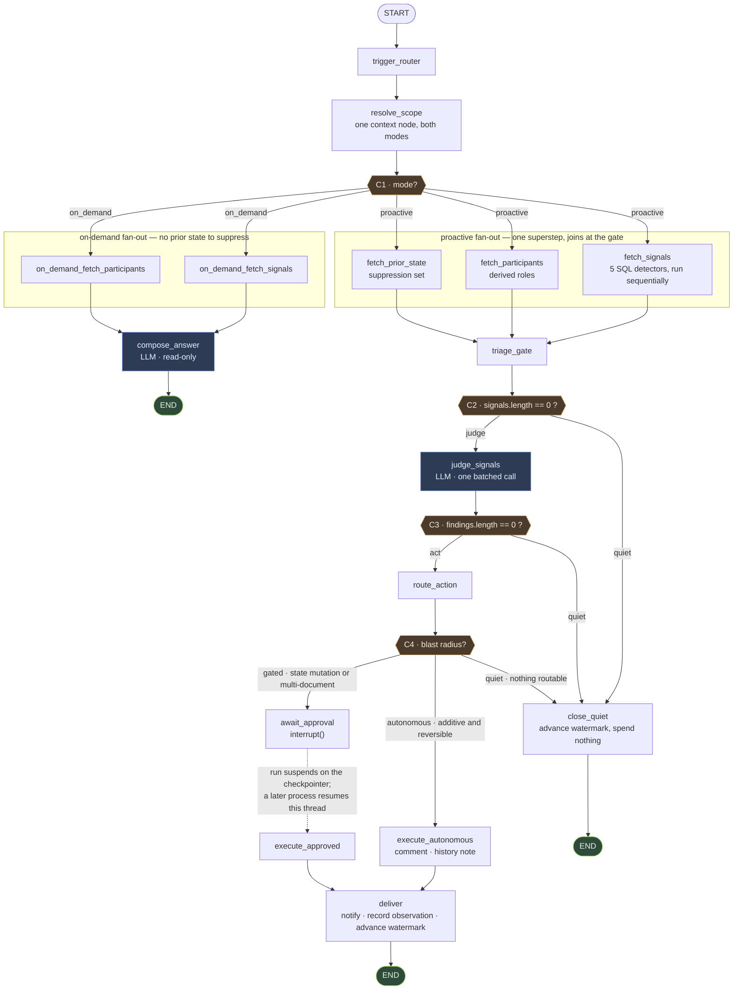

# FLEETGRAPH — A Project Intelligence Agent for Ship

Ship shows you what is happening. FleetGraph tells you what is going wrong, to the one person
who can fix it, and asks before it changes anything.

This document is the submission deliverable. Every architectural decision in it was made in
`PRESEARCH.md` and is reproduced here rather than revisited — where the two documents describe
the same thing, `PRESEARCH.md` holds the full argument and this one holds the answer.

## Status of what is described here

Several parts of the system are being built concurrently and this document runs ahead of some of
them. The rule applied throughout: **a section describing settled design that is not yet code
says so, in place, with the ticket that will close the gap.** No section asserts working
behaviour that has not been verified against the tree.

| Layer | State | Evidence |
|---|---|---|
| Migration `038` — index, `api_tokens.scopes`, observations, notifications, watermarks | **Built** | `api/src/db/migrations/038_fleetgraph.sql` |
| Data-access boundary — watermark, suppression, observations, notifications | **Built** | `agent/src/data/boundary.ts` |
| Five detectors + fingerprinting | **Built, unit-tested** | `agent/src/detectors/` |
| Graph state object | **Built** | `agent/src/graph/state.ts` |
| Graph nodes | **All thirteen node modules written** | `agent/src/graph/nodes/` |
| Graph assembly — 16 registered nodes, four conditional edges, `START`/`END` | **Built** | `agent/src/graph/index.ts` — `buildGraph(deps)`, `compileGraph(deps, checkpointer)` |
| Graph behaviour under test | **Five tests against real Postgres via testcontainers** | `agent/src/graph/index.test.ts` |
| Postgres checkpointer | **Built** — `PostgresSaver.fromConnString` + `setup()`, cached per process | `agent/src/graph/checkpointer.ts` |
| Judgment (LLM) client | **Built**, reusing `api/`'s `CircuitBreaker` rather than copying it | `agent/src/llm/client.ts` |
| Cron entrypoint | **Not written.** `agent:cron` is registered in `package.json`; `agent/src/entrypoints/` does not exist | `FG-110`–`FG-121` |
| `GET /ready` | **Built and wired** | `api/src/routes/ready.ts`, `app.ts:217` |
| FleetGraph HTTP endpoints | In progress | `api/src/routes/fleetgraph/` |
| `render_cron_job` in Terraform | **Written and planned**, `*/3 * * * *`, same image and tag as the web service | `terraform/render/cron.tf`, `terraform/render/PLAN-ANNOTATED.md` |
| Dockerfile builds `agent/` | **No.** It copies `shared/`, `api/`, `web/` only — the cron's `start_command` has no target in the image | `FG-117`, `FG-118` |
| UI surfaces — banner, chat, notification list | **Not started.** No `web/src/components/fleetgraph/` | `FG-155`–`FG-175` |
| LangSmith trace links | Not captured | `FG-181`–`FG-185` |

Verified against `fa51a0a`. Several agents are landing code on this branch concurrently, so the
table above is a point-in-time reading, not a standing claim.

Section **Unverified Claims** at the end lists every statement in this document that could not
be checked against code, so a reader does not have to reconstruct the list.

---

# Agent Responsibility

## What it monitors proactively

Five signal families, all derived from columns that already exist in Ship's `documents` table.
Detection runs as **SQL against Postgres directly**, not through Ship's HTTP API.

| Signal | Derived from | Threshold in code |
|---|---|---|
| Stalled work | `state = 'in_progress'`, `updated_at` unmoved | 5 business days |
| Review bottleneck | `state = 'in_review'`, `updated_at` unmoved | 2 business days |
| Sprint-miss risk | sprint `end_date` near, issues still `todo`/`backlog` | 2 business days out |
| Load imbalance | active issues per assignee vs. the sprint median | ≥ 2× median, team ≥ 3 |
| Rework churn | `reopened_at` set, or `done → in_progress` in `document_history` | ≥ 2 in 30 days, per project |

Thresholds are constants in `agent/src/detectors/types.ts` (`THRESHOLDS`), not literals, so the
tests, the judgment prompt, and this table cite the same number.

**Why SQL and not the REST API.** Production rate-limits at 100 requests per minute per IP
(`api/src/app.ts`), and every request pays a roughly four-query authentication preamble. A
scanner polling from one Render service is one IP; at any useful project count it would exhaust
a budget shared with real users behind the same egress. Detection is also a natural set query —
"every issue whose state and timestamps satisfy a predicate" — and expressing that as REST
pagination is strictly worse than expressing it as SQL.

| Alternative | Why it lost |
|---|---|
| Poll the REST API | The rate limiter binds long before the process does; measured, not assumed |
| Consume Ship webhooks | No webhook infrastructure exists; it would still need a reconciling scan |
| Postgres `LISTEN`/`NOTIFY` | Requires triggers, which puts agent concerns in the write path of every mutation |

**Why silence is measured on `updated_at` and not on `document_history` absence.** The obvious
reading of "nothing has happened to this issue" is "no history rows since." That is wrong in
this schema: `document_history` covers six `TRACKED_FIELDS` written from three route files, the
bulk-update path bypasses it entirely, and collaboration content writes are throttled. An issue
can change without producing a history row, and a detector keyed on history absence would report
live work as stalled. `updated_at` is written on every path.

`document_history` is used by exactly one detector — rework churn — where the signal is the
**presence** of `state` transitions rather than their absence. An undercount there makes that
detector quieter, never wrong.

**Cost owned.** `documents.updated_at` had no index. Migration `038` adds
`(workspace_id, updated_at DESC)` filtered on `archived_at IS NULL AND deleted_at IS NULL`,
which is what keeps the detectors' range predicates off a sequential scan.

## What constitutes a condition worth surfacing

Two gates, in order. A signal must cross a **deterministic threshold** in SQL, then survive an
**LLM judgment** pass asking whether this particular instance is worth a human's attention right
now. Only signals passing both are delivered.

These are different questions. "Has this issue sat in `in_progress` for five business days" is a
fact and should never cost a token. "Is that worth interrupting the PM, given the sprint ends
tomorrow and the assignee posted a standup explaining it" is a judgment, and it is exactly what
a rule engine gets wrong. Ship already has a rule engine that answers the first kind of question
well — `api/src/routes/accountability.ts`, nine detection types — and its output is a flat list
with no sense of what matters.

| Alternative | Why it lost |
|---|---|
| Thresholds only | That is `accountability.ts`; everything crossing a line is equally loud |
| LLM only | Pays tokens whether or not anything happened, and asks the model to do timestamp arithmetic |
| Static severity weights | A lookup table pretending to be judgment; cannot use context like "there is a standup explaining this" |

The cheap gate is also why the traces differ run to run. A quiet project and a drifting project
take visibly different paths through the same graph, which is the observability requirement
satisfied by the architecture rather than by contrivance.

## What it can do without human approval

Autonomous actions are limited to those that are **additive and reversible**:

- Post a comment on a document
- Log an observation to `document_history` with `automated_by = 'fleetgraph'`
- Create a FleetGraph notification
- Answer a question in on-demand chat

Everything that changes project state — issue state, assignee, priority, sprint membership,
creating or archiving documents — is **proposed, never executed**.

**Why this line and not another.** `api_tokens` has no scope column today, so a token inherits
the full permissions of the user who created it and there is no technical ceiling on what an
agent token can do. Since the platform cannot enforce a boundary, the boundary is enforced in
the graph and made visible. Additive-and-reversible is the line a user can always undo without
needing to know what the agent did.

Ship's schema already anticipates this: `document_history.automated_by` exists to mark automated
changes and `logDocumentChange` takes it as a parameter.

**Defence in depth.** Migration `038` adds `api_tokens.scopes TEXT[]`, nullable, where `NULL`
means unscoped and preserves every existing token's behaviour. FleetGraph's detection credential
is issued read-only, so the autonomy boundary is enforced by the credential as well as by the
graph.

| Alternative | Why it lost |
|---|---|
| Full autonomy on a whitelist of "safe" mutations | A wrong reassignment is invisible until someone notices, and no scope constrains it |
| Approve everything, including comments | The agent stops being proactive and becomes a queue of chores |
| Confidence thresholds gating autonomy | A self-reported score is not a safety mechanism |

## What must always require confirmation

Three classes:

1. **Any state mutation** — state, assignee, priority, sprint membership, create, archive.
2. **Any notification to someone outside the document's participants.**
3. **Any action touching more than one document at once.**

The third is the one that is easy to miss. Bulk is where an agent does the most damage fastest,
and Ship's own bulk endpoint (`POST /api/issues/bulk`, up to 100 ids) bypasses
`document_history` entirely — an agent-driven bulk update would leave no audit trail. FleetGraph
never calls that endpoint (`FG-125`), and a regression test asserts it (`FG-233`).

Confirmation tracks **blast radius, not action type**. A single comment and a fifty-issue
reassignment are not the same risk even though both are writes. Blast radius is observable from
the request itself, before the action runs, without asking the model to assess its own impact.

## How it knows who is on a project, and their role

Membership resolves from `document_associations` joined to `person` documents, with
`properties->>'user_id'` linking to `users`. Role is **derived from structure**, because Ship has
no column for it — `workspace_memberships.role` is `CHECK (role IN ('admin','member'))`.

| Derived role | Derivation |
|---|---|
| Engineer | Appears as `properties->>'assignee_id'` on issues in the sprint |
| PM | Owns the project or sprint document (`properties->>'owner_id'`) |
| Director | Has direct reports in the `reports-to` org chart, above the project owner |

Deriving is honest; adding a role column would model a fiction that immediately drifts from the
associations that actually drive the app. The graph's `Participant` type carries these as
`roles: Array<'assignee' | 'sprint_owner' | 'project_owner' | 'reports_to'>`
(`agent/src/graph/state.ts`), which is the same structural derivation expressed in the state
object.

| Alternative | Why it lost |
|---|---|
| Add a role column | A schema change to the user model to serve one feature, and it drifts from the associations |
| Ask the LLM to infer role | Non-deterministic routing for notifications is a bad trade |
| Configuration file | Stale the moment someone joins a project |

## Who it notifies, and when

Routed by **accountability for the signal**, not proximity to it, and therefore per signal type.
One named recipient per finding. This is implemented today: every detector sets
`accountableUserId` on the `Signal` it emits.

| Signal | Recipient | Resolved from | Verified in |
|---|---|---|---|
| Stalled work | Assignee | `properties->>'assignee_id'` | `stalledWork.ts` |
| Review bottleneck | Assignee — see caveat | `properties->>'assignee_id'` | `reviewBottleneck.ts` |
| Sprint-miss risk | Sprint owner | `properties->>'owner_id'` on the sprint | `sprintMissRisk.ts` |
| Load imbalance | Sprint owner — **never the overloaded person** | `properties->>'owner_id'` on the sprint | `loadImbalance.ts` |
| Rework churn | Project owner | `properties->>'owner_id'` on the project | `reworkChurn.ts` |

**Why per-signal rather than one ladder.** A single chain of assignee → sprint owner → project
owner breaks on two of the five. Load imbalance is a finding *about* the overloaded person, and
notifying them is useless because they cannot fix their own allocation. Sprint-miss risk has no
single assignee at all; it is a property of the sprint. Routing has to follow who can act.

Fallback when `owner_id` is null: the document's `created_by`, then a workspace admin. Never
nobody — a finding with no recipient is a finding that silently disappears.

**Escalation.** A finding not acknowledged after **2 business days** escalates one level up the
org chart via `properties->>'reports_to'` on the person document. It escalates **at most once**
and stops at the project owner. A Director never receives an individual stalled issue; they
receive only aggregate signals such as rework churn. The unit is business days, not runs — at a
3-minute cron, "two runs" would be six minutes, which would escalate a finding defined by five
days of silence almost immediately.
<!-- TODO(FG-084, FG-130): escalation is designed and unimplemented. `fleetgraph_notifications`
     carries the state column it needs; the escalation step itself lives in `deliver`. -->

**The caveat, volunteered rather than hidden.** Review bottleneck has no strictly correct
recipient. **Ship has no reviewer field** — an issue in `in_review` records who it is assigned
to, not who is meant to review it. The agent therefore tells the assignee their work is stuck,
which is true and useful but not directly actionable by them. Inferring a reviewer from comment
history is fabrication; adding a reviewer column is a schema change serving one detector. The
weaker version ships and the limit is named, in `PRESEARCH.md` Q6 and in the header of
`reviewBottleneck.ts`.

## How on-demand mode uses context from the current view

The chat component sends **route parameters, not rendered content**: document id, document type,
and active tab. A context node in the graph resolves that id into a scoped state object — the
document, its associations, its recent history, its participants — before any reasoning runs.

Ship's router makes this clean: `documents/:id/*`, `sprints/:id/plan`, `projects/:id`,
`programs/:programId/sprints/:id`. The id in the URL *is* the context.

Sending rendered content would make the agent's view of a document depend on what the UI
happened to render, including truncation and lazy-loaded tabs. Sending the id means the graph
resolves the same authoritative state whether it was invoked from chat or from the cron — which
is what makes "both modes run through the same graph" true rather than aspirational.

| Alternative | Why it lost |
|---|---|
| Send visible DOM / editor content | Brittle, and leaks presentation into reasoning |
| Send the whole workspace and let the model find the relevant part | Burns tokens, invites answers about the wrong document |
| Require the user to state context | The brief's core complaint is that users context-switch too much |

The chat surface is embedded in the document view. There is no standalone chatbot page — a
brief constraint, and one Ship already has precedent for: `PlanQualityBanner` and
`QualityAssistant` both scope AI to the document in view rather than to a chat session.

---

# Graph Diagram

Both modes, all sixteen registered nodes, every edge. The four conditional edges are the
hexagons (`C1`–`C4`); the dashed edge is the suspend-and-resume boundary, where the process
exits and a later one resumes the same thread.

Node labels are the exact strings exported from `NODES` in `agent/src/graph/index.ts`, so this
diagram and a LangSmith trace read the same.



Four structural details in the assembled graph that a reader should not have to infer:

- **`close_quiet` is a real node, not an early `END`.** All three quiet branches converge on it,
  because terminating quietly still has work to do: the watermark has to advance, or the next
  run re-covers a window it already cleared.
- **The on-demand path has its own fetch nodes.** `on_demand_fetch_signals` and
  `on_demand_fetch_participants` run the same functions as their proactive counterparts under
  different node names, so a trace names the path it took rather than making you deduce it.
  There is no on-demand prior-state fetch — there is nothing to suppress in a conversation.
- **C4 has three branches, not two.** `autonomous`, `gated`, and `quiet` — the third for a
  finding that survived judgment but resolved to no routable action.
- **Chat cannot act, structurally.** There is no edge from `compose_answer` to any execute node.
  That is a missing edge, not a prompt instruction, and
  `agent/src/graph/index.test.ts` asserts it.

---

# Graph Outline

The diagram in prose, which is what MVP requirement 4 asks for: node types, edges, branching
conditions.

## Node types

Sixteen registered nodes, from thirteen node modules — `fetch_signals` and `fetch_participants`
are each registered twice, once per mode, under distinct trace names.

| Layer | Node | Responsibility | Deterministic? |
|---|---|---|---|
| Entry | `trigger_router` | Record the invocation mode into state | Yes |
| Context | `resolve_scope` | Turn a scope reference — a workspace, or a document id from the URL — into a concrete target set; capture `scannedThrough` before any query runs | Yes |
| Fetch | `fetch_signals` | Run the five SQL detectors, return `Signal[]` | Yes |
| Fetch | `fetch_participants` | Resolve people in scope and derive their roles structurally | Yes |
| Fetch | `fetch_prior_state` | Load already-surfaced, unresolved observations for suppression | Yes |
| Fetch | `on_demand_fetch_signals` | Same function as `fetch_signals`, distinct trace name | Yes |
| Fetch | `on_demand_fetch_participants` | Same function as `fetch_participants`, distinct trace name | Yes |
| Gate | `triage_gate` | Decide whether anything crossed a threshold | Yes |
| Reasoning | `judge_signals` | Which signals matter, severity, recipient, phrasing — one batched call | **LLM** |
| Reasoning | `compose_answer` | On-demand only: grounded answer from scoped state, read-only | **LLM** |
| Action | `route_action` | Classify each finding's action by blast radius | Yes |
| Action | `execute_autonomous` | Comment / history note via Ship's HTTP API | Yes |
| Action | `await_approval` | `interrupt()`; the run suspends on the Postgres checkpointer | Yes |
| Action | `execute_approved` | Run the proposal after a human accepts | Yes |
| Output | `deliver` | Write the notification, record the observation, advance the watermark | Yes |
| Output | `close_quiet` | Terminate having surfaced nothing, and still advance the watermark | Yes |

Two LLM nodes out of sixteen. That ratio is the design: the model judges pre-measured facts and
phrases them, and does nothing else.

**Why `close_quiet` exists rather than an edge straight to `END`.** A quiet run has not done
nothing — it has established that a window is clear, and the watermark has to record that or the
next run re-covers ground it already cleared. Making it a node also means the quiet path is
*named* in a trace, which is what lets a reader tell a healthy workspace from a graph that
failed to start.

## Edges

**Parallel fan-out.** `fetch_signals`, `fetch_participants`, and `fetch_prior_state` run
concurrently and join at `triage_gate`. They are independent reads with no ordering dependency —
signals from the documents tables, participants from associations and the org chart, prior state
from FleetGraph's own tables — so their combined latency is the slowest of the three rather than
the sum.

Mechanically this is one conditional edge returning **three node names at once**, which LangGraph
runs in a single superstep and joins by the three plain edges into `triage_gate`. The fan-out is
therefore the same construct as the mode branch, not a separate mechanism: C1 returns a list on
the proactive side and a two-element list on the on-demand side.

Fetching participants lazily after triage would save a query on quiet runs, but participants are
needed to *judge* severity (a stalled issue owned by someone on leave is a different finding), so
it would move the work later and serialise it behind the model call.

One nuance the code adds, which `PRESEARCH.md` does not address: the five detectors *inside*
`fetch_signals` run **sequentially**, not in parallel. Five queries against a pool capped at four
connections would saturate it, and the gain would be milliseconds on queries that are already
indexed range scans (`agent/src/detectors/index.ts`). The parallelism that matters is at the
graph's fetch nodes, where the work is genuinely independent.

**Failure isolation.** One detector throwing must not lose the other four's findings, so
`runDetectors` catches per-detector rather than per-run.

## Branching conditions

| # | Edge | Fires after | Condition | Branches |
|---|---|---|---|---|
| C1 | `resolve_scope` | `routeByMode(state)` | `proactive` → the three-node fan-out · `on_demand` → the two-node fan-out |
| C2 | `triage_gate` | `signals.length === 0` | `quiet` → `close_quiet`, zero tokens spent · `judge` → `judge_signals` |
| C3 | `judge_signals` | `findings.length === 0` | `quiet` → `close_quiet` · `act` → `route_action` |
| C4 | `route_action` | Blast radius | `autonomous` → `execute_autonomous` · `gated` → `await_approval` · `quiet` → `close_quiet` |

**C2 is the one that matters most.** On a healthy project the run ends at the triage gate having
spent zero tokens and touched no model; on a drifting project it runs the full path and may
suspend for approval. Two runs of identical code produce visibly different traces, which is what
distinguishes a graph from a pipeline. `agent/src/graph/index.test.ts` asserts exactly that: a
quiet run and a drifting run visit **different node sets**, and the drifting run visits more.

**C2 and C3 both terminate quietly and are still separate edges on purpose.** "The database found
nothing" and "the model judged nothing worth saying" are identical in outcome and completely
different in a trace. Telling them apart is how you know whether a silent week means a healthy
project or a miscalibrated prompt.

C1 is a single conditional edge doing two jobs: it selects the mode *and* performs the fan-out,
by returning a list of node names rather than one. Both modes share `trigger_router` and
`resolve_scope`, which is what makes "the difference is the trigger, not the graph" literally
true rather than a slogan.

## Where the assembled graph differs from `PRESEARCH.md` Q17

Q17's table places conditional edge 1 after `trigger_router`. **It fires one node later, after
`resolve_scope`.** Same condition, same two branches, one node further down.

The reason is `scannedThrough`. Scope resolution is common to both modes and has to capture the
scan's upper bound *before* any query runs, so that a row written mid-run is picked up next time
rather than skipped. Branching before that would mean duplicating the capture on both sides of
the branch — two places to get the crash-safety property right instead of one.

Recorded in the header of `agent/src/graph/index.ts` as well, so the deviation is visible from
the code and not only from here.

## State carried across the graph

One typed state object, threaded through every node (`agent/src/graph/state.ts`):

| Field | Holds |
|---|---|
| `mode` | `'proactive' \| 'on_demand'` |
| `scope` | Workspace / project / sprint / document under examination |
| `actor` | Invoking user (on-demand) or the agent identity (proactive) |
| `signals[]` | Detector output: type, target, measurement, threshold, bucket, fingerprint |
| `participants[]` | People in scope with structurally derived roles |
| `suppressed[]` | Findings already surfaced and still open |
| `findings[]` | Post-judgment: severity, recipient, proposed action |
| `pending` | The proposal awaiting approval, when suspended |
| `messages[]` | Conversation turns, on-demand only |

Keeping `signals` (measured) separate from `findings` (judged) is deliberate: a LangSmith trace
then shows exactly where determinism ends and the model begins.

## State that persists between runs

| Store | Holds | Purpose |
|---|---|---|
| `fleetgraph_observations` | Fingerprint, target, first seen, last surfaced, resolution, `snooze_until` | Suppression and escalation |
| `fleetgraph_notifications` | Recipient, finding, state, acknowledged | Delivery — Ship has no notifications table |
| `fleetgraph_watermarks` | Per workspace: last scanned, last completed | Crash-safe run boundary |
| LangGraph Postgres checkpointer | Serialised graph state per thread | Survives the `interrupt()` for human approval |

`(workspace_id, fingerprint)` is **unique** on the observations table. That constraint is the
single most important line in migration `038`: a suppression failure turns one finding into
roughly 480 model calls a day, silently, with a cost graph as the only symptom.

**Why a durable checkpointer is not optional.** Human approval takes hours; the cron container
exits when the run ends. Without durable state the suspended run dies with the process and the
approval has nothing to resume. This was the one assumption the whole cron model rested on, so
it was verified before anything was built: `@langchain/langgraph` 1.4.8 with
`@langchain/langgraph-checkpoint-postgres` 1.0.4, interrupt in one process, `process.exit(0)`,
resume in a second — eight assertions, including that the pre-interrupt nodes did **not** re-run.

**Where the checkpointer's tables live, because someone will go looking.** `PostgresSaver.setup()`
creates `checkpoints`, `checkpoint_blobs`, `checkpoint_writes`, and `checkpoint_migrations` in
whatever database the connection string names — Ship's. They are **not** in
`api/src/db/migrations/`, and that asymmetry is deliberate: the library owns their schema and
migrates them itself, so a hand-written migration would fight it the first time it changes them.
`setup()` is idempotent, which is what makes the destroy-and-redeploy cycle work against an empty
database with no manual step (`agent/src/graph/checkpointer.ts`).

## Human-in-the-loop

The gate is LangGraph's `interrupt()` at `await_approval`, with the proposal serialised into the
checkpointer. An external approval queue would have to reconstruct what the run saw, judged, and
proposed, and the reconstruction is where the reasoning and the action drift apart.

The confirmation surface is **in the document the finding is about** — a compact banner between
title and editor, matching `PlanQualityBanner`, with Accept / Dismiss / Snooze. Findings whose
target is a set (load imbalance) surface on the sprint view, because that is the document the
decision is about.

| Response | Effect |
|---|---|
| **Accept** | Resume the graph, execute via the Ship HTTP API, record the outcome |
| **Dismiss** | Mark the observation resolved-by-dismissal. **That fingerprint never fires again for that target** |
| **Snooze** | Suppress for 1 / 3 / 5 business days, default 3, then **re-run the detector** |

Dismissal is permanent for that fingerprint because a dismissed finding that returns next week is
the fastest route to users disabling the agent. Snooze re-evaluates rather than replays, so a
condition that resolved itself disappears silently — which is only affordable because detection
is cheap. Snooze horizons are in business days because every threshold is in business days; an
hours-scale snooze would wake before the underlying state could plausibly change.

The `await_approval` node and the `interrupt()` inside it are written, and the graph routes to
them on C4's `gated` branch.

<!-- TODO(FG-131 – FG-137, FG-155 – FG-159): the resume paths (accept / dismiss / snooze) and the
     banner that drives them are not written. The suspend half and the checkpointer it rests on
     are built; nothing yet resumes a suspended thread from a user action. -->

---

# Use Cases

Six, exceeding the minimum of five. **This table matches the shipped detectors**, not the prose —
where `PRESEARCH.md` Q9's summary and the code disagree, the code is authoritative and the
difference is named below the table.

| # | Role | Trigger | Agent detects / produces | Human decides |
|---|---|---|---|---|
| 1 | Engineer (PM on escalation) | Issue `state = 'in_progress'`, not archived or deleted, `updated_at` unmoved for ≥ 5 business days | Work that looks active but has not moved; one signal per issue carrying the idle count, the threshold, and the assignee | Blocked, done-but-unmarked, or abandoned |
| 2 | PM | Sprint `end_date` within 2 business days while issues associated to it are still `todo` or `backlog` | Predicted sprint miss as **one signal per sprint** carrying the count of unstarted issues — not one per issue | Descope, reassign, or move the date |
| 3 | PM / Director | An assignee holds ≥ 2× the sprint median of active work (`in_progress` + `in_review`), in a sprint with ≥ 3 people holding work | Load imbalance before it becomes a miss; the finding is *about* the overloaded person and goes *to* the sprint owner | Rebalance — the agent proposes, never reassigns |
| 4 | Engineer / PM | Issue `state = 'in_review'`, `updated_at` unmoved for ≥ 2 business days | Review bottleneck — finished work stuck at the gate | Who reviews, or waive it |
| 5 | Director | ≥ 2 issues in a project reopened (`reopened_at` set, or `done → in_progress` in `document_history`) within a 30-day lookback | Rework churn as a quality signal, aggregated **per project** | Whether definition-of-done needs attention |
| 6 | Any | User opens chat on a sprint / issue / project view | Grounded answer about *that* document's real state; no action taken | Everything — this path is read-only |

Use case 6 is the on-demand mode and is deliberately read-only, which is what makes it safe to
embed everywhere.

## Where the code and `PRESEARCH.md` disagree

The full register, not only the use cases. `PRESEARCH.md` was written before the code and is
graded as a design document; where the two disagree, **the code is authoritative** and the
difference is recorded rather than smoothed over. Seven, and none of them changes a decision.

| # | `PRESEARCH.md` says | The code does | Resolution |
|---|---|---|---|
| 1 | Q9: use case 1 triggers on "`started_at` > 5 business days, no `document_history` row since" | Filters on `updated_at` idle ≥ 5 business days; `started_at` travels as context, not as the predicate | The code agrees with **Q1**, which argues at length that history absence proves nothing. Q9's one-line summary contradicts Q1, not the code |
| 2 | Q9: use case 4 triggers on "`in_review` > 2 business days with no history change" | `updated_at` idle ≥ 2 business days | Same correction as #1 |
| 3 | Q9: use case 3 also fires when "a sprint member has zero assigned" | Only the over-loaded side is detected; there is no zero-assignment branch | **Not implemented.** A person with zero work is *below* the median and `LOAD_IMBALANCE_FACTOR` only fires above it. A real reduction in scope, recorded rather than dropped |
| 4 | Q9: use case 5 counts transitions "within one sprint" | A 30-day lookback aggregated per project | Project-level aggregation is what Q9's own "aggregated per project" column says; the sprint window was the drift |
| 5 | Q11/Q20: the scan "only considers documents changed since the last run" and "a quiet workspace returns zero rows" | The watermark bounds the **run**, not the query. `runDetectors` takes no watermark parameter | The code is right: absence-based detectors would hide exactly what they look for. Argued in full under **Trigger Model → What the watermark actually does** |
| 6 | Q16 implies the five detectors are part of the parallelism | The three fetch **nodes** are parallel; the five detectors inside `fetch_signals` run sequentially | Not a contradiction, an omission. Five queries against a pool capped at four connections would saturate it |
| 7 | Q17: conditional edge 1 fires after `trigger_router` | It fires after `resolve_scope`, one node later. Same condition, same two branches | `scannedThrough` must be captured before any query runs, and scope resolution is common to both modes — branching first would duplicate that capture. Argued under **Graph Outline → Where the assembled graph differs from Q17** |

Rows 1–4 are `PRESEARCH.md` Q9 compressing details wrongly. Rows 5–7 are the implementation
finding a better answer than the design did, and each is recorded at the seam in the code as
well as here.

## How these were discovered rather than invented

By reading what Ship already detects and finding the complement. `accountability.ts` implements
nine detection types — standup, week_start, week_issues, weekly_plan, weekly_retro, weekly_review,
project_retro, and two changes-requested variants. Every one is **process compliance**: did you
file the artifact. None of them look at whether the work itself is moving.

That is the pain point, and it is structural rather than imagined. Ship has columns for
`started_at`, `completed_at`, `cancelled_at`, and `reopened_at`, and nothing in the product reads
them to ask whether work is progressing. All six use cases are built from columns that exist and
are populated, which is also why each is testable against real data.

---

# Trigger Model

## The decision

**Hybrid — but not the usual meaning: poll for detection, event-driven for invocation.**

A **Render cron job every 3 minutes** drives proactive mode. A user action in the Ship UI invokes
the same graph synchronously for on-demand mode. The trigger differs; the graph does not.

## Why 3 minutes

The requirement is under 5 minutes from an event appearing in Ship to the agent surfacing it. A
3-minute interval leaves roughly 2 minutes of headroom for the run itself, which is comfortably
more than it needs. It runs in its own process, so it is alive when no user session is.

| Alternative | Why it lost |
|---|---|
| In-process `setInterval` in the API | Dies when the web service sleeps on Render's free plan; couples agent uptime to API uptime |
| External scheduler (GitHub Actions cron) | Puts the trigger outside Terraform, and the MVP requires the deployment to be defined there |
| 1-minute cron | Three times the runs to buy latency no use case needs |
| 5-minute cron | Zero headroom; a single cold start breaches the SLA |

## Poll vs. webhook vs. hybrid — the tradeoffs, defended

| Model | Cost | Reliability | Latency |
|---|---|---|---|
| Pure poll | Constant, independent of activity | Survives agent downtime — the next run re-covers the window | Bounded by the interval |
| Pure webhook | Scales with activity | **Ship has no webhook infrastructure.** A missed delivery is lost with no reconciliation | Near-zero |
| **Hybrid (chosen)** | Near-zero when idle: the detectors return no rows and the run ends at the triage gate before any model call | The watermark reconciles anything a crashed run missed | 3 min proactive, immediate on-demand |

**The usual argument against polling is wasted work, and it does not hold here.** The expensive
resource is model tokens, not queries. A quiet workspace runs five indexed range scans, produces
zero signals, and terminates at `triage_gate` having spent nothing. The poll is nearly free
precisely *because* the expensive part sits behind a deterministic gate.

**The argument for webhooks is latency, and the latency is not needed.** The requirement is five
minutes, not five seconds. Building outbound webhooks into Ship would mean touching the write
path of every mutation — and Ship's own bulk endpoint already demonstrates how easily a write
path gets missed, since it bypasses `document_history` today. An event emitter added to routes
would acquire the same holes.

## How stale is too stale

Three minutes for detection, matching the interval. The honest answer, though, is that **none of
the six use cases are latency-sensitive at that scale** — they detect drift measured in business
days. A stalled issue is defined by five days of silence; learning about it 3 minutes versus 30
minutes after the threshold crosses changes nothing for the user.

The 5-minute requirement is a system property being tested, not a property these use cases need.
It is met because it is required, and the use cases are not dressed up to pretend they demand it.

Where staleness *would* bite is the on-demand path, where a user asks about a document they just
edited. That path does not poll at all — it reads current state synchronously, so it is never
stale.

## What the watermark actually does

This is the one place the implementation departs from the written design, and it departs in the
right direction, so it is stated plainly rather than smoothed over.

`PRESEARCH.md` describes the watermark as scoping the scan: "find documents changed since the
last recorded high-water mark," and "a quiet workspace returns zero rows." **The detectors do not
do that, deliberately.** They measure conditions that have *persisted* — "idle for five business
days" is true of a row that has **not** changed — so filtering on `updated_at > watermark` would
hide exactly what the detectors are looking for.

So the watermark **bounds the run, not the query**. `scannedThrough` is captured before the
detectors execute (any row written while they run is picked up next time rather than skipped),
and it is written back only on a completed run.

| Property | Still true | Now false |
|---|---|---|
| A quiet run costs zero tokens | Yes — it ends at `triage_gate` | — |
| A crashed run re-covers its window | Yes — the watermark only advances on completion | — |
| The `(workspace_id, updated_at)` index earns its place | Yes — the detectors' `updated_at <` range predicates use it | — |
| A quiet workspace scans zero rows | — | It runs five indexed range scans that return nothing |

The cost argument survives intact, because it was always a token argument. The "zero rows"
phrasing in `PRESEARCH.md` Q11/Q20 does not.
<!-- TODO(FG-064): the ticket says "all detectors accept a watermark and scope only to documents
     changed since." The detectors take no watermark parameter and the ticket text is wrong.
     Reconcile the ticket, not the code. -->

## What it costs at 100 projects and at 1,000

The cron is **per workspace, not per project** — one scan covers every project in a workspace,
because the query is an indexed range scan with project as a grouping, not a loop.

| Scale | Scans/day | LLM calls/day | Note |
|---|---|---|---|
| 100 projects | 480 | ~50–150 | Only projects with a signal reach the model |
| 1,000 projects | 480 | ~200–600 | Scan count is **flat**; only judgment scales |

**The scan count does not grow with project count.** What grows is the number of projects with
something worth judging, which is the thing worth paying for. The cost curve tracks drift in the
portfolio, not the size of it.

The naive design — one cron per project — would be 480 × N runs/day and would hit Ship's API
rate limit at roughly two projects.

| Alternative | Why it lost |
|---|---|
| Per-project scheduling | 480 × N runs/day; breaks the rate limit at two projects |
| Per-workspace with a model call per project | Makes LLM cost linear in project count for no gain, since quiet projects have nothing to judge |

## How redundant work is avoided

Four mechanisms, cheapest first:

1. **Threshold predicates in SQL** — the detectors emit nothing unless a bar was crossed.
2. **Suppression** — a SHA-256 fingerprint of (signal type + target + bucket) checked against
   `fleetgraph_observations`. An already-surfaced, unresolved finding never reaches the model
   again. Buckets are coarse and open-ended (`<5d`, `5-9d`, `10-19d`, `20d+`) so a finding
   re-surfaces when the situation *materially worsens*, not merely because a day passed.
3. **Content hashing** — SHA-256 of the judged input, so re-judging identical state is skipped.
   Ship already uses this exact pattern in `ai-analysis.ts` (`computeContentHash`).
4. **Triage gate** — no signals means no model call at all.

Suppression is keyed on the *finding*, not on time, so a finding is surfaced once and escalated
on a schedule rather than repeated on one. A time-based cache would re-surface the same finding
whenever the TTL expired, which is precisely the alert-fatigue failure.

---

# Performance

## Detection latency budget

| Stage | Budget | Basis |
|---|---|---|
| Worst-case wait for the next cron | 180 s | 3-minute interval |
| Container cold start | ~15 s | Same image as the API; the one real estimate here |
| Watermark scan + five detectors | 1 s | Indexed range scans (migration `038`) |
| Judgment (LLM) | 20 s | Hard ceiling — the existing Bedrock request timeout, not an estimate |
| Delivery | 1 s | Two inserts |
| **Total worst case** | **217 s = 3 min 37 s** | **83 s of headroom against the 300 s SLA** |

Every term is a worst case, and the two largest are bounded by configuration rather than by
measurement: the interval is ours to set, and the model call cannot exceed 20 s because the
existing request timeout kills it first. A pathologically slow judgment fails fast into
`ai_unavailable` and the signal is judged on the next run rather than breaching the SLA.

**Verification is a timed test run**, per the brief: introduce an event into Ship, start the
clock, assert the agent surfaces it inside the window.
<!-- TODO(FG-209, FG-238): the timed run has not been performed. The 15 s cold start is the only
     unbounded term and is the reason the measurement is required rather than optional. -->

## Token budget per invocation

| Path | Input | Output | Notes |
|---|---|---|---|
| Quiet proactive run | **0** | **0** | Terminates at `triage_gate` |
| Proactive with signals | ~2,000–4,000 | ~500–1,000 | Signals are pre-measured; the model judges, it does not search |
| On-demand chat turn | ~3,000–6,000 | ~300–800 | Scoped to one document plus its history |

`max_tokens` is capped at 2048 and input is bounded by `MAX_CONTENT_TEXT_LENGTH` (50 KB) — both
existing limits in `ai-analysis.ts`, inherited rather than re-derived.

**Why the input is small.** The model never receives raw project data to search. It receives
*measurements* — "issue X, in_progress, 7 business days idle, threshold 5, assignee Y, sprint
ends in 2 days" — because the SQL layer did the finding. The `Signal` type carries a `context`
map of already-measured facts for exactly this purpose.

## Cost cliffs

| Cliff | Trigger | Mitigation |
|---|---|---|
| Judging every signal individually | N model calls per run instead of 1 | Batch all signals for a scope into one judgment call; severity ranking needs to see them together anyway |
| **Suppression failure** | Same finding re-judged every 3 min = ~480 calls/day/finding | Unique index on `(workspace_id, fingerprint)`, plus bucketing. **The biggest cliff in the design** |
| On-demand unbounded | Cost scales with engagement, not drift | Per-user rate limit reusing the existing `checkRateLimit` pattern (120/hr) |
| Conversation history growth | Long threads resend full history each turn | Cap at N turns; scope state is re-resolved rather than carried |
| Watermark reset | A migration touching `updated_at` en masse | Detectors are threshold-based, so a mass re-scan finds the same signals and suppression absorbs them — one expensive scan, not an alert storm |

Every cliff except suppression is bounded by something external: user behaviour, thread length,
deploy frequency. A suppression bug is bounded by nothing, and its symptom is a cost graph rather
than an error. It gets a regression test of its own (`FG-230`).

Full cost analysis, including actual development spend and projections at 100 / 1,000 / 10,000
users, is due at Final Submission and is not attempted here.

---

# Retry Strategy and Fallback Behaviour

Engineering requirement 4: every outbound call has an explicit timeout and bounded retry with
exponential backoff, and the agent degrades rather than crashing or hanging.

## The values, and where they come from

FleetGraph does **not** write a new circuit breaker. `api/src/services/circuitBreaker.ts` exists,
is unit-tested, and already wraps Bedrock. FleetGraph reuses that class and adds a second
instance for the Ship HTTP API.

| Parameter | Value | Verified in |
|---|---|---|
| Connect timeout | 3 s | `ai-analysis.ts` — `CONNECT_TIMEOUT_MS = 3_000` |
| Request timeout | 20 s | `ai-analysis.ts` — `REQUEST_TIMEOUT_MS = 20_000` |
| Max attempts | 3 | `ai-analysis.ts` — `MAX_ATTEMPTS = 3` |
| Breaker failure threshold | 5 consecutive | `ai-analysis.ts` — `BREAKER_FAILURE_THRESHOLD = 5` |
| Breaker cooldown | 60 s | `ai-analysis.ts` — `BREAKER_COOLDOWN_MS = 60_000` |
| Breaker states | closed / open / half-open | `circuitBreaker.ts` |

Exponential backoff between attempts comes from the AWS SDK's standard retry mode, configured by
`maxAttempts: 3` on the `BedrockRuntimeClient`. The Ship HTTP client, which has no SDK behind it,
implements backoff explicitly on the pattern already used in `api/src/services/caia.ts`:
`base × 2^(attempt-1)`, bounded by the attempt count.
<!-- TODO(FG-123, FG-124): the Ship API client and its breaker instance are not written. The
     breaker class and the Bedrock configuration above are verified; the second instance is not. -->

**Why reuse rather than write a second one.** The existing breaker's own comments record why it
exists: *"a retry makes a single request more likely to succeed, but when the dependency is down
it multiplies the load and multiplies the latency every caller waits through."* That reasoning
applies unchanged.

## What happens when a dependency is down

The two halves fail independently, because detection reads Postgres directly and actions go
through HTTP.

| Path | Failure | Behaviour |
|---|---|---|
| Detection (direct SQL) | Postgres unreachable | Abort the run **without advancing the watermark**; the next run re-covers the missed window |
| Actions (HTTP API) | Ship 5xx or unreachable | Breaker opens; findings are recorded and queued, not lost; delivery retries on the next run |
| Judgment (LLM) | Provider unreachable | Breaker opens; the call returns `ai_unavailable` immediately; signals persist unjudged and are judged next run |

**Not advancing the watermark is the key detail.** It advances only on a completed run, so a
crashed or aborted run leaves it where it was and the next scan re-covers the same window. The
proactive path is therefore crash-safe **without any retry logic** — reconciliation is inherent
to the design rather than bolted on.

| Alternative | Why it lost |
|---|---|
| Advance the watermark optimistically and retry failures | A crash between advancing and delivering loses findings permanently |
| Dead-letter queue | New infrastructure to solve a problem the watermark already solves |
| Fail the whole run if any dependency is down | A Bedrock outage would then also stop detection, which is unnecessary |

## The degradation ladder

1. **LLM down** → deterministic signals are still detected, recorded, and visible on demand. The
   agent loses judgment, not detection.
2. **Ship API down** → findings accumulate in `fleetgraph_observations`; delivery resumes when
   the API returns.
3. **Postgres down** → the agent is fully down. So is Ship, so there is nothing to detect.

Each rung keeps the layer beneath it working. The agent never crashes, never hangs, and never
loops, because every outbound call has a bounded timeout and a breaker in front of it.

Failure isolation also runs one level down: inside `fetch_signals`, one detector throwing is
caught per detector, so a malformed row in one family does not lose the other four's findings.

## What is cached, and for how long

| Cached | TTL | Invalidated by |
|---|---|---|
| Participants and derived roles | 15 min | Membership changes rarely; staleness costs a mis-route at worst |
| Detector results | Not cached | Cheap by construction; caching would trade correctness for nothing |
| Judgments | Until the finding resolves | Content hash — same input, same judgment |
| Suppression set | Run lifetime | Reloaded each run from `fleetgraph_observations` |
| OpenAPI-derived tool schemas | Process lifetime | Only change on deploy |

Judgments are keyed on content rather than time because a finding whose underlying state has not
changed has not become more or less true with age. A global TTL would make judgments expire and
re-fire, which is the alert-fatigue failure again.

---

# Rollback Trigger and Procedure

Engineering requirement 1: a failing CI run must roll the deployment back automatically. A
documented manual procedure someone follows is not sufficient.

## What triggers a rollback

| Trigger | Detected by | Response |
|---|---|---|
| A CI job fails on the deployed commit | GitLab CI `verify` stage — `lint`, `type-check`, `test`, plus the agent suite | The pipeline does not promote the image; if the commit is already live, re-apply the previous SHA |
| The post-deploy health check never passes | Render polls `health_check_path = "/health"` after each deploy | **Render rolls back to the previous instance automatically.** Configured in `terraform/render/main.tf` |
| `/ready` returns 503 after deploy | `api/src/routes/ready.ts` — 503 when Postgres is unreachable. An open Bedrock breaker is reported as `degraded` at 200, not a rollback trigger | Operator-triggered rollback by SHA |
| A regression test for a use case fails | `FG-229`–`FG-234` | Blocks promotion; the failing commit never becomes the deployed tag |

## The procedure

Deployment is **promote, do not rebuild**. `terraform/render/main.tf` uses
`runtime_source.image`, so Render pulls an image CI already built, tested, and pushed. The image
carries its commit SHA as an OCI label and as a runtime env var, and `/health` reports that SHA
back.

Rollback is therefore the same command with an older SHA:

```bash
cd terraform/render
terraform apply -var image_tag=<previous-sha>
curl -s "$(terraform output -raw service_url)/health"   # must report <previous-sha>
```

Nothing is rebuilt, so a rollback cannot fail the way a redeploy can — the image already exists,
was already tested, and already ran. Any commit whose CI run pushed an image is a valid rollback
target (`git log --oneline main`, or the package's version list on ghcr.io).

The agent rolls back with the same command, because it runs the **same image** as the API with a
different `start_command`. That is the point of the one-image decision: no second artifact to
keep in sync, and no way for the agent and the API to be running different versions of the
shared types, the circuit breaker, or the schema expectations.

<!-- TODO(FG-117, FG-118): the one-image claim is not true of the tree yet. The Dockerfile copies
     `shared/`, `api/`, and `web/` only — `agent/` is neither built nor present in the runtime
     stage — and `agent/src/entrypoints/cron.ts` does not exist. Both must land before the cron
     resource is written, or the `start_command` seam has nothing to point at. -->


## Two caveats that are properties of the app, not the pipeline

- **Database migrations are not rolled back.** The container runs `node dist/db/migrate.js` at
  start and there are no down migrations. Rolling the image back to before a schema change leaves
  the new schema in place. That is safe for additive migrations, and migration `038` is entirely
  additive — new tables, a new nullable column, new indexes, every statement guarded by
  `IF NOT EXISTS`. It is not safe in general for destructive ones.
- **Render's dashboard rollback also exists**, but using it puts the live service out of sync
  with Terraform state. Prefer `terraform apply`, so the configuration keeps describing reality.

## What is not built yet

The repository's CI pipeline has four stages — `setup`, `verify`, `audit`, `package` — and **no
deploy stage**. Promotion is currently a `terraform apply` an operator runs. The automatic
rollback that engineering requirement 1 asks for therefore rests today on Render's health-check
rollback, which is configured and real, plus the promotion gate, which is manual.

<!-- TODO(FG-236, FG-237): wire the CI-triggered automatic rollback. The pieces exist — the
     image is addressed by SHA, the previous SHA is recoverable from git, and `terraform apply`
     is idempotent — but no pipeline job performs the re-apply on a failed verify. Until that
     job exists, this section describes a procedure, not an automation. -->

---

# Observability — LangSmith Traces

LangGraph traces automatically once `LANGCHAIN_TRACING_V2`, `LANGCHAIN_API_KEY`, and
`LANGCHAIN_PROJECT` are set. Nodes are named so the trace reads as the graph outline above rather
than as anonymous steps.

Two trace links are required, showing **different execution paths through the same graph**:

| # | Path the trace must show | Expected node sequence | Link |
|---|---|---|---|
| 1 | Quiet run — nothing crossed a threshold | `trigger_router → resolve_scope → fetch_signals ‖ fetch_participants ‖ fetch_prior_state → triage_gate → close_quiet → END`. **Zero model calls** | <!-- TODO(FG-181, FG-184, FG-185): not captured --> |
| 2 | Drifting run — reaches an action and hits the human gate | `… → triage_gate → judge_signals → route_action → await_approval` (suspends on the checkpointer) | <!-- TODO(FG-182, FG-184, FG-185): not captured --> |

**The links do not exist yet and no placeholder URL is written here.** A fabricated or dead link
would be worse than an empty cell, because it would read as satisfied. What is missing is the
LangSmith wiring and a run to trace — there is no cron entrypoint yet (`FG-110`).

**The property the traces are meant to demonstrate is already asserted in a test.** MVP
requirement 2 asks for two traces showing *different execution paths*.
`agent/src/graph/index.test.ts` builds a quiet workspace and a drifting one, runs the same
compiled graph against both, and asserts the visited node sets are **not equal** and that the
drifting run visits strictly more nodes. The trace links will be evidence of a property that is
already under regression test rather than a one-off screenshot.

The paths differ by construction, not by contrivance: trace 1 is what a healthy workspace
produces and trace 2 is what a drifting one produces, from identical graph code. That is the
point of the triage gate.

---

# MVP Requirement Coverage

Every MVP checkbox from the brief (p.3), checked one at a time against this document and the
tree. "Covered" means this document satisfies its documentation obligation; it does not claim the
underlying feature is built unless the Evidence column says so.

| # | MVP requirement | Doc | Code | Notes |
|---|---|---|---|---|
| 1 | Graph running with ≥ 1 proactive detection wired end-to-end | Documented | **Nearly** | The graph is assembled and runs end-to-end **in test** — a 20-day-idle issue reaches `judge_signals` and populates state at `deliver`, against real Postgres. What is missing is the process that runs it outside a test: no cron entrypoint (`FG-110`), and the Dockerfile does not build `agent/` (`FG-117`) |
| 2 | LangSmith tracing enabled, ≥ 2 shared trace links showing different paths | Section present, links empty | Partial | The *different paths* property is asserted by a regression test today. The tracing wiring and the two shared links are not done (`FG-176`–`FG-185`). Deliberately not faked |
| 3 | FLEETGRAPH.md with Agent Responsibility and Use Cases, ≥ 5 use cases | **Covered** | n/a | Agent Responsibility answers all seven brief questions; six use cases, matched to the code |
| 4 | Graph outline — node types, edges, branching conditions | **Covered** | **Yes** | Sixteen registered nodes, the fan-out, and four conditional edges — all present in `agent/src/graph/index.ts` and named identically here and in `NODES` |
| 5 | ≥ 1 human-in-the-loop gate implemented | Documented | Partial | `await_approval` is written, wired to C4's `gated` branch, and `interrupt()` durability is verified across a process exit. The resume paths a human drives (accept / dismiss / snooze) are not written (`FG-131`–`FG-137`), and there is no UI to drive them from |
| 6 | Running against real Ship data, no mocked responses | Documented | Partial | Detectors and the full graph run against a real Postgres provisioned by testcontainers, loading `schema.sql` and every migration. Only the LLM is faked, which engineering requirement 3 requires. No deployed run against a live workspace yet |
| 7 | Agent chat and notifications accessible in the UI | Documented | **No** | `fleetgraph_notifications` exists and `api/src/routes/fleetgraph/` is in progress. **No `web/src/components/fleetgraph/` at all** — nothing is accessible in the UI yet (`FG-155`–`FG-175`) |
| 8 | Deployed via Terraform, `/health` + `/ready`, annotated plan, destroy-and-redeploy | Documented | Partial | `terraform/render/` declares Postgres, the web service, and `render_cron_job`. `/health` and `/ready` both exist and are wired. Outstanding: the Dockerfile does not build `agent/`, so the cron's `start_command` has no target; and the apply, annotated plan, and destroy-and-redeploy have not been run (`FG-117`, `FG-196`–`FG-205`) |
| 9 | Trigger model documented and defended | **Covered** | n/a | Poll/webhook/hybrid tradeoffs, staleness, and the 100/1,000-project cost curve, each with the alternative named |

Performance requirements from the same page:

| Requirement | Status |
|---|---|
| Detection latency < 5 min | Budget documented, 83 s of headroom. **Unmeasured** — the timed run is `FG-209` |
| Cost per graph run documented and defended | Covered — token budget and cost cliffs above |
| Estimated runs per day documented and defended | Covered — 480/day flat, independent of project count |

Engineering requirements (brief p.4):

| Requirement | Status |
|---|---|
| 1 · Regression tests with automatic rollback | Rollback trigger and procedure documented above. The **automatic** half is not wired (`FG-236`) |
| 2 · E2E tests for both modes, in CI | Not written (`FG-238`–`FG-240`) |
| 3 · Mock external services with stable fakes | Pattern exists — `mocks/bedrock-expectations.json` and the `BEDROCK_ENDPOINT` override, which `agent/src/llm/client.ts` already honours. Extending the fixtures is `FG-245` |
| 4 · Retries, timeouts, circuit breakers | Documented above with verified values. The Ship-API breaker instance is `FG-124` |
| 5 · `CHANGES.md` developer documentation | Exists from Week 4 and continues; agent sections are `FG-255`–`FG-257` |

**Three MVP items are fully satisfied: 3, 4, and 9.** Requirement 4 is now satisfied in code as
well as in prose — every node and edge described here exists and is under test.

Items 1, 2, 5, 6, 7, and 8 are documented but await code. The four that are genuinely outstanding
rather than nearly done: **no cron entrypoint** (`FG-110`), **no LangSmith trace links**
(`FG-181`–`FG-185`), **no UI at all** (`FG-155`+), and **no CI deploy stage**, so engineering
requirement 1's automatic rollback is not wired (`FG-236`).

---

# Unverified Claims

Every statement in this document that could not be checked against the tree on the branch it was
written from. Listed so a reader does not have to infer which parts are design and which are
behaviour.

| Claim | Status | Ticket |
|---|---|---|
| The graph registers sixteen nodes with four conditional edges | **Verified.** `agent/src/graph/index.ts`; the labels in the diagram are the exported `NODES` strings | `FG-085`–`FG-089` |
| Three fetch nodes run as a parallel fan-out | **Verified** structurally — C1 returns all three names in one superstep. The wall-clock saving is not measured | `FG-076` |
| A quiet run spends zero tokens | **Verified.** Asserted on a call counter the graph increments through its real path, with the judge injected rather than module-mocked, so the test is not testing a mock | `FG-092` |
| Judgment batches all signals into one call | **Verified.** The drifting-run test asserts the judge is called exactly once, not once per signal | `FG-093`, `FG-104` |
| Chat cannot reach an execute node | **Verified.** Asserted structurally on the visited node set, so adding an edge from `compose_answer` to an execute node fails the test | — |
| The on-demand path resolves recent document history | **Partly false today.** The query was fixed to select `field` (the real column name — `field_name` does not exist), but the row mapping in `resolveScope.ts:114` still reads `r.field_name`, so every `recentHistory[].field` is `undefined`. The query no longer throws, so no test catches it | `FG-071` |
| The LLM call is wrapped in the existing `CircuitBreaker` | **Verified.** `agent/src/llm/client.ts` imports `CircuitBreaker` from `api/dist/services/circuitBreaker.js` — the built declaration, not a copy — and constructs its own instance | `FG-097` |
| A second breaker instance guards the Ship HTTP API | Design | `FG-124` |
| Explicit exponential backoff in the Ship API client | Design. The `caia.ts` precedent it copies is verified | `FG-123` |
| Escalation after 2 business days, at most one hop | Design. The person `reports_to` property and `routes/team.ts` are verified | `FG-084` |
| The run suspends at `await_approval` and a later process resumes it | The node is written and wired to C4's `gated` branch, and the spike proved durability across a real process exit. **The in-graph suspend/resume is not itself covered by the five graph tests** | `FG-137` |
| Accept / Dismiss / Snooze semantics | Design. `snooze_until` and `resolution` columns exist in `038` | `FG-131`–`FG-134` |
| The approval banner renders in the document view | Design | `FG-155`–`FG-159` |
| Chat sends route params and is embedded in context | Design | `FG-143`, `FG-162`–`FG-164` |
| `/ready` reports Postgres and breaker state | **Verified.** `api/src/routes/ready.ts`, mounted at `app.ts:217`. One nuance: it returns **503 only when Postgres fails**. An open Bedrock breaker returns 200 `degraded`, deliberately — the app renders `ai_unavailable` fine, and failing readiness there would pull a serving instance for a dependency it does not need | `FG-150`–`FG-153` |
| `render_cron_job` scheduled `*/3 * * * *` | **Verified.** `terraform/render/cron.tf`, same `image_repository` and `image_tag` as the web service, `start_command` as the only difference. Not yet applied | `FG-186`–`FG-189` |
| The same image runs either entrypoint | **False today.** The `agent:cron` script exists in `agent/package.json`, but the Dockerfile copies only `shared/`, `api/`, and `web/` — `agent/` is neither built nor copied into the runtime stage. Also, `agent/src/entrypoints/cron.ts` does not exist | `FG-110`, `FG-117`, `FG-118` |
| 15 s container cold start | The one term in the latency budget that is an estimate, not a bound | `FG-209` |
| 480 scans/day at any project count | Arithmetic from a 3-minute interval, not a measurement | — |
| Token ranges per invocation | Estimates. `max_tokens` 2048 and the 50 KB input bound are verified in `ai-analysis.ts` | — |
| CI-triggered automatic rollback | The pipeline has no deploy stage. Render's health-check rollback is configured and real; the CI half is not | `FG-236` |
| LangSmith traces show two different paths | No traces captured. The underlying property — quiet and drifting runs visiting different node sets — **is** asserted by a test | `FG-181`–`FG-183` |

The seven places this document corrects `PRESEARCH.md` rather than repeating it are consolidated
in **Use Cases → Where the code and `PRESEARCH.md` disagree**, with the argument for each at the
seam where it belongs. All seven favour the code.

Verified against `fa51a0a`. Three things in this table were false in the understating direction
one commit earlier, which is the argument for re-reading it rather than trusting it.

---

# Sections due later

| Section | Due | State |
|---|---|---|
| Test Cases — Ship state, expected output, trace link, per use case | Early Submission | `FG-221`–`FG-228` |
| Architecture Decisions — framework, node design, state management, deployment | Early Submission | `FG-250`–`FG-254`. The arguments exist in `PRESEARCH.md`; they are not duplicated here yet |
| Cost Analysis — development spend, production projections at 100 / 1,000 / 10,000 users | Final Submission | `FG-260`–`FG-264` |
