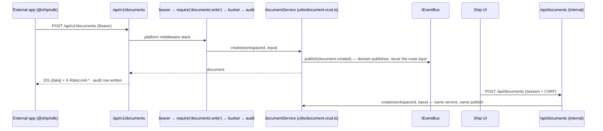
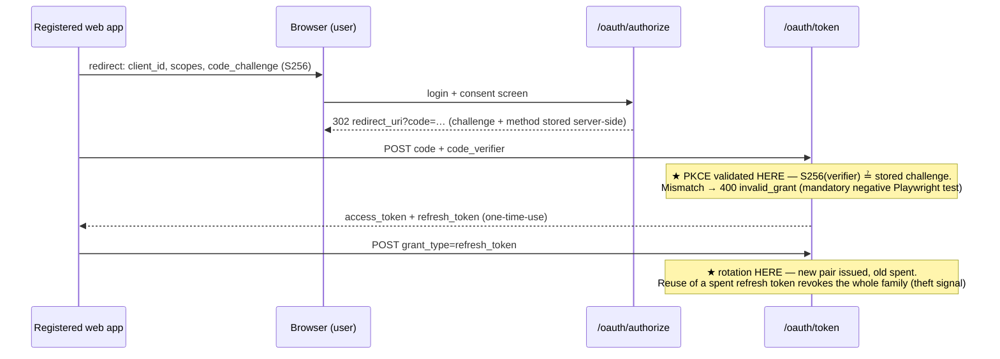
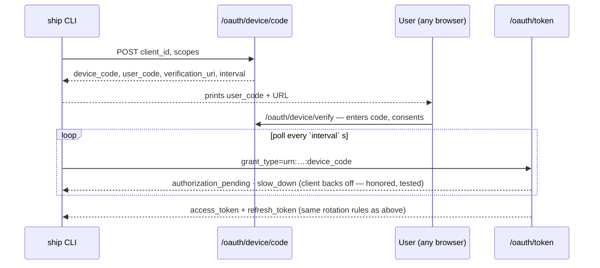
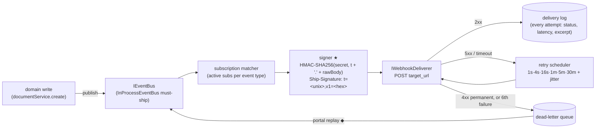

# Architecture Appendix — PlugForge (Week 6)

**This is the long form.** [`docs/architecture.md`](architecture.md) is the submitted
Architecture Document. It carries the nine sections of p.12's Section/Content table and the
artifact each row names — the composition-root pseudo-code and its test sibling, the
boundary, OAuth, and agent before/after diagrams, the stable / pre-1.0 SDK split, and the
four failure modes p.12 lists by name — which is why it runs past p.13's 1–2 page cap.
Everything here is the reasoning underneath those artifacts: the rejected alternatives, the
measured numbers, the decision records, and the long-form diagrams.

Nothing in this file is required reading to grade the Architecture Document row. It exists
because the depth is real and deleting it to satisfy a length cap would have been the wrong
way to meet the cap.

---


**Scope.** Ship (Part 1/2) becomes a platform: a versioned public API at `/api/v1/`, OAuth 2.0 (Authorization Code + PKCE, Device Grant), Stripe-style signed webhooks, a typed SDK (`@ship/sdk`), and the FleetGraph agent rewired from privileged insider to platform citizen. Modules marked **(new)** ship this week; unmarked paths exist today.

## Module Layout

```
api/src/platform/            (new) everything public-facing; imports domain services, never route files
  apps/                      oauth_apps registry — create/rotate/list; client_secret hashed (SHA-256, unsalted, high-entropy), raw shown exactly once, never recoverable
  oauth/                     RFC 6749 Auth Code + 7636 PKCE + 8628 Device Grant; token issuance; one-time-use refresh tokens with family revocation
  scopes/                    ScopeRegistry — scopes-as-data (documents/issues/sprints × read/write, webhooks:manage) + require(scope) middleware factory,
                             pure grant-time validation (requested-scope check, issuance intersection, upgrade policy) that OAuth calls before issuing
  ratelimit/                 IRateLimiter + in-memory token bucket (per-app and per-token); emits X-RateLimit-* headers, 429 + Retry-After
  webhooks/                  event registry (Zod-typed, 8 types), IEventBus + InProcessEventBus, subscription matcher, HMAC signer,
                             IWebhookDeliverer, retry scheduler, delivery log, DLQ + replay
  api/v1/                    the ONLY public router — fresh middleware stack, ApiError envelope, opaque cursor pagination ({data, next_cursor});
                             resource-map.ts is the one place public `sprints` maps onto Ship's internal `weeks` route — the contract name, not the table name
                             (`document_type` has said `sprint` since Part 1, so the translation is route-path and vocabulary only)
  openapi/                   public OpenAPI 3.1 registry; generated from route metadata, served at /api/v1/openapi.json
  audit/                     public API call log — timestamp, app client_id, user_id, route, scope, status, latency, request_id; queryable in the dev portal
  clock.ts                   Clock / SystemClock / FakeClock — a file, not a module; the retry scheduler, the token bucket and OAuth expiry all read it
sdk/                         (new) @ship/sdk workspace package — see SDK Surface
integrations/cli/            (new) must-ship reference integration (ship login / docs / webhooks tail); imports ONLY @ship/sdk (workspace dep rule)
api/src/routes/, utils/      existing internal surface (/api/*) — session+CSRF auth, unchanged; domain logic in utils/document-crud.ts et al.
web/src/                     existing React UI; the (new) developer portal pages consume /api/v1 like any external client
agent/                       existing FleetGraph agent (LangGraph) — Epic 7 swaps its data path onto the SDK
```

The public/internal split is enforced mechanically, not by convention: an ESLint `no-restricted-imports` boundary rule fails the build if `api/src/platform/api/v1/` imports from internal route files, and `integrations/*` may depend only on `@ship/sdk`.

## SOLID Rationale

- **S — Single Responsibility.** Each platform concern is its own middleware module under `api/src/platform/` (authN in `oauth/`, authZ in `scopes/`, throttling in `ratelimit/`, recording in `audit/`). Domain logic stays where Part 1 put it (`api/src/utils/document-crud.ts`); the platform layer wraps it and never re-implements it.
- **O — Open/Closed.** `ScopeRegistry` (`platform/scopes/registry.ts`) and the event registry (`platform/webhooks/events.ts`) are data. Adding `sprints:write` or `sprint.completed` is a registration at module load — no middleware edit, no route audit. The 403 handler reads the registry to name the missing scope.
- **L — Liskov Substitution.** `InProcessEventBus` (must-ship) and a queue-backed bus are drop-in substitutes behind `IEventBus`; likewise `InMemoryDeliverer` (synchronous, for tests) vs. the HTTP deliverer behind `IWebhookDeliverer`. Tests assert against the interface contract, so swapping in BullMQ later is a composition-root change only.
- **I — Interface Segregation.** The SDK is resource-segregated: `client.documents`, `client.issues`, `client.sprints`, `client.webhooks` (`sdk/src/resources/`). A CLI that only tails webhooks compiles against exactly that client — not a 40-method god object.
- **D — Dependency Inversion.** Domain services publish through `IEventBus` and know nothing about HTTP delivery, signing, or retries; `app.ts` injects concretes. Same for `IRateLimiter`, `ITokenStore` (SDK side), and the clock the retry scheduler reads — which is what makes retry tests deterministic instead of `setTimeout`-flaky.

## Composition Root

`createApp()` in `api/src/app.ts` is today the single place the app is assembled (helmet → rate limit → session/CSRF → the internal routers — **38** `app.use('/api/…')` calls over **30** distinct path prefixes, plus the two `/api/v1` mounts). PlugForge extends the same function — it stays the only file that chooses concretes:

```ts
export function createApp(deps = productionDeps()) {
  const { bus, deliverer, limiter, clock, db } = deps;         // injected concretes

  registerScopes(scopeRegistry);                               // scopes-as-data (OCP)
  registerEventTypes(eventRegistry);                           // 8 Zod-typed event types

  const signer   = new HmacSigner();                           // Ship-Signature: t=<unix>,v1=<hex-hmac>
  const retries  = new RetryScheduler({ clock, deliverer, log: deliveryLog(db) });
  // The ladder is RETRY_SCHEDULE_SECONDS — [1, 4, 16, 60, 300, 1800], p.4's own
  // list — imported, never restated. It used to be an inline array literal here,
  // which made this graded document a second copy of the schedule. Six rungs,
  // but MAX_ATTEMPTS = 6 attempts consume only FIVE of them: intervals sit
  // between attempts, attempt 1 is immediate (p.5's Testing Scenario 7 requires
  // it), and the 30 m rung is therefore unreachable. See platform/webhooks/retry.ts.
  const pipeline = new WebhookPipeline(bus, subsRepo(db), signer, deliverer, retries, deliveryLog(db));

  const v1 = createPublicRouter({                              // fresh router — shares NO middleware with /api
    auth:  bearerTokenMiddleware(tokenRepo(db)),               // invalid/missing/expired → 401, distinct codes
    scope: requireScope(scopeRegistry),                        // insufficient → 403 naming the missing scope
    limit: rateLimitMiddleware(limiter),                       // 429 + Retry-After; X-RateLimit-* on every response
    audit: publicAuditMiddleware(auditRepo(db)),
    error: apiErrorMiddleware(),                               // every failure → { code, message, details?, request_id }
    openApiDocument: generatePublicOpenAPIDocumentOrDie(),     // throws ⇒ createApp() throws (see Failure Modes)
  });                                                          // served INSIDE the router by mountUnauthenticated,
                                                               // above bearerAuth and above the catch-all
  app.use('/oauth', oauthRouter(appsRepo(db), tokenRepo(db), clock));  // concrete flows: authorize, token, device
  app.use('/api/v1', v1);                                      // public, versioned contract
  app.use('/api', internalRouters);                            // Part-1 surface, untouched
  return app;
}
```

**The openapi.json mount is inside the router, not below it (finding F11).** An earlier
version of this sketch showed `app.get('/api/v1/openapi.json', serveGeneratedSpec())` mounted
*after* `app.use('/api/v1', v1)`, and both halves of that are wrong against the router L08
built — twice over, quietly. Express matches the `/api/v1` mount first, and the router ends
with `notFoundHandler()` then `apiErrorMiddleware()`, so a route registered below that line is
never consulted: it returns a well-formed `not_found` envelope that reads like a wrong URL
rather than a wrong mount order. And `router.use(deps.bearerAuth)` blankets every path beneath
it, so the spec MVP gate item 10 requires a grader to fetch without credentials would have
answered 401. `mountUnauthenticated` is the seam that fixes both; the header of
`api/src/platform/openapi/route.ts` carries the full finding.

**`registerScopes` and `registerEventTypes` are the sketch's names and were never built.**
Neither identifier exists anywhere in `api/src`. What shipped is simpler and makes the same
Open/Closed point without a boot-time step: the scope set is the `SCOPE_DEFINITIONS` array in
`platform/scopes/scopes.ts` and the event types are a frozen `EVENT_TYPES` in
`platform/webhooks/events.ts`, both module-level `as const` data. `docs/architecture.md`'s
Composition Root carries the shipped shape; this block is kept as the sketch it was, with the
differences named here rather than silently edited into looking prescient.

**What the webhook half of that sketch is called in the code, now that it exists (L15).**
The sketch predates the build and its shapes are close but not literal; the names below are
the ones a reader should grep for. `subsRepo(db)` is `PgWebhookSubscriptionRepo(pool,
envSecretCipher())`, constructed in `productionDeps()` and nowhere else. `new HmacSigner()`
is `new SignatureSigner(deps.clock)` — the clock is a constructor argument with no default,
which is what makes the tolerance boundary testable without sleeping. `new
WebhookPipeline(...)` is `bus.subscribe('*', createWebhookPipeline({ repo, signer, queue }))`
— a handler registered on the bus rather than an object holding one, so the direction of
the dependency matches the diagram. `retries` and `deliveryLog(db)` are **not** wired yet:
they are L16's, and the `queue` argument is the seam they arrive through
(`ImmediateDeliveryQueue` today, first attempt only and no retries).

Sibling test wiring — same shape, in-memory concretes, no network and no clock:

```ts
// api/src/deps.ts — the sibling of productionDeps(), same shape, in-memory concretes
export const testDeps = (overrides: Partial<AppDeps> = {}): AppDeps => ({
  bus: new InProcessEventBus(),      deliverer: new InMemoryDeliverer(),   // resolves synchronously
  limiter: new InMemoryTokenBucket({ capacity: 100, refillPerSecond: 100 / 60 }),
  clock: new FakeClock(),  db: pool,  corsOrigin: 'http://localhost:5173',
  ...overrides,
});
createApp(testDeps());   // retry-schedule tests advance FakeClock; no setTimeout anywhere in tests
```

## Public/Internal Boundary

Both surfaces call the **same domain services**; auth/scope/rate-limit/audit/webhook concerns attach only at the public layer. Internal `/api` keeps its session+CSRF stack (`api/src/middleware/auth.ts`) byte-for-byte.



Contract details asserted by fitness tests over every `/api/v1` route: OpenAPI entry exists, a scope is declared, failures ship the `ApiError` shape (`unauthorized | forbidden | not_found | validation_failed | rate_limited | server_error`), list endpoints paginate with opaque base64 cursors over `{id, timestamp, resource}` — three keys, not two: `resource` binds a cursor to the collection that minted it, so a cursor replayed against another resource is a `validation_failed` rather than a plausible-looking wrong page (`decodeCursor` returns `foreign-resource`).

### Error envelope decisions

The code set above is **closed at six** and is printed verbatim in the PRD (p.7). Three
things about it are ours to defend rather than the PRD's to dictate:

**`validation_failed` → 422, not 400.** The PRD names statuses only for 401 (p.2, p.3),
403 (p.3) and 429 (p.4). 422 is the honest code for the case: the request body parsed
fine, so the syntax was never in question — what failed is the semantics. The single
`400` in the PRD (p.2) is `invalid_grant` on `/oauth/token`, which is RFC 6749's error
format on a route that is not under `/api/v1` and is not an `ApiError` at all; the code
union deliberately has no `invalid_grant` member. Anyone reading a 400 from this API is
therefore reading an OAuth error, and anyone reading a 422 is reading a validation
error — the two never blur.

**The envelope is identical everywhere; `details` is the only variable part, and its
sub-shape is fixed per CODE, not per route.** `validation_failed` carries
`details.fields[]`; `forbidden` carries `details.{missing_scope, granted_scopes,
scope_description}` (p.2 requires the 403 to name the missing scope, which is what
forces `details` to exist at all); `rate_limited` may carry
`details.retry_after_seconds`; `unauthorized` may carry `details.reason` — a closed
enum of `expired | invalid | missing` that satisfies MVP gate item 3's "401 with a
distinct error code" without adding a seventh `ApiErrorCode` to a union the PRD prints
verbatim on p.7 (dispute B14); `not_found` and `server_error` omit
`details` entirely. Per-route detail shapes were available and were rejected: a consumer
that has to learn a different error body per endpoint has no envelope, only a
convention. `apiErrorBodySchema` (Zod, `.strict()`, discriminated on `code`) is the one
definition of this, and both the serializer and the fitness harness import it.

**Codes map 6 → 5 onto the SDK's `kind` union, not 1:1.** `unauthorized` and `forbidden`
both surface as `kind: 'auth'`, because the question an SDK consumer's `catch` block is
actually asking is "would a better token fix this?" — and for both, it would. The
mapping is published as data (`SDK_KIND_BY_CODE`) so the SDK imports it rather than
restating it.

**`request_id` is minted server-side, always, and an inbound `X-Request-Id` is ignored.**
It is the join key for the audit trail (p.4). A client-supplied key lets a caller collide
its rows with another app's, or forge a trail that never happened, and the value of an
audit trail is exactly that the audited party did not write it.

**A body-parser failure is a client error, not a server error.** `express.json()`
rejects an oversized or malformed body by calling `next(err)` with an error that is not
an `ApiError`, and the terminal handler correctly scrubs anything it does not recognise
into `server_error`/500. That is the wrong answer here and it costs a consumer real
time: 500 means "we broke, retry", so an SDK with a retry ladder retries a 2 MB body at
exponentially increasing intervals until it gives up. `bodyErrors.ts` translates them
into `validation_failed` with `details.fields[{ field: 'body' }]`. **422 and not 413** —
HTTP's answer is 413, but the code set is closed at six and the status is derived from
the code, so a 413 would require a seventh member of a union the PRD prints verbatim.
That is a real cost of the closed set, and it is recorded here rather than hidden: the
status is imprecise, the code and message are not.

### Pagination and versioning decisions (L08)

**Where the pagination line falls.** A collection endpoint backed by a database table
paginates with an opaque cursor; a collection whose cardinality is bounded by CODE
returns `{ data }` with no `next_cursor`. The test is **bounded-by-code vs.
bounded-by-data**, not small vs. large — "small" is a judgement about today's contents
that nothing re-checks, while a list whose length is a compile-time constant cannot grow
into a pagination bug without someone editing this repository. The `as const` collections — `routeMetadata.ts` names `/api/v1/scopes` and
`/api/v1/events` as the worked example — would declare `list: 'none'`; the document-backed
collections declare `'cursor'`. **Neither of those two routes is mounted today**: the pair is
the illustration the rule was written against, not shipped surface. The routes that actually
declare `'none'` are `/api/v1/me` and `/api/v1/openapi.json` (`laneParity.test.ts` asserts
exactly that set). The field is required with no default and `createApp()`
throws at wiring time on a route that omits it, because "nobody thought about it" and
"it does not paginate" must not look the same to Testing Scenario 4's clause (d).

**The sort key is `(created_at, id)`, and it is not `position`.** The internal list sorts
by `ORDER BY position ASC, created_at DESC` over a column drag-reorder rewrites
(`api/src/routes/documents.ts:120`). Paginating on a mutable column means a user
reordering a sidebar corrupts a concurrent API walk, which is exactly what "cursors are
stable across reordering operations" (p.3) forbids. The keyset is a row comparison —
`(created_at, id) < ($1, $2)` — because the logically equivalent `OR` form plans as a
bitmap-or or a seq scan rather than an ordered index range scan; migration 063 ships the
covering index and `assertKeysetIndexed` EXPLAINs the real page query to keep it honest.

**Four things the PRD does not name, and our answers:** the page-size parameter is
`limit`; the default is 25; the maximum is 100; the order is newest-first. An
out-of-range `limit` is **rejected, not clamped** — clamping is the more common industry
choice and it turns the loop a CLI author actually writes,
`while (data.length === limit)`, into an infinite one. Query parameters are a **strict
allowlist**: `offset`, `page`, `per_page`, `fields`, `sort` and `order` each return 422
with a message pointing at what to use instead. That is a strong policy with a real cost
— a future optional parameter is a breaking change for a caller already sending it — and
it is the only cheap way to make "sparse fieldsets are out of scope" verifiable rather
than merely asserted.

**Versioning past `/api/v1/`: additive-only within v1; a breaking change goes to
`/api/v2/`; no deprecation or sunset headers this week.** Pre-Search 2.2 (p.16) poses the
question and offers three answers without choosing. Additive-only means a new optional
response field or a new endpoint may land in v1, while removing a field, renaming one,
narrowing a type, or tightening validation may not. Deprecation headers were rejected
because they are a promise about a lifecycle — a sunset date, a migration guide, a
support window — and by Sunday there are no external consumers to make that promise to.
Shipping the header without the lifecycle would be a claim the project cannot keep.
Enforced structurally rather than by convention: a test asserts the public router is
mounted at exactly one version prefix and that no registered route path contains a
second version segment.

### Audit-trail decisions (L12)

**Retention: 30 days of raw rows, plus a per-day-per-app rollup kept indefinitely
(decision D10, PF-341).** PRD p.10's Cost Analysis assumptions list requires *"plus audit
log rows. State both"* retention windows and explain why each is set there. This is ours;
the delivery log's is L16's.

The reason is Epic 7, not storage. p.13 grades the submission on *"the agent's audit-log
rows showing OAuth app"* authentication, and a policy that deletes the evidence for the
claim the project is graded on is the wrong policy at any price. Thirty days also
outlasts the grading window plus a re-review. Pruning is implemented against that number
(`platform/audit/retention.ts`) and rolls a day up **before** deleting it, in one
transaction — delete-then-rollup turns a retention job into data loss the first time it
is interrupted.

Rejected: **7 days raw only** — cheapest and demo-sized, but it makes the Epic 7 claim
unprovable a week after the demo. **Indefinite raw** — no pruning to write and every
question stays answerable, but see the arithmetic below.

What is deliberately lost at 30 days: the rollup keeps counts per app per day, not
per-route or per-request detail. After 30 days you can prove "this app made 412 calls on
2026-08-12, 9 of them 4xx" and you cannot answer "which document did it read". The first
question is what Epic 7 and the portal's usage view ask; the second is a debugging
question whose useful life is days.

**Row-growth arithmetic (PF-342).** Measured, not estimated: 200 000 synthetic rows were
inserted into the shipped `public_api_calls` table and `pg_total_relation_size` read back.

| | bytes/row |
|---|---|
| heap | 141 |
| indexes (3) | 214 |
| **total** | **356** |

The indexes cost more than the data, which is the correct trade for a table that exists
to be queried by app and by request id, and it is why the total is the number the
arithmetic below uses rather than the heap alone.

Against p.9's projection tiers (100 users → ~20 000 calls/day; 100 000 users → ~20 000 000
calls/day; the two middle rows interpolate on the same per-user rate):

| tier | calls/day | rows in 30 days | raw storage at 356 B/row |
|---|---|---|---|
| 100 users | 20 000 | 600 000 | **≈ 0.2 GB** |
| 1 000 users | 200 000 | 6 000 000 | ≈ 2.1 GB |
| 10 000 users | 2 000 000 | 60 000 000 | ≈ 21 GB |
| 100 000 users | 20 000 000 | 600 000 000 | **≈ 214 GB** |

That table is the whole case against indefinite raw retention: at the top tier it is
~214 GB *per month*, growing without bound, on a single Postgres instance. It is also why
30 days is affordable at the tiers this project will actually see — a fifth of a gigabyte
at the demo tier.

The rollup is one row per app per day. At 50 registered apps that is ~18 000 rows a year,
under 4 MB with its index, which is why "indefinite" costs essentially nothing.

**Epic 7 proof mechanism: a fitness test, with a SQL query for the demo (decision D11,
PF-344).** Pre-Search 3.5 (p.18) asks how you would tell, post-demo, that *"the agent
actually went through the public API for every action"*, and offers a grep of the audit
log, a dashboard panel, or a fitness test that runs the agent and inspects the trail.

**Shipped choice: the fitness test as the graded artifact, with `callsPerDay` as the demo
query.** The PRD's own phrasing is "for **every** action", and a grep establishes only
that *some* calls went through the front door — it cannot see an action that bypassed it,
because the evidence of a bypass is an absence. The fitness test is also the only option
that keeps proving it after the demo.

Rejected: **a grep or SQL query alone** — cheapest, and it is kept as the demo artifact
precisely because a query is what you show on a screen, but it cannot establish the
"every" half. **A dashboard panel** — demo-friendly, but a screenshot is not an assertion
and it costs L22 work for evidence that decays the moment the data does.

**Owners, because this decision is not L12's alone to execute:** L23 owns the agent
rewire and therefore owns the fitness test. L22 owns the portal panel, which remains
worth building for operators but is not the graded proof. L12 owns what both consume —
the rows, the `listCalls` query surface, and `callsPerDay`.

**Known limitation, disclosed rather than designed around (B11).** `PublicApiCallRecord`
is a closed key set, so a call the developer portal made on a user's behalf is
indistinguishable in this trail from a call the developer's own integration made: both
authenticate as the same app with the same token type. Adding a "came from the portal"
field would undo PF-326, the ticket that exists to keep this row from growing fields.
L22's PF-676 discloses the limitation in the UI instead.

### Rate-limiting decisions (L11)

**`X-RateLimit-Reset` on a windowless bucket (PF-307).** A token bucket has no window
boundary, so "reset" is defined rather than derived: on an allowed response it is the
unix second at which the bucket is **full** again, and on a 429 it is the unix second at
which **one** token is available. A client being served wants to know when it can resume
its normal rate; a throttled client wants the earliest useful retry, which is also what
`Retry-After` says. Rejected: seconds-remaining rather than an epoch (every
`X-RateLimit-Reset` in the wild is an epoch), and one-token-available on allowed
responses too (identical to *now* while the bucket serves, which is what the L01 sketch
returned and is information the client already had). Both branches are strictly in the
future and rise monotonically as the bucket drains.

**The denominator for p.6's "100% of public API responses with rate-limit headers"
(PF-313).** Taken literally the target includes responses the per-app/per-token limiter
never runs for, because something above it answered first: a 401 from bearer auth, a 404
on an unmatched `/api/v1` path, and `/api/v1/openapi.json`, which is mounted above
bearer auth by design and which L13 measured (F45) as bypassing the limiter entirely.
**Shipped: an unauthenticated fallback bucket keyed by client IP** (`v1_anon_rate_limit`,
above both the unauthenticated mount and bearer auth), so the literal 100% is true and
those responses carry a real decision. Rejected: scoping the target to authenticated
responses and documenting the deviation — defensible, but it leaves the most-polled
public endpoint unthrottled for the sake of a sentence; and a header-emitting shim that
back-fills placeholder values, because a number that corresponds to no bucket is worse
than a missing header, since a client will plan against it. The anon bucket charges
authenticated requests too, so its ceiling is configured **above** the per-app ceiling
(1200/min vs 600/min) — a backstop that binds before the real limit is not a backstop.
The residual caveat: a very large single-egress deployment can still meet it.

**Limits are per-process (PF-315).** Bucket state is a `Map` in one Node process. On the
single-service topology this deploys to, the configured limit is the real limit; on N
instances it becomes N × the configured rate. That is the cost of p.10's "token-bucket
in-memory must-ship", and the mitigation is the interface: `IRateLimiter` makes p.10's
own alternatives (`@upstash/ratelimit`, Redis, Cloudflare edge rules) a `productionDeps()`
edit. Full discussion, including the bucket-map eviction rule, in
`api/src/platform/README.md`.

**`/oauth/*` throttling (finding F29).** `/oauth/token` presents credentials and, until
L11 took the finding, met no rate limit at all: the lane was scoped to `/api/v1`, L04's
PF-107 asserts the internal `apiLimiter` does not reach the OAuth router, and L05's
PF-132 throttles only the device grant's `user_code` guess space. It is now throttled by
the same `IRateLimiter`, keyed by client IP, mounted in the composition root. The 429
keeps the **OAuth** error surface — `{error: 'slow_down', error_description}` per RFC
8628 §3.5, not the `ApiError` envelope — because `/oauth` is not `/api/v1` and an OAuth
client library looks for `error`, never for `code`.

## OAuth Flows





Access tokens are opaque high-entropy strings stored hashed (same discipline as the existing `api_tokens` table); the bearer middleware resolves token → app + user + granted scopes on every `/api/v1/*` request.

The authorization code itself is a row in `oauth_authorization_codes` (migration 065), not a process-local map: the token exchange is a different request that may land on a different instance, and a map would make the flow work on one process and fail on two. The row stores `sha256(code)` and never the code, carries the `code_challenge` and `code_challenge_method` the PRD requires be *recorded* at `/oauth/authorize`, lives 60 seconds, and is redeemable exactly once — `consumed_at` is set by a conditional `UPDATE … WHERE consumed_at IS NULL` inside the same transaction that issues the tokens, so two simultaneous exchanges yield one token pair and one `invalid_grant`. A **replayed** code returns `invalid_grant` *and* revokes the token family the first redemption produced, which is RFC 6749 §4.1.2's SHOULD and keeps one theft-response story for the whole grant rather than a strong one for refresh tokens and a weaker one for codes.

**Measured, p.6's "OAuth Auth Code + PKCE round-trip (P95) < 3s".** Twenty consecutive runs, one worker, testcontainers Postgres: **p50 949 ms, p95 980 ms, max 983 ms.** The number covers the three *server* legs — authorize render, consent POST, token exchange — and **excludes** human think time at the consent screen and browser paint; the exclusion is stated because a figure that quietly included think time would be measuring the user. One run is not a P95, which is why there are twenty. Recorded by `e2e/oauth-pkce.spec.ts`, which prints the line above on every run so the figure is re-derived rather than inherited.

### The consent screen: a server-rendered endpoint, same origin, own layout

PRD p.16 asks where the consent screen lives — "a route inside Ship's UI, a dedicated endpoint with its own minimal layout, or something else". It is the middle option: `GET /oauth/authorize` renders its own HTML on Ship's origin, outside React, and the decision POSTs to `/oauth/authorize/decision`.

The argument is structural, not aesthetic. Ship's UI is a Vite SPA that boots a router, a query client and an IndexedDB-backed cache; routing the authorize leg through it puts MVP gate item 2's own Playwright test behind SPA hydration, and `playwright.config.ts` retries failures — so hydration flake would be retried into green and the gate would stop gating. Second, this response must carry its own `frame-ancestors`, `X-Frame-Options` and cache headers, which are per-response decisions the app-wide helmet configuration does not make. Third, it keeps `/oauth/*` a single request/response chain with no dependency on the frontend build, so the flow works against a bare API container.

**Rejected:** a React route, for the first reason above; and a third-party hosted login. Not because the PRD forbids one — **p.10's stack table explicitly lists it**: *"Hand-rolled minimal IETF-correct flows (RFC 6749 + 7636 PKCE + 8628 Device Grant) for learning; alternatives include node-oauth2-server, Ory Hydra, or Auth0 fronting Ship."* An earlier draft of this paragraph said nothing in the stack table permitted one, which inverted the argument: the table permits it and names two products. The reason we did not take it is the clause p.10 attaches to the hand-rolled option — *for learning* — plus what an external IdP would cost the graded artifacts. Ship being its own authorization server is what makes the OAuth sequence diagrams p.12 asks for describe code in this repository rather than a vendor's, and it is also the answer to p.17's question about keeping OAuth Playwright tests stable. There is no external IdP to stub or containerize, so the flow's only moving parts are Ship's own session login and a page with no client-side JavaScript: no hydration wait, no network-idle heuristic, no third-party redirect.

**Cost, stated:** this is the only non-React UI in the repository and somebody has to keep it looking like Ship. It is also a deviation from p.10's "the portal reuses the public API like any other client" — but p.10 says that of the *portal*, and p.17 places the consent screen *alongside* the portal rather than inside it.

**Clickjacking (p.16's second clause)** is answered with headers on the actual response, not with a reading of helmet's configuration: `Content-Security-Policy: frame-ancestors 'none'`, `X-Frame-Options: DENY` and `Cache-Control: no-store`, set explicitly on the OAuth router above every route, and asserted both on the response and inside a real framed browser. Helmet is configured once app-wide with an explicit directives object that sets `frame-src` and **not** `frame-ancestors` — different directives solving opposite problems — so relying on it would be relying on another lane's configuration that no test pins.

**CSRF** on the decision POST is the same `csrf-sync` synchroniser token the internal surface uses, injected rather than re-created so it shares one session store with the portal. The route additionally **refuses bearer authentication outright**: `conditionalCsrf` in `app.ts` skips CSRF whenever an `Authorization: Bearer` header is present, which is safe only because the internal middleware does not fall back to session auth on an invalid bearer, and this route closes that locally rather than depending on the coupling.

### The device verification UX: a code-entry form, with the completed URI as a confirmed convenience

PRD p.16 asks it as a genuinely open question — *"For the Device Authorization Grant: what is your verification URL UX — do users paste a code into a form, or do you embed the code in a URL they click? RFC 8628 allows both."*

**Both ship, and the form is the normative path.** `GET /oauth/device/verify` renders a one-field form; `POST /oauth/device/verify` accepts the code and shows consent; `POST /oauth/device/verify/decision` records it. `verification_uri_complete` (RFC 8628 §3.3.1) is returned alongside `verification_uri` and pre-fills that field.

The form is normative because it is what p.3 actually requires — *"`/oauth/device/verify` accepts the `user_code`"*, and a URL that carries the code does not "accept" it — and because p.7's SDK callback `onUserCode: (code, verifyUrl) => void` hands the caller a code *and* a URL as two separate values, which presumes the user does something with the code.

**The load-bearing part is not which one ships. It is that the completed URI still renders the code and asks the user to confirm it matches their terminal.** Without that confirmation the completed URI is a one-click device-phishing primitive, and RFC 8628 §5.4 names exactly this attack: an attacker starts their *own* device flow, sends the victim the completed URL, and the victim authorizes the attacker's device believing it is their own. The consent screen therefore displays the `user_code` prominently and asks for the comparison in words, with a Deny prompt naming the attack. A test asserts the code appears in the rendered body — an implementation that dropped it would pass every other assertion in the lane.

**Rejected:** form-only, which is a worse demo for no security gain (the form stays reachable either way, and the confirmation is what does the work); and complete-URI-only, which removes the confirmation step and contradicts p.3.

**Cost, stated:** the confirmation is one extra thing to read on a screen users will click through, and it is only as good as the user's attention. It is still the only control available — the server cannot distinguish the victim's browser from the attacker's.

The screen reuses the authorization-code consent screen's hardening rather than restating it: one template family (`consentPage.ts`), the same `frame-ancestors 'none'` / `X-Frame-Options: DENY` / `Cache-Control: no-store` set router-wide, the same unconditional `csrf-sync` protection, and the same outright refusal of bearer authentication — each asserted on *this* route rather than assumed from the neighbour.

**Guessing the `user_code`** is bounded by the product RFC 8628 §5.1 actually requires, not by either half alone: a 28-character ambiguity-free alphabet at length 8 gives ≈ 38.5 bits (3.8 × 10¹¹ codes), and `/oauth/*` is rate-limited at 30 requests/minute per IP — so a code is exposed to at most ~300 attempts across its whole 600-second life, giving P(hit) ≈ 10⁻⁶ even assuming a hundred codes live at once. On top of that transport limit the verification screen counts *failed lookups* per session and per IP, cutting entry off for 15 minutes after five, and **invalidating any code found after three distinct wrong ones** — after three misses a correct guess is evidence about the guesser, and the legitimate user re-runs one command. The arithmetic is asserted against the shipped constants, so lowering the entropy or loosening the limit fails a test rather than quietly invalidating this paragraph.

### The `/oauth` error surface is deliberately **not** the `ApiError` envelope

`/oauth/*` emits RFC 6749 §5.2's `{error, error_description?, error_uri?}`. `/api/v1/*` emits `ApiError`. Two specifications govern two surfaces and they are not collapsed.

This is not an oversight in the error-envelope work above, it is a consequence of it. The PRD's only `400` is `invalid_grant` on `/oauth/token` (p.2); the `ApiError` union is closed at six codes printed verbatim on p.7 and contains no `invalid_grant`, and its status map has no 400. Wrapping an OAuth failure in the public envelope would ship a contract violation to every RFC-compliant client — an OAuth library looks for `error`, not for `code` — including the browser PKCE demo and any grader's off-the-shelf client. One Zod schema, `oauthErrorBodySchema`, is the assertion oracle for every negative test on this surface, and a fitness test asserts no `/api/v1` route can emit an OAuth error body.

The consequence worth stating rather than leaving to be discovered: because `/oauth` is mounted as a sibling of `/api/v1` and shares none of its middleware, the public audit middleware never sees a token exchange, so no `public_api_calls` row will ever record one. That is precisely the gap the `client_secret` auth log fills with its own signal. If a later change moves `/oauth` under `/api/v1`, the fitness test asserting the separation fails — which is the intended trigger to revisit both.

### Scope upgrades: re-consent with union

A client that holds `documents:read` and now needs `documents:write` restarts `/oauth/authorize`. The user is shown the **union** of what they already granted and what is newly requested, consents once, and a fresh token replaces the old one. There is no partial grant, no mutable grant record, and no state meaning "granted A, pending B". The policy lives in one function — `resolveScopeUpgrade()` in `platform/scopes/validation.ts` — that both the authorization-code and device flows call, rather than being re-derived in each.

The alternative is incremental consent: the new token carries only the increment and the client holds several tokens at once. It is the better product answer, and Google ships it. It is the wrong answer for this build, because it turns a grant from a fact into an accumulator: every code path that reads scopes has to merge across live tokens, and revocation has to reason about which of several tokens carried which grant. Re-consent-with-union keeps a token's scope set immutable for its whole life, which is the property the rest of the scope layer assumes — `reconcileTokenScopes()` can treat a presented token as a complete statement of what its bearer may do, and the audit trail's `scope used` field has one token to point at rather than a set.

The cost is real and it is the user's: they see a consent screen again, listing permissions they already approved. Showing the union rather than the delta is what keeps that screen truthful — the user is consenting to the whole of what the new token will carry, not to an increment whose base they would have to remember. `resolveScopeUpgrade()` returns `requiresConsent: false` when the existing grant already covers the request, so the screen is never shown for a no-op.

The authorization-code half of this policy is implemented by *doing nothing special*, and that is the point. There is no grant table, no lookup of a prior grant and no `UPDATE` against one: a client that now wants more restarts `/oauth/authorize` asking for the union, the user sees every scope the new token will carry, and a fresh token replaces the old. The only `UPDATE` this flow performs anywhere is `consumed_at` on the code row, which belongs to single-use redemption rather than to a grant record — a fitness test asserts exactly that one statement and no other. The absence of grant state is what makes the decision cheap, so the absence is what is tested.

## Webhook Pipeline



★ **Signature is computed at send time, per attempt**, with the subscription's **current** secret (**encrypted** at rest, shown once on creation) — the timestamp in the signed payload is what defeats replay; the SDK verifier rejects signatures older than 300 s by default. ◆ **Idempotency-Key originates at the event's first delivery** (derived from `event_id` **and** `subscription_id` — one event legitimately produces N deliveries, and keying on the event alone would hand two unrelated apps that happen to share a target URL the same key, so a subscriber doing its job would dedupe one of them away). It is **persisted on the attempt-1 row and read back thereafter, never recomputed**, and is carried unchanged through every retry and portal replay — that key is the subscriber's dedupe contract, and the persistence is what makes it survive any future change to the derivation.

### The timestamp: what it defends, the window, and clock drift (L15 PF-447)

PRD p.13 asks all three in the interview list: *"Why a timestamp in the header — what
attack does it prevent, and what is your tolerance window? What happens if your server's
clock drifts?"*

**The attack.** Capture-and-resend. A signed webhook is a valid, correctly-MACed HTTP
request; anyone who observes one — a compromised proxy, a logged request body, a
subscriber's own archived traffic — can send it again, unchanged, and it verifies
forever. That turns "the subscriber created one issue" into "the subscriber created a
thousand". The timestamp defeats it because `t` is **inside the signed bytes**: an
attacker cannot refresh it to the current second without invalidating `v1`, and cannot
recompute `v1` without the secret. The old `t` is what the verifier rejects.

The timestamp is not a substitute for idempotency, and neither replaces the other. The
window bounds *how long* a captured request stays usable; `Idempotency-Key` is what stops
a legitimately-retried delivery being applied twice. A subscriber needs both.

**The window: 300 seconds.** Stripe's default, and the reasoning transfers: wide enough
to absorb the ordinary skew between two hosts that both run NTP plus a slow retry, narrow
enough that a captured request is worthless within minutes. It is the default of the
published `verifyWebhook(headers, rawBody, secret, toleranceSec = 300)` (p.7) and it is
asserted from **both** sides — 300 s verifies, 301 s does not — so the boundary is a
tested fact rather than a documented intention. The tolerance is symmetric: a timestamp
300 s in the *future* is rejected too, because that means either a broken sender clock or
someone pre-minting signatures to replay later.

A caller may narrow it. Nobody can widen it past what their own verifier accepts, which is
the right place for the decision to live — the subscriber, not us, knows how stale a
request they are willing to act on.

**Clock drift.** A server running fast or slow by more than the tolerance signs payloads
that **every** subscriber rejects. The symptom is distinctive and worth memorising,
because it is what tells drift apart from the other failure that looks like it:

| Symptom | Cause |
|---|---|
| 100% verification failure, **all** subscriptions, starting at once | server clock drift |
| One subscription failing, the rest fine | that subscriber's secret is stale — it did not update after a rotation |
| Failures that begin only after a delivery has been retrying a while | signing at enqueue instead of per attempt (which is why we sign per attempt) |

The control is NTP on the host — nothing in the application can detect its own clock being
wrong, because it has no second source of truth to compare against. What the application
*does* do is make the failure legible: the timestamp is emitted in unix seconds and read
from an injected `Clock`, so the value in a rejected header can be compared against a
subscriber's own clock and the drift read off directly.

The mechanical half of the answer is `SignatureSigner`, which takes a `Clock` as a
constructor argument with no default. A fitness test asserts `Date.now()` and `new Date()`
appear nowhere in `platform/webhooks/signer.ts`. That exists for testability first — it is
what lets the 300 s boundary be asserted without sleeping — but it also means there is
exactly one place a deployment's notion of time enters the signer.

**Where the signature is computed** is marked ★ on the pipeline figure above: after the
matcher has selected subscriptions, before the deliverer touches the network, once per
attempt. `signer.ts` holds the emitter, the parser and the reference verifier;
`__fixtures__/signature-vectors.json` holds eight committed vectors that both this server
and L18's SDK verifier are tested against, so the two implementations agree with the
specification rather than merely with each other.

### What is signed, and why the secret is encrypted rather than hashed (L15)

**The signed bytes are the timestamp, a literal `.`, then the raw body — `t` ‖ `.` ‖
`rawBody`.** PRD p.16's Pre-Search 2.3 asks the question (*"the raw request body, the
body plus the timestamp, the body plus a versioned scheme tag?"*) and does not answer it;
p.3 and p.7 constrain only the header shape, which is compatible with all three. This is
our choice and these are the two rejected alternatives.

*Not the raw body alone.* The timestamp would then be unauthenticated header data. An
attacker who captured one valid signed request could rewrite `t=` to the current second
and replay it forever — the signature over the body is still perfectly valid — and every
verifier on earth would accept it. The anti-replay property does not weaken, it
disappears. Putting `t` inside the MAC is what makes the tolerance window mean anything.

*Not a versioned scheme tag inside the signed bytes.* The tag lives in the header instead,
as the `v1=` key. That makes a future `v2` an **additional** header field a verifier
checks alongside `v1`: both can be emitted during a migration and each subscriber cuts
over on its own schedule. Baking the tag into the signed bytes would make the same
migration a breaking change to what is signed, so every subscriber would have to move at
once. The parser is deliberately tolerant of unknown `key=value` pairs today so that
adding one tomorrow breaks nothing already deployed — and deliberately strict about the
pairs it does read: a duplicated key returns `null` rather than last-wins, because two
answers to "what is the timestamp" is not a question a verifier may resolve by preference.

**One serialization, never two.** The envelope becomes a `Buffer` once
(`envelopeToRawBody`), and `DeliveryRequest.rawBody` is that same buffer — the bytes the
HMAC consumed are the bytes that go on the wire. `JSON.stringify` is not canonical: key
order, unicode escaping and float formatting may all differ between two serializations of
one logical value, so a verifier that re-serializes what it parsed computes a different
digest for a payload nobody touched. That failure presents exactly like an attack, which
is the worst possible way for it to present.

**The signing secret is AES-256-GCM encrypted at rest, not hashed — and that departs from
p.3's literal word.** p.3 says *"hashed signing secret"*; p.12's Failure Modes row asks
what happens when *"a subscriber's signing secret is rotated mid-flight"*, which presumes
the server re-signs each attempt with the subscription's current secret. HMAC-SHA256 is
symmetric and a cryptographic hash is one-way. The two requirements are not in tension —
they are mutually impossible, and the contradiction is the PRD's (filed as C3). The
tempting non-answer, storing `sha256(secret)` and signing with *that*, satisfies the word
and is theater: whatever the server signs with **is** the key, so a database dump forges
signatures either way, and it silently breaks p.7's printed
`verifyWebhook(headers, rawBody, secret)` unless the SDK hashes internally.

So the key lives in `WEBHOOK_SECRET_KEY` in the environment and never in the database;
`secret_ciphertext` holds nonce ‖ ciphertext ‖ tag. What that buys is confidentiality
against a **database dump** — a leaked backup, a snapshot in the wrong bucket — which is a
different event with a very different frequency from a compromised application host. It
buys nothing against an attacker who has the host, because the host has the key, and
nothing here claims otherwise. Decryption **fails closed**: a missing or wrong key throws,
the delivery aborts, and nothing is sent unsigned.

`oauth_apps.client_secret_hash` correctly stays hashed, and the asymmetry is one sentence:
a client secret is *presented back to us* and can be verified by comparing digests, so
hashing costs nothing; a webhook secret is *used by us to produce a MAC* and is never
presented, so hashing costs everything and buys nothing.

## SDK Surface

`@ship/sdk` (new workspace package). **Stable for the week:** `ShipClient` with resource clients (`documents`, `issues`, `sprints`, `webhooks` — method signatures fitness-tested against the OpenAPI spec, drift fails CI); `ShipClient.authorizationCodeFlow()` and `ShipClient.deviceLogin()`; async-iterator pagination (`for await (const doc of client.documents.iterate())` — consumers never see cursors); `verifyWebhook(headers, rawBody, secret, toleranceSec = 300)` → boolean in one call; typed error union discriminated on `kind: 'auth' | 'rate_limit' | 'not_found' | 'validation' | 'server'`. **Pre-1.0 (may move):** `ITokenStore` implementations beyond in-memory/file, OAuth helper option bags, CLI internals. Install footprint budget: < 250 KB min+gzip, production deps only, enforced in CI — **0 production dependencies**, which is the mechanism, and **228.0 KB** gzipped (233,463 B over 175 published files, 629.8 KB raw — **91.2%** of budget), which is the proof it ran. The method is gzip of the *unminified* published files, an upper bound on min+gzip, and the "KB" the script prints is 1024 bytes, the same unit as its 250 KB budget line. Re-measured on `pf/integration` at `d497daf` on 2026-08-15 from a clean build; `sdk/size-report.json` carries exactly these numbers, so the committed artifact and this paragraph agree. Every earlier reading in this paragraph's history — 208.8 KB over 163 files, then 218.4 KB, then 219.8 KB over 169 files — was correct when taken and went stale as published files landed; the file count is the tell, and it is quoted here so a reader can see which tree a number came from. Because the method gzips unminified output, **doc comments count against this budget**. Headroom is now **22.0 KB**, and the trend is one direction, so a further ~20 KB of published output would breach p.9 and the answer at that point is a minifier, not a re-measurement.

Regenerating is `pnpm --filter @ship/sdk build && pnpm --filter @ship/sdk size`, and it should be re-run before submission — but **delete `sdk/tsconfig.tsbuildinfo` first if you have also deleted `sdk/dist`**. `sdk/tsconfig.json` sets `composite: true`, so `tsc` consults the build-info file, concludes the outputs are current, and emits nothing; the CJS half then rebuilds normally. A `rm -rf sdk/dist && pnpm --filter @ship/sdk build` therefore produces a *half-populated* `dist` and the script cheerfully reports it — 84.3 KB over 59 files, well under budget and completely wrong. It exits 0, so nothing catches it. `verifyWebhook` p95 **0.020292 ms** against p.8's 1 ms target (mean 0.015639 ms, p50 0.012583 ms — the committed `sdk/perf-report.json`; an earlier draft of this paragraph printed 0.0137 ms, which matches no field in it), measured over 5000 iterations on a real `document.created` envelope and enforced by `pnpm --filter @ship/sdk perf:check`; both figures upload as one `sdk-budget-reports` CI artifact.

**The stable/pre-1.0 split above is also machine-readable and cannot drift from this paragraph** (L18 PF-548). `sdk/src/stability.ts` exports `STABLE_SURFACE` and `PRE_1_0_SURFACE`, and `surfaceStability.test.ts` asserts that every name the published barrel re-exports — types included, which needs a source parse since `import *` sees only values — appears in **exactly one** of them. There is no unclassified state and no default, so adding a surface costs one line saying what is being promised about it, which is the only reliable moment to ask. §4 of that test reads this very section and fails if the two disagree.

### The four resource clients, and what each one calls (L18 PF-521–532)

`client.documents` · `client.issues` · `client.sprints` · `client.webhooks` — four named classes, not one object with a namespace per resource, which is the Interface-Segregation evidence p.12 asks for. Each is `readonly` in the types **and** non-writable at runtime (`Object.defineProperty`, because `readonly` is erased by `tsc` and swapping `client.documents` for a look-alike is how a token goes somewhere it should not).

**Testing Scenario 5's second half runs against all 22 spec operations** (14 paths; counted from the committed `docs/openapi.json`). `sdk/src/operations.ts` publishes `OPERATION_BINDINGS`: one row per `operationId`, naming the SDK method that serves it. The method path is typed against the real classes, so a binding pointing at a method that does not exist fails `pnpm type-check`; a spec operation with no binding, or a public SDK method with no operation, fails `api/src/platform/openapi/sdkSurfaceParity.test.ts` **by name**. Parity is checked at signature level — required parameters covered, no invented parameters, request-body fields equal, return type equal to the 2xx schema field-for-field — because existence-only parity passes for a method that takes `any` and returns `any`. The spec-side walk is L13's `listSpecOperations` and nothing under `sdk/` parses an OpenAPI document; the test greps for a second parser, because Scenario 5 comparing two parsers would measure their agreement rather than the spec's agreement with the SDK.

**`sprints` is the public noun and Ship's internal one appears nowhere under `sdk/`** — a grep over the whole package asserts it, since a leaked internal noun in a published package cannot be taken back. The translation lives in `platform/api/v1/resource-map.ts` alone.

**`create()` returns the webhook signing secret once, and the type says so.** `webhooks.create()` and `.rotate()` return `WebhookSubscriptionWithSecret`; `.list()`, `.get()`, `.update()` and `.delete()` return `WebhookSubscription`, which has no `signing_secret` field at all. Two types rather than one optional field, so a consumer who reads the secret off a listed subscription fails to compile rather than handing `undefined` to `verifyWebhook` at 3am.

**Pagination terminates on what it receives, not on what the server promises.** `paginate` stops on `next_cursor: null`, on the key being **absent** (a stripped key used to send the walk back to page 1 forever — L99 F21), and on an empty page; a server that returns the same cursor twice raises `PaginationStalledError` rather than yielding duplicate rows silently. `iterate()`'s options type admits no `cursor`, so p.4's *"consumer code never sees them"* is a compile error and not a convention.

### `ITokenStore` — the contract, and where it lives (L17 PF-503/504/509)

Pre-Search 2.4 (p.17) asks three questions about this interface. The answers are here, and the interface is declared in `sdk/src/auth/tokenStore.ts` and exported from the package root.

**Three methods, structurally satisfied.** `load(): Promise<StoredTokens | null>` · `save(tokens): Promise<void>` · `clear(): Promise<void>`. Any object with those three methods is an `ITokenStore` — a consumer writing a Keychain or Vault store imports no base class and registers nothing. There is deliberately no `update`: a rotation replaces the whole pair, and a partial update is exactly the shape that lets an access token and a refresh token belong to different generations.

**It persists BOTH tokens, not only the access token** — `{accessToken, refreshToken | null, expiresAtSeconds | null, scopes[]}`. p.3 mandates one-time-use refresh with rotation, and the drill's stage-2 outcome measures persistence *across process restarts* (p.8); an access-token-only store makes `ship login` a device flow on every invocation and fails TTFE on the second command. The cost is stated rather than hidden: the file on disk now holds the credential worth stealing, which is why `FileTokenStore` writes `~/.ship/credentials.json` at mode 0600 inside a 0700 directory, atomically (temp file + `rename`, never truncate-then-write), and why no SDK code path puts a token into a message, a log line or a stack.

**Three implementations.** `InMemoryTokenStore` (the default, and the test double p.10 asks for), `FileTokenStore` (Node only — `@ship/sdk/node`, or the `node` export condition), `LocalStorageTokenStore` (browser; `localStorage` is XSS-readable, so it is the store the PRD names rather than the store to reach for when an in-memory credential would do).

**Threading model for refresh: single-flight, keyed on the store instance.** Concurrent 401s await one in-flight refresh promise and retry once with its result. This is not a performance choice — p.3's refresh tokens are one-time-use with family revocation, so two parallel refreshes present the same token twice and the second **revokes the family**, logging the user out. Ten concurrent expired calls produce exactly one `/oauth/token` request. The guarantee is process-scoped: two terminals sharing one `~/.ship/credentials.json` are two processes and this promise cannot see across them (D14, below). The client is therefore built to work under **strict** rotation and assumes no server-side replay window exists; it re-reads the store inside the critical section so a refresh performed elsewhere is picked up rather than overwritten, and it never retries a failed refresh. A cross-process lockfile is the real fix for concurrent CLIs and belongs with the CLI (L19), not with a library that also runs in a browser.

**Corruption.** See Failure Modes: a read that fails or returns garbage is logged-out — one attempt at most, `{ kind: 'auth' }`, and **no write-back**, including no `clear()`. `clear()` is a write, and a credential the SDK cannot parse may still be one a human can repair.

### Browser and Node entry points (L17 PF-507)

The package root used to re-export `verifyWebhook`, whose module imports `node:crypto` at top level, so any bundler resolving `@ship/sdk` for the browser pulled a Node built-in — failing to resolve, or silently polyfilling crypto into every consumer's bundle against a 250 KB budget. The `exports` map is now conditional: the `browser` condition resolves to `dist/browser.js` (client, errors, retry, `InMemoryTokenStore`, `LocalStorageTokenStore` — no `node:` specifier anywhere in its import graph), every other condition resolves to `dist/index.js`, which adds `verifyWebhook` and `FileTokenStore`. Node consumers are unaffected; `@ship/sdk/browser` and `@ship/sdk/node` exist for a consumer who wants to be explicit.

## Time-to-First-Event Drill

p.6's signature technical challenge, and p.14's *"The TTFE drill is the rubric."* One command —
`pnpm drill ttfe` — packs `@ship/sdk`, installs the tarball into an empty directory outside the
workspace, logs in through the device flow, subscribes, creates a document, receives the signed POST
on a real socket and verifies it. Six named stages (p.6's own list, in p.6's order), each recording
elapsed milliseconds into `test-results/ttfe.json`. Full operator detail in `docs/ttfe-drill.md`.

**The drill is a vitest run, not a Playwright spec, and that is a decision rather than a preference.**
`playwright.config.ts:60` is `retries: process.env.CI ? 2 : 1`. p.9's target is *"0% (any flake = bug
in the drill or the platform)"*, and a retry is precisely the mechanism that converts a flake into a
pass — so a drill written into the Playwright suite would forfeit its own headline target on a line
of config it never reads. `vitest.drill.config.ts` sets `retry: 0`, and
`scripts/ttfe/check-fitness.mjs` fails the build if that changes, if a fixed-duration sleep appears
in the drill or its harness, or if `@playwright/test` is ever imported by either.

**The boundary is kept structurally, not waived.** p.11 says `integrations/**` imports only
`@ship/sdk`; PF-587 needs a booted Ship, which needs server code. Those collide, and the resolution
is a process boundary: `scripts/ttfe/harness.ts` — which holds `pg`, `DATABASE_URL` and the
`api/src` entrypoint — lives outside `integrations/` and is spawned as a child process, spoken to
over HTTP. The drill file itself imports `@ship/sdk` (as types; the runtime namespace comes from the
real install), node builtins, vitest, and its own package's test support. The tempting alternative —
one `eslint-disable` on a `createApp` import — would make the drill the single place in the
repository where the boundary claim it exists to demonstrate is false. Same split, same reason, as
`scripts/l19-device-approve.ts`.

### Decision: a real install of the packed artifact, two cadences, symlink rejected (PF-589)

Pre-Search 3.2 (p.17) asks it outright — full `pnpm install` in a fresh container, or a workspace
symlink with the install step mocked? Which proves more, and which is fast enough for CI? **Answer:
a real install in both modes**, because those two are only a trade if there is one mode.

A workspace symlink resolves `sdk/src` through tsconfig `paths` and therefore never executes the
published artifact. The `exports` map, the `files` allowlist, the built `dist/` and peer-dependency
resolution all go untested, and each is a live way `pnpm install @ship/sdk` fails for a stranger
while CI is green. L99's F14 — `verifyWebhook` top-level-importing `node:crypto`, found
independently by two lanes — is exactly that class of bug. p.8's install row asks for *"Workspace
package resolves"*, *"types load in editor"* and *"no peer-dependency errors"*, and a symlink checks
none of the three honestly.

Cost, measured rather than estimated: **1.4–2.3 s** for `pnpm pack` plus `pnpm add <tarball>` into a
fresh temp directory with a warm store, against a 60 s budget for the whole loop. The seconds are
not the trade they look like.

**Two residual honesty gaps, stated rather than hidden.** First, the fast mode installs from a
**local tarball**, so registry resolution and network variance are exercised only by `--clean`; a
local Verdaccio would close that and buys coverage of npm's availability rather than of ours.
Second — and this one was a real defect, not a caveat — importing
`node_modules/@ship/sdk/dist/index.js` **by path** bypasses the `exports` map completely, which is
most of what the decision above is buying. The drill therefore writes a one-line
`export * from '@ship/sdk'` shim inside the install directory and imports **that**, so Node resolves
the bare specifier through the manifest the way a stranger's `import` does. The first version did
not, and the negative control for a wrong `exports` map stayed green through it (L99 F131).

### Where each target lives, and why two of them cannot collide

| Target | PRD | Where it is asserted |
|---|---|---|
| TTFE loop < 60 s in CI | p.8 | Per run in the drill; P95 over the last 20 runs in `check-series.mjs` |
| TTFE ≤ 30 min on a clean machine | p.6, p.8 | `--clean` mode and one human-timed run — **never** the fast mode |
| Webhook delivery P95 (first attempt) < 2 s | p.6 | `metrics.eventToPostMs`, P95 over the same series (L99 U5's owner) |
| `verifyWebhook` < 1 ms | p.8 | L18's recorded benchmark, asserted to belong to the build the drill installed |
| Drill flake rate 0% over 20 CI runs | p.9 | `scripts/ttfe/soak.sh` + `check-series.mjs --soak` |

The 60 s and 30 min figures pull in opposite directions, and the resolution is to give each its own
mode rather than to pick one. Both land in the same artifact carrying a `mode` field, so the two can
never be reported as each other.

**Every threshold above lives in `ttfe.thresholds.json` and nowhere else** (PF-609). Raising one is
then a reviewable diff with the number visible in it, which is the point: p.8's budget is graded, and
a budget that can be relaxed inside a test body is not a budget. A fitness check fails the build on a
second `60_000` literal anywhere in the lane's files.

**Timings carry the load they were taken under.** L99's F80 measured 6.0× P95 spread on one commit
on this hardware while query counts stayed bit-identical, under load ratios of 1.33–1.88 — and the
machine fingerprint matched exactly on every run, because it says *"same box"* and not *"the box was
idle enough to time on"*. So `ttfe.json` records `loadAvg1`, `loadRatio` and `loadCertified` beside
every number, and a figure taken above the veto is reported but not treated as certified.

## Agent-as-Citizen (Epic 7)

Today FleetGraph is a privileged insider by construction — two separate back doors:

```mermaid
flowchart TB
    subgraph Before["BEFORE — privileged insider"]
        API1[internal routes] -->|"TRIGGER: api → @ship/agent, in-process<br/>(routes/fleetgraph/agentBridge.ts)"| A1[FleetGraph agent]
        A1 -->|"direct SQL — agent/src/data/pool.ts,<br/>boundary.ts"| DB1[(Postgres)]
    end
    subgraph After["AFTER — platform citizen"]
        API2[internal routes] -->|"TRIGGER — unchanged, and not a back door"| A2[FleetGraph agent]
        A2 -->|"@ship/sdk"| V1["/api/v1/*"]
        V1 -->|"bearer + scopes + rate limit + audit ★"| SVC[same domain services]
        SVC --> DB2[(Postgres)]
    end
```



**The `api → @ship/agent` edge points the way it always did, and it survives the rewire.** It was drawn above as one of two "back doors" and it is not one: it is Ship *invoking its own app* from the chat endpoint, which is the same direction as a user pressing a button. The privilege the rewire removes is the arrow that used to run the other way — the agent reaching around the front door into Postgres. So the edge is relabelled rather than deleted, and L01's boundary fence is extended to `agent/src/**` in the direction that matters: nothing under `agent/` may import `api/src/`.

The agent authenticates as a first-party OAuth app (seeded by `db:migrate`, so it provably exists in deployed environments — see *First-Party App Seeding* below). The swap lives behind a feature flag, `SHIP_AGENT_VIA_SDK`, default **off**; CI runs the Part 2 regression suite with the flag **on and off**, which is what makes the rewire a refactor rather than a rewrite. ★ **The payoff is the audit trail:** every agent read now lands in the public audit log under the agent app's `client_id` — "the agent went through the front door" is provable with one query, not a claim. One LLM call per agent turn is unchanged; the platform itself does zero AI work.

### The three scopes, and the defence for each

Least privilege, not `*` — and under decision **D5b** that means **read-only**. Exactly three, and each is earned by a named reader rather than requested in case it is useful:

| Scope | What needs it |
|---|---|
| `issues:read` | `stalledWork.ts`, `reviewBottleneck.ts`, `reworkChurn.ts`, `loadImbalance.ts` and `sprintMissRisk.ts` all read `documents` filtered to `document_type = 'issue'` |
| `sprints:read` | `loadImbalance.ts` and `sprintMissRisk.ts` read `document_type = 'sprint'`; the sprint's calendar window comes from `sprintSchema`'s server-computed `start_date`/`end_date` rather than from the `workspaces` table, which has no public route and should never have one — it is tenant configuration |
| `documents:read` | `reworkChurn.ts` reads a `project` document and `graph/nodes/fetchParticipants.ts` reads a `person` document; both are `documents` on the public surface |

There is **no write scope, and no `webhooks:manage`.** `agentAppCitizen.test.ts` asserts the list is exactly those three and names any offender — the agent carried `issues:write` until 2026-08-12 under a comment claiming least privilege, which is the failure that assertion exists to prevent.

### The two write actions became recommendations, and that is a real change

The agent had three action kinds. `notify` never touched Ship over HTTP and is unchanged. The other two — `comment` (`POST /api/documents/:id/comments`) and `history_note` (`POST /api/issues/:id/history`) — **have no public route and no registered scope**, so under read-only there is nowhere for them to go.

Adding those routes was considered and rejected: it is exactly the sprawl p.2 warns against, and it would need two write scopes the seven-scope registry does not have. So under the flag both actions write a **recommendation** into `fleetgraph_notifications` — the agent's own table, carrying the same model phrasing, the same measurement and the same threshold the comment would have carried, distinguished by a `kind` column (migration 075).

**What that costs, stated rather than glossed.** A `document_history` row is rendered in Ship's own UI and makes *"what did the agent do last week"* answerable with one query by someone who does not know which documents to look at. A recommendation row is not rendered there. **The agent's trail moves from `document_history` to `public_api_calls` + `fleetgraph_notifications`, so the query a reader would run changes.** The information still reaches the accountable person; the surface it reaches them on is different, and one reader of the old surface loses a view.

### The front-door claim is bounded, and here is the boundary

Under the flag, the agent's reads go through `@ship/sdk` → `/api/v1/*`, and a `Queryable` wrapper records every statement the flag-on path issues. The run asserts the tables touched are a subset of the agent's own — `fleetgraph_watermarks`, `fleetgraph_observations`, `fleetgraph_notifications`, `fleetgraph_checkpoints` — **plus a named exception list**, which is non-empty:

| Exception | Why it is not on the public API |
|---|---|
| `document_history` (`reworkChurn.ts`, `resolveScope.ts`) | A `GET /api/v1/issues/:id/history` route would invent a public endpoint the PRD never asks for and a scope p.3 does not register. Left on direct SQL, named and counted, rather than growing the public surface to win a sentence |
| `users.name` (`loadImbalance.ts`, `fetchParticipants.ts`) | No public users resource this week. The display name degrades to the id, which is cosmetic in a prompt — and a client-credentials token has no user context to resolve names against anyway |
| `document_associations` (`loadImbalance.ts`, `sprintMissRisk.ts`) | **Not a design decision — the honest state of the branch.** D13 rescues this in principle (issue→sprint and issue→project membership arrives as `issueSchema.belongs_to`), but these two detectors have not been re-pointed at it yet. Filed as **F144**. This row should shrink to nothing, not stay |

This table has **three** rows because `SQL_EXCEPTIONS` in `agent/src/data/citizenReader.ts` has three entries. It carried two for a while after the third was added, which made an Epic 7 claim p.13 grades look one exception cleaner than it is. If the two ever disagree again, the array is the authority.

So the honest claim is **"every Ship-data read the agent makes goes through the public API, except the three rows above, which are named and asserted"** — not "every action, without qualification". A bounded claim a reader can check beats an absolute one they cannot.

## First-Party App Seeding

**Three apps are seeded by `db:migrate`, on every invocation.** (p.17: *"How is the agent's app seeded — at boot, via a migration, manually in dev? What guarantees it exists in deployed environments?"*)

| App | Scopes | Why it exists |
|---|---|---|
| `ship_app_firstparty_fleetgraph_agent` | `documents:read`, `issues:read`, `sprints:read` | Epic 7 — the agent as a platform citizen, least privilege rather than `*`; **read-only** under D5b, and `PLATFORM_APP_SEEDS` in `api/src/db/platformApps.ts` is the shipped list this row mirrors |
| `ship_app_grader_readonly` | `documents:read`, `issues:read`, `sprints:read` | MVP gate item 10 (p.2) — a pre-registered **read-only** app for graders |
| `ship_app_grader_demo` | `documents:read`, `documents:write`, `webhooks:manage` | **D12** — `webhooks:manage` was added by F122; without it `ship webhooks tail` exited 3 with *"Missing scope: webhooks:manage"* against the only app a grader can log in as, which is p.11's demo moment. `PLATFORM_APP_SEEDS` in `api/src/db/platformApps.ts` is the shipped list |

*What guarantees it exists.* The seeding runs inside `db:migrate`, which runs on every deploy. It is deliberately **not** a numbered migration: `migrate.ts` skips any migration already recorded in `schema_migrations`, so a numbered file runs exactly once per database — a secret configured after the first deploy would never reach it, and a **rotated** secret would never be written. Migration 041 keeps only the one-time structural rows (the system owner user, the grader workspace); the app upsert is re-applied every run, idempotent via `ON CONFLICT (client_id) DO UPDATE`. This replaces `db:seed`, which does **not** run on deploy the way `db:migrate` does.

*Secrets come from the environment and are never generated.* `AGENT_CLIENT_SECRET`, `GRADER_CLIENT_SECRET`, `DEMO_CLIENT_SECRET`. Absent in dev or test → no row, no failure, local development untouched. Absent in **production** → the deploy fails naming the missing variable, before any statement runs. A generated secret would be strictly worse than none: the row would exist, the health check would go green, and nobody could ever authenticate, because the plaintext was discarded the moment it was hashed. That failure — healthy boot, credential missing, symptom three layers away — is one this repo has already paid for once.

*Grant-agnostic by construction.* No column and no seed field encodes a grant type. **The agent's grant is decided and shipped — Client Credentials, RFC 6749 §4.4** (`platform/oauth/clientCredentialsGrant.ts`; `docs/architecture.md` → OAuth Flows carries the row). The seed stays grant-agnostic anyway, because the grant is a property of the token exchange rather than of the app record, and the same row would serve a second flow if one is ever added. This paragraph previously said the grant was undecided; it was, and then it was not.

*Tenancy.* The grader and demo apps belong to a dedicated **Grader Sandbox** workspace, so a token issued to either sees that workspace and no other. That is the answer to *"how do graders get an app without exposing your tenant's data"* (p.18).

*⚑ D12 — open, and shipped flagged.* p.6's five-line story is `ship login` → **`ship docs create`** → `ship webhooks tail`; p.12 makes that story the demo video and p.13 makes the terminal screenshot the Social Post. The grader's app is **read-only by requirement**, so a grader following the README cannot run the headline command. The second, write-scoped demo app is the option that keeps all three artifacts reproducible. The two alternatives, recorded rather than dismissed: **(a)** document `ship docs ls` as the grader's smoke test and leave the demo unreproducible — cheapest, but three graded artifacts then show something the reader cannot repeat; **(b)** widen the grader app's scopes — contradicts p.2's "read-only" in the gate checkbox, which is the one place a grader will look. The cost of the chosen option is that the README explains two apps instead of one: a documentation cost, not a security one. **This decision is the user's to close, not the lane's.**

## Secret Storage — `client_secret` at Rest

**SHA-256, unsalted, and no recovery process.** (PRD p.15 asks where `client_secret` values live at rest — "hashed with what algorithm, salted how, recoverable via what".)

*Algorithm:* SHA-256, hex, one hashing site — `hashClientSecret()` in `api/src/platform/apps/secrets.ts`. It matches the `api_tokens` precedent (`api/src/middleware/auth.ts:84`) by **convention, not by import**: the boundary lint forbids `platform/**` from importing internal middleware, so the helper is duplicated deliberately and the file header records why. Reading that duplication as an oversight and "fixing" it undoes the fence.

*Salted:* **Not salted, and that is the answer rather than an omission.** A salt defends against precomputation — rainbow tables, cross-account hash reuse — and precomputation is only a threat when the input space is small enough to enumerate. `generateClientSecret()` draws **32 bytes from `crypto.randomBytes`**: 256 bits, uniformly distributed. There is no dictionary to run and no table to precompute, so a per-row salt would add a column and change nothing an attacker can do. The same reasoning rules out a slow KDF (bcrypt, argon2): iteration cost buys time against a feasible search, the search here is not feasible, and the cost would land on `/oauth/token`, which verifies a client secret on every exchange. The 32-byte constant is therefore load-bearing — if it ever shrinks, this argument has to be rewritten, not just the code.

*Recoverable via what:* **nothing, by design.** p.2 requires the raw secret be shown "once on creation and rotation; never recoverable thereafter". No column stores it, no endpoint returns it, and no operational process retrieves it. A lost secret is **rotated, not recovered**. `secret_prefix` — the first 8 characters, stored in clear, mirroring `api_tokens.token_prefix` — exists so an operator can still say *which* secret without holding one.

*Asymmetry with the webhook signing secret, deliberately.* The signing secret is encrypted (AES-256-GCM), not hashed, because the server must **use** it to produce an HMAC; a one-way hash cannot key a MAC. `client_secret` is **presented back to us** and verified by comparison, so a hash is sufficient and strictly safer. The two are different problems that share the word "secret".

## Token Lifecycle & Refresh Rotation

*Answers PRD Pre-Search 1.4 (p.15) and 2.1 (p.16). L06 owns this section; L25 pulls from it rather than restating it, so there is one place for the answer and the code to disagree.*

**How long are access tokens valid?** **One hour.** **What is the rotation policy?** **One-time-use refresh tokens, 30 days, sliding — every exchange issues a fresh pair.** Both are single exported constants in `api/src/platform/oauth/tokens.ts` (`ACCESS_TOKEN_TTL_SECONDS`, `REFRESH_TOKEN_TTL_SECONDS`), and a test asserts each number appears exactly once in the lane so the config and the behaviour cannot drift apart.

*Why one hour.* An opaque access token is checked against the database on **every** `/api/v1` request, so a short TTL costs nothing in verification work — the lookup happens either way. What it buys is a bounded blast radius: a leaked access token is useful for at most an hour. This is the reason the token is opaque rather than a JWT. A JWT would let the resource server skip the lookup, and skipping the lookup is exactly the property we do not want: a self-validating token cannot be revoked before it expires without a revocation list, which is a database lookup wearing a disguise. Opaque + a lookup is the honest version of the same cost, and it is what makes D2's *"a deleted user's access cannot outlive them"* true rather than aspirational.

*Why 30 days, sliding.* It makes `ship login` a once-a-month act rather than a daily one, which is the second line of the five-line developer story (**p.6**; restated as the demo script on p.12 — p.8 is the drill-stage table, which is a different artifact). Sliding means an actively used credential never expires and an abandoned one dies in a month.

*Both are overridable at boot* through `AppDeps.tokenTtl`, never through a mutable module binding. That is the seam L24's rotation drill consumes: PF-727 requires expiry to be produced **by configuring a short TTL, never by waiting**, because p.11 rules out `setTimeout` waits and p.9 budgets zero flake over twenty runs. A test boots with a 2-second access TTL and advances an injected `FakeClock`; a grep asserts no `setTimeout` and no `Date.now()` in this lane's non-test source.

**Will you implement stolen-refresh-token detection (reuse invalidates the family)?** **Yes, family-wide, and it takes the live access token with it.** Every token issued by one grant redemption shares a `family_id`; every rotation keeps it and links `replaces_token_id`. The spend is a conditional `UPDATE … WHERE spent_at IS NULL` whose **zero-row result is the reuse signal**, and on that signal every token in the family is revoked regardless of type or spent state. The access-token half is the part that is easy to omit and the only part a client can observe. Proven by replaying a *long-spent* `R1` after three rotations — revocation is keyed on the family, not on "the previous token" — and by the anti-vacuity direction, that a second user's family is untouched.

**Will you support refresh tokens from day one, or add them later? What is the migration cost if you wait?** (Pre-Search 2.1, p.16.) **Day one**, and the question is close to rhetorical here: p.3's Core Technical Requirements table makes one-time-use rotation and family revocation a graded row, p.8's integrations menu makes the rotation drill one of five, and L17/L18/L19 have already built the client side against a refresh token existing.

*The migration cost of waiting, enumerated rather than hand-waved.* Deferring would mean long-lived access tokens with no revocation story short of per-app revocation, every credential in `~/.ship/credentials.json` becoming a month-long bearer secret, and a later retrofit touching **five surfaces**: the token table, both grant redemptions, the bearer middleware, the SDK store shape, and the CLI's refresh path. Versus zero today.

### Refresh rotation under concurrent clients — an open decision (D14)

**Shipped behaviour: strict. Reuse always revokes the family.** The alternative is implemented behind one constant and is one line away; this section is the record of why the choice is live rather than settled.

*The residual, measured rather than asserted.* L17's single-flight promise is keyed on the SDK's **token-store instance**, so it serializes refreshes inside **one process**. L19's CLI persists credentials to a shared `~/.ship/credentials.json`, so two terminals running `ship docs ls` at once are **two processes holding one credential**. Both see an expired access token, both present `R1`, and under strict rotation the second one revokes the user's family and logs them out — plausibly during a demo.

| | Option (a) — **strict**, shipped | Option (b) — **10 s same-generation window** |
|---|---|---|
| Behaviour | every reuse revokes the family | re-presenting the *immediately preceding* token within the window returns the **already-issued** pair; anything older still revokes |
| PRD fit | p.3's *"reuse invalidates the family"*, unqualified | a documented departure from that sentence |
| Standards | strictest reading of OAuth 2.1 BCP | the BCP's own stated accommodation |
| Cost | concurrent CLI processes are unsupported; a plausible demo action destroys the session | a process-local replay cache — behind more than one API instance a replay landing elsewhere still revokes, so it **softens** the failure rather than removing it |
| Graded assertions | unaffected | unaffected — L24's PF-725 replays a long-spent `R1` after three rotations, far outside any window, and still gets family revocation |

*Switching is one line:* `REFRESH_REPLAY_WINDOW_MS` in `api/src/platform/oauth/tokens.ts`, `0` today. Both behaviours are table-tested, so flipping it does not land untested code. **If this flips, the "yes, family-wide" answer above has to gain the qualifier in the same commit** — a Pre-Search answer that says *"reuse invalidates the family"* while the code has a replay window is exactly the drift the consistency check exists to catch.

## Failure Modes

**`client_secret` rotated — instant invalidation, and a documented departure from Stripe.** (PRD p.17: *"is the old secret immediately invalidated, or does it work alongside the new one for a grace period? What does Stripe do, and why?"*)

*What Stripe does, and why.* Stripe lets the developer choose an expiry for the outgoing key — immediately, or after 1 hour, 24 hours, 3 days, or 7 days. That exists because Stripe's customers have live production integrations running on machines they cannot all redeploy at once; a hard cutover would take a merchant's checkout down while a deploy rolled out. The grace period buys a migration window, and the cost is that a leaked key stays valid for the length of that window.

*What we ship, and why it is a departure rather than an oversight.* **Instant.** The old secret stops verifying the moment the new one is issued, and there is nowhere in the schema to put a second live hash — `oauth_apps.client_secret_hash` is overwritten, not appended to, so a grace period is not accidentally representable. The trade Stripe is making does not apply here: a one-week build with no production integrations has no migration window to protect. And instant is the only model where responding to a leak is *finished* at the moment you act — with a grace period, "I rotated the key" and "the leaked key is dead" are different events, and the gap between them is exactly when the thief is still spending.

The shipped behavior and this paragraph are held together by one constant: **`ROTATION_POLICY` in `api/src/routes/apps.ts`**, returned as `rotation_policy` on every create and rotate response. Flipping the model means changing that constant, which means changing this paragraph. The developer portal (L22) renders whichever value the API returns rather than hard-coding the copy, so a future grace period is a data change, not a UI rewrite — and the UI cannot end up lying about the security model.

The same call is made for the webhook signing secret, so the platform has one rotation story rather than two.

**`client_secret` leaked — detection, response, and blast radius.** (p.17: *"automatic rotation, manual rotation by the owner, or admin-driven force-rotate? What's the audit signal you'd alert on?"*)

*Detection.* Every client-secret verification is recorded to `client_secret_auth_log` (migration 040) with the `client_id`, the `secret_prefix`, the outcome, and the source IP — never the secret and never its hash. Three conditions are alertable, each table-tested: **(a)** failed verifications for one `client_id` crossing a threshold inside a window — the shape a rotated-then-retried thief makes; **(b)** *successful* verifications for one `client_id` from more than N distinct source IPs in a window — a shared secret being used from somewhere new; **(c)** **any** verification attempt against an app with `active = false`.

This has its own table rather than a filter over the public audit trail because of a measured fact: the audit middleware sits in the `/api/v1` stack, and `client_secret` is presented at `/oauth/token`, which mounts at `/oauth` — outside `/api/v1`. No `public_api_calls` row can ever record a secret authentication.

*Response.* **Owner-initiated rotation and admin force-rotate ship. Automatic rotation does not.** Automatic rotation is rejected with its reason rather than quietly omitted: rotating a credential nobody asked to rotate invalidates a live integration, and there is no channel in this build to hand the replacement to its owner — so it converts a *suspected* leak into a *certain* outage.

*Blast radius, which is why the playbook has two steps.* **Rotating the secret does not revoke tokens already issued.** The secret is an issuance credential, not a session; tokens minted before the rotation keep working until they expire. The response to a confirmed leak is therefore **rotate *and* revoke** — rotation closes the door, revocation evicts whoever is already inside.

*Honest limit.* The three conditions are queryable and tested; they are not **paged**. There is no `/metrics` endpoint and no notifier in this build, so p.18's "where does it show up" is answered by "logs and a query". The missing piece is an alerting surface, not a signal.

**Refresh-token family revoked mid-session — what the user actually sees.** (The token-family case is not one of the four scenarios p.12 lists, and the shipped behaviour demands it: nothing else here covers a **server-initiated** logout. The next paragraph covers the client-local case.)

A family is revoked when a spent refresh token is presented again — the theft signal, and the server cannot tell a thief from an honest second process. Revocation is immediate and total: **every device holding a token from that family is logged out at its next request**, not at the end of the current access token's hour, because the sweep revokes the live access token alongside the refresh token. A user with the CLI in one terminal, the SDK in a script, and the portal in a browser loses all three at once if any one of them replays a spent token.

What they see is a plain 401 with `details.reason: 'invalid'` — deliberately **not** `'expired'`, because `'expired'` tells an SDK to refresh, and refreshing is precisely what will not work here. The SDK surfaces `kind: 'auth'` and the CLI prints a re-login prompt. **The recovery is re-authentication, not repair.** There is no unrevoke: the family is dead, a fresh `ship login` starts a new one, and nothing about the old family's state carries over. That is the intended outcome when the alternative is leaving a possibly-stolen credential live.

The honest limit: because reuse and theft are indistinguishable at the server, a client bug that double-spends a refresh token produces a real user-visible logout. That is the cost of the strict reading, and it is the exact tension recorded as D14 above.

**Token store corrupted (SDK side).** `ITokenStore` reads that fail or return garbage are treated as logged-out, never as a retry loop: the next call surfaces `{ kind: 'auth' }` and the helper flows re-authenticate cleanly. Corruption is a client-local event — the server sees at worst a 401'd request, and no partial credential is ever written back.

**Signing secret rotated mid-flight.** Rotation takes effect at the next delivery attempt: the signer reads the subscription's current secret at send time, so in-flight failures re-sign with the new secret on retry. A subscriber that hasn't updated its env verifies against the old secret, fails, and the retry ladder covers the update window — **381 s, about 6½ minutes**, not the 30-minute tail the ladder's last rung suggests, because `MAX_ATTEMPTS = 6` consumes only the first five rungs (`LADDER_TOTAL_WAIT_SECONDS` in `platform/webhooks/retry.ts`, and the same fact the composition-root sketch above records). The pathological case parks in the DLQ, replayable from the portal with the original Idempotency-Key.

**Queue deliverer crashes.** The intended contract is at-least-once + Idempotency-Key dedupe — never silent at-most-once — and what ships is the durable half of it, not the recovery half.

Durable: `PgDeliveryLog` writes each attempt **before** it is sent (migration 051), so a crash mid-flight leaves a non-terminal row, and `Idempotency-Key` is persisted on the attempt-1 row so anything re-sent later carries the same key. `ResumableDelivery` in `deliveryLog.ts` is the shape a resumer would read. An interrupted delivery is therefore reconstructable from durable state rather than from process memory.

Not recovered: **nothing re-drives on restart.** `RetryScheduler.pendingTimers` lives in process memory and dies with the process, and no boot handler scans the log or the DLQ. `replay.ts` states the reason at the call site — resuming an interrupted ladder needs the subscription's target URL and decrypted secret, and every read on `IWebhookSubscriptionRepo` is app-scoped by design (PF-432), so a boot handler has no app context to scope with. Closing it means projecting `app_id` onto `DeliveryRecord` or adding an unscoped `findByIdForSystem` to L15's port; each widens a boundary another lane argued for, so it is filed as **F64** rather than stubbed. A `redriveInterrupted()` returning a count and driving nothing would make PF-459's write-before-attempt design look proven when it is only half-used.

So recovery today is **manual**: an operator replays from the developer portal, which drives the existing row with its original Idempotency-Key. Crash-interrupted deliveries are visible in the log as non-terminal rows and are not automatically retried. The in-process must-ship deliverer restarts with the process and loses its ladder; a queue-backed drop-in would inherit durability from the same log and would still need the boot handler that does not exist. This paragraph previously claimed the re-drive happened; it does not, and `docs/architecture.md` → Failure Modes now says the same thing.

**OpenAPI generator throws at boot.** Fail fast: the process refuses to start. The spec is the contract artifact — serving traffic without it is exactly the drift the fitness test exists to prevent. In practice this never reaches production: spec generation + validation against the OpenAPI 3.1 schema runs as a unit test, and the spec↔route parity fitness test fails the PR first.

## Deployment Topology (Terraform)

Live topology is AWS, from the root modules in `terraform/*.tf` — the one configuration with real state (S3, `ship/terraform.tfstate`, locked via `use_lockfile`) and the one whose resources exist in account `379484935796`. This supersedes the Render deployment described here previously; **D6** records why, and `docs/infra/topology.md` carries the full inventory with the command behind each claim. In one region, `us-east-1`, inside VPC `vpc-06ed04dea6a97a28c` (`10.0.0.0/16`): an **Elastic Beanstalk** environment `ship-api-prod` (application `ship-api`, Docker on Amazon Linux 2023, `t3.small`, load-balanced) whose instances sit in the **private** subnets with `AssociatePublicIpAddress: false`, behind a public-facing ALB in the public subnets; **Aurora Serverless v2** PostgreSQL 16.8 (`ship-aurora`, 0.5–4 ACU, encrypted, `PubliclyAccessible: false`) in those same private subnets; a **NAT gateway** in a public subnet, which is what lets the private instances pull images and reach AWS APIs at all; S3 + CloudFront (`E3VSP84GNHG3D`) fronting the built frontend, with WAF attached; and configuration in SSM Parameter Store under `/ship/*` rather than in the environment definition.

**The security groups are the blast-radius answer,** and they are a chain rather than a list: `ship-alb` takes 80/443 from `0.0.0.0/0`; `ship-eb-instance` takes 80 *only* from the ALB's group; `ship-aurora` takes 5432 *only* from the instance group. Nothing reaches the database except application instances, and the instances are not addressable from the internet. **Two IAM roles, in the two-role shape p.2 asks about under ECS's names:** `aws_iam_role.eb_instance` (`ship-eb-instance-role`, reached through `aws_iam_instance_profile.eb`) is the role the application assumes — ECS would call it the *task role*; `aws_iam_role.eb_service` (`ship-eb-service-role`, assumed by `elasticbeanstalk.amazonaws.com` under an `sts:ExternalId` condition) is the role the platform assumes on our behalf — ECS's *execution role*. Elastic Beanstalk does not use those words and no resource named `task_role` or `execution_role` exists; the mapping and its limits are written out honestly in `docs/infra/iam-least-privilege.md`.

PlugForge's own must-ship surface adds **six Terraform resources — three of them AWS**, all of them credential plumbing: `terraform/platform-apps.tf` declares three `random_password` (the `hashicorp/random` provider, which creates nothing in AWS) and three `aws_ssm_parameter` — the `AGENT_CLIENT_SECRET`, `GRADER_CLIENT_SECRET` and `DEMO_CLIENT_SECRET` the app seeder reads, generated and stored in Parameter Store rather than pasted into an environment. Everything else PlugForge added is a Postgres table inside Aurora — OAuth apps, tokens, subscriptions, the delivery log, audit rows — and the deliverer runs in-process, so **no new compute, network or data resource**. An earlier draft of this paragraph said "no AWS resources", which was true before the seeded apps needed secrets and is not true now. What changed with D6 is the deployment underneath them: this is an environment stood up from scratch, not env-vars added to a service that already existed, so the destroy-redeploy drill's blast radius is the whole stack — 76 resource instances in `ship/terraform.tfstate`, re-creatable from config alone. `terraform/render/` is **retained as a fallback**, pinned provider and annotated plan intact (`terraform/render/PLAN-ANNOTATED.md`); falling back means re-applying it, not switching traffic to something already running. `terraform/environments/{dev,prod,shadow}` are a second, **unapplied** configuration of the same resources — alternatives to the root, not layers on top of it; see `docs/infra/topology.md` §2–3 before applying anything there.
