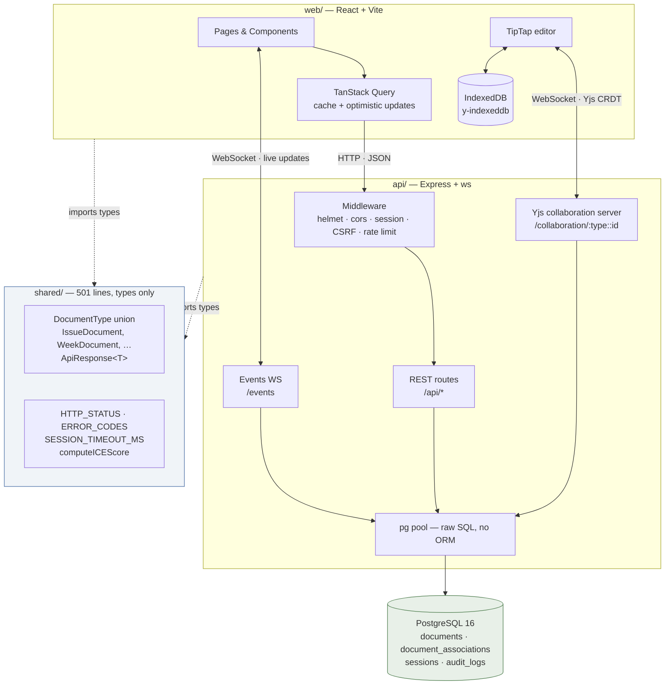

# Package Architecture

How `web/`, `api/`, and `shared/` relate, and what actually moves between them.

Verified against commit `076a183` with the stack running locally.



## Reading the diagram

**Dotted edges are compile-time only.** `shared/` is types and constants — it erases at build.
Nothing ships in it at runtime.

**Solid edges are real traffic.** Three separate connections run between browser and server,
which is unusual — most apps have one:

| Transport | Path | Carries |
|---|---|---|
| HTTP | `/api/*` | Document CRUD, auth, everything transactional |
| WebSocket | `/collaboration/{docType}:{docId}` | Yjs CRDT sync for the editor |
| WebSocket | `/events` | Live updates outside the editor |

Vite proxies all three in development (`web/vite.config.ts:31-45`). Ports come from a `.ports`
file written by `scripts/dev.sh`, so several worktrees can run at once without colliding.

## What crosses the package boundary

13 files import `@ship/shared` on each side. The most-used exports are constants rather than
types:

```
7×  SESSION_TIMEOUT_MS · HTTP_STATUS · ERROR_CODES
5×  computeICEScore · ABSOLUTE_SESSION_TIMEOUT_MS
1×  DocumentType · IssueState · IssuePriority · DocumentVisibility
```

`shared/src/types/auth.ts` is two comment lines recording that `LoginInput`, `LoginResponse`,
and `Session` were removed and are now defined separately in both `api/` and `web/`. Login
request and response shapes are the most obvious thing the two halves need to agree on, so the
contract is thinner than the three-package layout implies.
