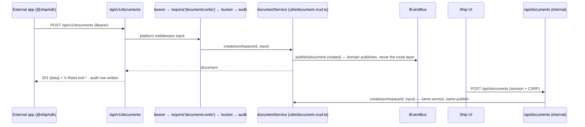
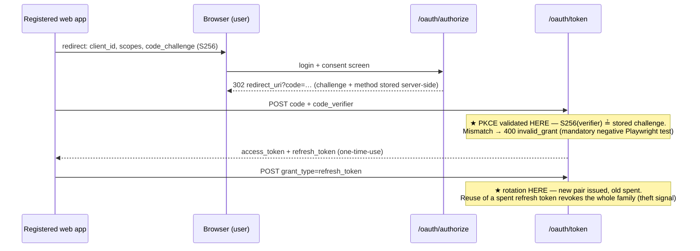
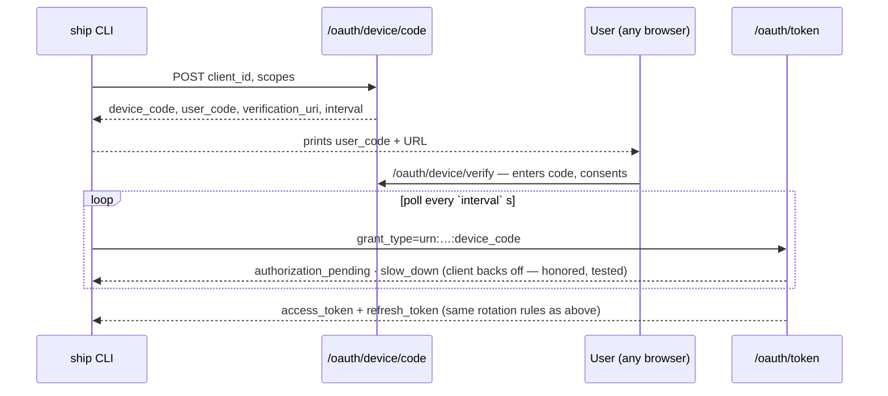
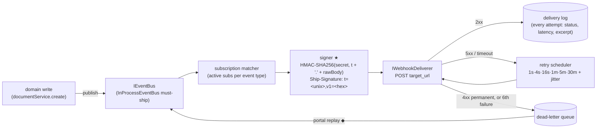
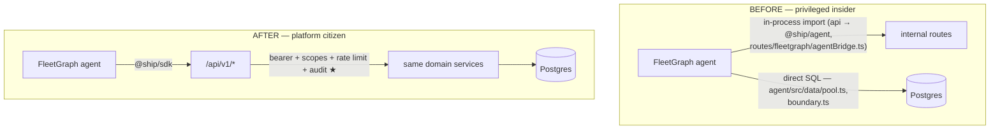

# Ship Platform Architecture — PlugForge (Week 6)

**Scope.** Ship (Part 1/2) becomes a platform: a versioned public API at `/api/v1/`, OAuth 2.0 (Authorization Code + PKCE, Device Grant), Stripe-style signed webhooks, a typed SDK (`@ship/sdk`), and the FleetGraph agent rewired from privileged insider to platform citizen. Modules marked **(new)** ship this week; unmarked paths exist today.

## Module Layout

```
api/src/platform/            (new) everything public-facing; imports domain services, never route files
  apps/                      oauth_apps registry — create/rotate/list; client_secret hashed (SHA-256, unsalted, high-entropy), raw shown exactly once, never recoverable
  oauth/                     RFC 6749 Auth Code + 7636 PKCE + 8628 Device Grant; token issuance; one-time-use refresh tokens with family revocation
  scopes/                    ScopeRegistry — scopes-as-data (documents/issues/sprints × read/write, webhooks:manage) + require(scope) middleware factory,
                             pure grant-time validation (requested-scope check, issuance intersection, upgrade policy) that OAuth calls before issuing
  ratelimit/                 IRateLimiter + in-memory token bucket (per-app and per-token); emits X-RateLimit-* headers, 429 + Retry-After
  webhooks/                  event registry (Zod-typed, 8 types), IEventBus + InProcessEventBus, subscription matcher, HMAC signer,
                             IWebhookDeliverer, retry scheduler, delivery log, DLQ + replay
  api/v1/                    the ONLY public router — fresh middleware stack, ApiError envelope, opaque cursor pagination ({data, next_cursor});
                             resource-map.ts is the one place public `sprints` maps onto Ship's internal `weeks` route — the contract name, not the table name
                             (`document_type` has said `sprint` since Part 1, so the translation is route-path and vocabulary only)
  openapi/                   public OpenAPI 3.1 registry; generated from route metadata, served at /api/v1/openapi.json
  audit/                     public API call log — timestamp, app client_id, user_id, route, scope, status, latency; queryable in the dev portal
  clock.ts                   Clock / SystemClock / FakeClock — a file, not a module; the retry scheduler, the token bucket and OAuth expiry all read it
sdk/                         (new) @ship/sdk workspace package — see SDK Surface
integrations/cli/            (new) must-ship reference integration (ship login / docs / webhooks tail); imports ONLY @ship/sdk (workspace dep rule)
api/src/routes/, utils/      existing internal surface (/api/*) — session+CSRF auth, unchanged; domain logic in utils/document-crud.ts et al.
web/src/                     existing React UI; the (new) developer portal pages consume /api/v1 like any external client
agent/                       existing FleetGraph agent (LangGraph) — Epic 7 swaps its data path onto the SDK
```

The public/internal split is enforced mechanically, not by convention: an ESLint `no-restricted-imports` boundary rule fails the build if `api/src/platform/api/v1/` imports from internal route files, and `integrations/*` may depend only on `@ship/sdk`.

## SOLID Rationale

- **S — Single Responsibility.** Each platform concern is its own middleware module under `api/src/platform/` (authN in `oauth/`, authZ in `scopes/`, throttling in `ratelimit/`, recording in `audit/`). Domain logic stays where Part 1 put it (`api/src/utils/document-crud.ts`); the platform layer wraps it and never re-implements it.
- **O — Open/Closed.** `ScopeRegistry` (`platform/scopes/registry.ts`) and the event registry (`platform/webhooks/events.ts`) are data. Adding `sprints:write` or `sprint.completed` is a registration at module load — no middleware edit, no route audit. The 403 handler reads the registry to name the missing scope.
- **L — Liskov Substitution.** `InProcessEventBus` (must-ship) and a queue-backed bus are drop-in substitutes behind `IEventBus`; likewise `InMemoryDeliverer` (synchronous, for tests) vs. the HTTP deliverer behind `IWebhookDeliverer`. Tests assert against the interface contract, so swapping in BullMQ later is a composition-root change only.
- **I — Interface Segregation.** The SDK is resource-segregated: `client.documents`, `client.issues`, `client.sprints`, `client.webhooks` (`sdk/src/resources/`). A CLI that only tails webhooks compiles against exactly that client — not a 40-method god object.
- **D — Dependency Inversion.** Domain services publish through `IEventBus` and know nothing about HTTP delivery, signing, or retries; `app.ts` injects concretes. Same for `IRateLimiter`, `ITokenStore` (SDK side), and the clock the retry scheduler reads — which is what makes retry tests deterministic instead of `setTimeout`-flaky.

## Composition Root

`createApp()` in `api/src/app.ts` is today the single place the app is assembled (helmet → rate limit → session/CSRF → ~30 internal routers). PlugForge extends the same function — it stays the only file that chooses concretes:

```ts
export function createApp(deps = productionDeps()) {
  const { bus, deliverer, limiter, clock, db } = deps;         // injected concretes

  registerScopes(scopeRegistry);                               // scopes-as-data (OCP)
  registerEventTypes(eventRegistry);                           // 8 Zod-typed event types

  const signer   = new HmacSigner();                           // Ship-Signature: t=<unix>,v1=<hex-hmac>
  const retries  = new RetryScheduler(clock, [1, 4, 16, 60, 300, 1800]);  // seconds, + jitter
  const pipeline = new WebhookPipeline(bus, subsRepo(db), signer, deliverer, retries, deliveryLog(db));

  const v1 = createPublicRouter({                              // fresh router — shares NO middleware with /api
    auth:  bearerTokenMiddleware(tokenRepo(db)),               // invalid/missing/expired → 401, distinct codes
    scope: requireScope(scopeRegistry),                        // insufficient → 403 naming the missing scope
    limit: rateLimitMiddleware(limiter),                       // 429 + Retry-After; X-RateLimit-* on every response
    audit: publicAuditMiddleware(auditRepo(db)),
    error: apiErrorMiddleware(),                               // every failure → { code, message, details?, request_id }
  });

  app.use('/oauth', oauthRouter(appsRepo(db), tokenRepo(db), clock));  // concrete flows: authorize, token, device
  app.use('/api/v1', v1);                                      // public, versioned contract
  app.use('/api', internalRouters);                            // Part-1 surface, untouched
  app.get('/api/v1/openapi.json', serveGeneratedSpec());       // generation failure = boot failure (see Failure Modes)
  return app;
}
```

Sibling test wiring — same shape, in-memory concretes, no network and no clock:

```ts
// api/src/deps.ts — the sibling of productionDeps(), same shape, in-memory concretes
export const testDeps = (overrides: Partial<AppDeps> = {}): AppDeps => ({
  bus: new InProcessEventBus(),      deliverer: new InMemoryDeliverer(),   // resolves synchronously
  limiter: new InMemoryTokenBucket({ capacity: 100, refillPerSecond: 100 / 60 }),
  clock: new FakeClock(),  db: pool,  corsOrigin: 'http://localhost:5173',
  ...overrides,
});
createApp(testDeps());   // retry-schedule tests advance FakeClock; no setTimeout anywhere in tests
```

## Public/Internal Boundary

Both surfaces call the **same domain services**; auth/scope/rate-limit/audit/webhook concerns attach only at the public layer. Internal `/api` keeps its session+CSRF stack (`api/src/middleware/auth.ts`) byte-for-byte.



Contract details asserted by fitness tests over every `/api/v1` route: OpenAPI entry exists, a scope is declared, failures ship the `ApiError` shape (`unauthorized | forbidden | not_found | validation_failed | rate_limited | server_error`), list endpoints paginate with opaque base64 cursors over `{id, timestamp}`.

### Error envelope decisions

The code set above is **closed at six** and is printed verbatim in the PRD (p.7). Three
things about it are ours to defend rather than the PRD's to dictate:

**`validation_failed` → 422, not 400.** The PRD names statuses only for 401 (p.2, p.3),
403 (p.3) and 429 (p.4). 422 is the honest code for the case: the request body parsed
fine, so the syntax was never in question — what failed is the semantics. The single
`400` in the PRD (p.2) is `invalid_grant` on `/oauth/token`, which is RFC 6749's error
format on a route that is not under `/api/v1` and is not an `ApiError` at all; the code
union deliberately has no `invalid_grant` member. Anyone reading a 400 from this API is
therefore reading an OAuth error, and anyone reading a 422 is reading a validation
error — the two never blur.

**The envelope is identical everywhere; `details` is the only variable part, and its
sub-shape is fixed per CODE, not per route.** `validation_failed` carries
`details.fields[]`; `forbidden` carries `details.{missing_scope, granted_scopes,
scope_description}` (p.2 requires the 403 to name the missing scope, which is what
forces `details` to exist at all); `rate_limited` may carry
`details.retry_after_seconds`; `unauthorized` may carry `details.reason` — a closed
enum of `expired | invalid | missing` that satisfies MVP gate item 3's "401 with a
distinct error code" without adding a seventh `ApiErrorCode` to a union the PRD prints
verbatim on p.7 (dispute B14); `not_found` and `server_error` omit
`details` entirely. Per-route detail shapes were available and were rejected: a consumer
that has to learn a different error body per endpoint has no envelope, only a
convention. `apiErrorBodySchema` (Zod, `.strict()`, discriminated on `code`) is the one
definition of this, and both the serializer and the fitness harness import it.

**Codes map 6 → 5 onto the SDK's `kind` union, not 1:1.** `unauthorized` and `forbidden`
both surface as `kind: 'auth'`, because the question an SDK consumer's `catch` block is
actually asking is "would a better token fix this?" — and for both, it would. The
mapping is published as data (`SDK_KIND_BY_CODE`) so the SDK imports it rather than
restating it.

**`request_id` is minted server-side, always, and an inbound `X-Request-Id` is ignored.**
It is the join key for the audit trail (p.4). A client-supplied key lets a caller collide
its rows with another app's, or forge a trail that never happened, and the value of an
audit trail is exactly that the audited party did not write it.

**A body-parser failure is a client error, not a server error.** `express.json()`
rejects an oversized or malformed body by calling `next(err)` with an error that is not
an `ApiError`, and the terminal handler correctly scrubs anything it does not recognise
into `server_error`/500. That is the wrong answer here and it costs a consumer real
time: 500 means "we broke, retry", so an SDK with a retry ladder retries a 2 MB body at
exponentially increasing intervals until it gives up. `bodyErrors.ts` translates them
into `validation_failed` with `details.fields[{ field: 'body' }]`. **422 and not 413** —
HTTP's answer is 413, but the code set is closed at six and the status is derived from
the code, so a 413 would require a seventh member of a union the PRD prints verbatim.
That is a real cost of the closed set, and it is recorded here rather than hidden: the
status is imprecise, the code and message are not.

### Pagination and versioning decisions (L08)

**Where the pagination line falls.** A collection endpoint backed by a database table
paginates with an opaque cursor; a collection whose cardinality is bounded by CODE
returns `{ data }` with no `next_cursor`. The test is **bounded-by-code vs.
bounded-by-data**, not small vs. large — "small" is a judgement about today's contents
that nothing re-checks, while a list whose length is a compile-time constant cannot grow
into a pagination bug without someone editing this repository. `/api/v1/scopes` and
`/api/v1/events` are `as const` arrays and declare `list: 'none'`; the document-backed
collections declare `'cursor'`. The field is required with no default and `createApp()`
throws at wiring time on a route that omits it, because "nobody thought about it" and
"it does not paginate" must not look the same to Testing Scenario 4's clause (d).

**The sort key is `(created_at, id)`, and it is not `position`.** The internal list sorts
by `ORDER BY position ASC, created_at DESC` over a column drag-reorder rewrites
(`api/src/routes/documents.ts:120`). Paginating on a mutable column means a user
reordering a sidebar corrupts a concurrent API walk, which is exactly what "cursors are
stable across reordering operations" (p.3) forbids. The keyset is a row comparison —
`(created_at, id) < ($1, $2)` — because the logically equivalent `OR` form plans as a
bitmap-or or a seq scan rather than an ordered index range scan; migration 063 ships the
covering index and `assertKeysetIndexed` EXPLAINs the real page query to keep it honest.

**Four things the PRD does not name, and our answers:** the page-size parameter is
`limit`; the default is 25; the maximum is 100; the order is newest-first. An
out-of-range `limit` is **rejected, not clamped** — clamping is the more common industry
choice and it turns the loop a CLI author actually writes,
`while (data.length === limit)`, into an infinite one. Query parameters are a **strict
allowlist**: `offset`, `page`, `per_page`, `fields`, `sort` and `order` each return 422
with a message pointing at what to use instead. That is a strong policy with a real cost
— a future optional parameter is a breaking change for a caller already sending it — and
it is the only cheap way to make "sparse fieldsets are out of scope" verifiable rather
than merely asserted.

**Versioning past `/api/v1/`: additive-only within v1; a breaking change goes to
`/api/v2/`; no deprecation or sunset headers this week.** Pre-Search 2.2 (p.16) poses the
question and offers three answers without choosing. Additive-only means a new optional
response field or a new endpoint may land in v1, while removing a field, renaming one,
narrowing a type, or tightening validation may not. Deprecation headers were rejected
because they are a promise about a lifecycle — a sunset date, a migration guide, a
support window — and by Sunday there are no external consumers to make that promise to.
Shipping the header without the lifecycle would be a claim the project cannot keep.
Enforced structurally rather than by convention: a test asserts the public router is
mounted at exactly one version prefix and that no registered route path contains a
second version segment.

## OAuth Flows





Access tokens are opaque high-entropy strings stored hashed (same discipline as the existing `api_tokens` table); the bearer middleware resolves token → app + user + granted scopes on every `/api/v1/*` request.

The authorization code itself is a row in `oauth_authorization_codes` (migration 065), not a process-local map: the token exchange is a different request that may land on a different instance, and a map would make the flow work on one process and fail on two. The row stores `sha256(code)` and never the code, carries the `code_challenge` and `code_challenge_method` the PRD requires be *recorded* at `/oauth/authorize`, lives 60 seconds, and is redeemable exactly once — `consumed_at` is set by a conditional `UPDATE … WHERE consumed_at IS NULL` inside the same transaction that issues the tokens, so two simultaneous exchanges yield one token pair and one `invalid_grant`. A **replayed** code returns `invalid_grant` *and* revokes the token family the first redemption produced, which is RFC 6749 §4.1.2's SHOULD and keeps one theft-response story for the whole grant rather than a strong one for refresh tokens and a weaker one for codes.

**Measured, p.6's "OAuth Auth Code + PKCE round-trip (P95) < 3s".** Twenty consecutive runs, one worker, testcontainers Postgres: **p50 949 ms, p95 980 ms, max 983 ms.** The number covers the three *server* legs — authorize render, consent POST, token exchange — and **excludes** human think time at the consent screen and browser paint; the exclusion is stated because a figure that quietly included think time would be measuring the user. One run is not a P95, which is why there are twenty. Recorded by `e2e/oauth-pkce.spec.ts`, which prints the line above on every run so the figure is re-derived rather than inherited.

### The consent screen: a server-rendered endpoint, same origin, own layout

PRD p.16 asks where the consent screen lives — "a route inside Ship's UI, a dedicated endpoint with its own minimal layout, or something else". It is the middle option: `GET /oauth/authorize` renders its own HTML on Ship's origin, outside React, and the decision POSTs to `/oauth/authorize/decision`.

The argument is structural, not aesthetic. Ship's UI is a Vite SPA that boots a router, a query client and an IndexedDB-backed cache; routing the authorize leg through it puts MVP gate item 2's own Playwright test behind SPA hydration, and `playwright.config.ts` retries failures — so hydration flake would be retried into green and the gate would stop gating. Second, this response must carry its own `frame-ancestors`, `X-Frame-Options` and cache headers, which are per-response decisions the app-wide helmet configuration does not make. Third, it keeps `/oauth/*` a single request/response chain with no dependency on the frontend build, so the flow works against a bare API container.

**Rejected:** a React route, for the first reason above; and a third-party hosted login, because nothing in the stack table permits one and Ship *is* the authorization server here — which is also the answer to p.17's question about keeping OAuth Playwright tests stable. There is no external IdP to stub or containerize, so the flow's only moving parts are Ship's own session login and a page with no client-side JavaScript: no hydration wait, no network-idle heuristic, no third-party redirect.

**Cost, stated:** this is the only non-React UI in the repository and somebody has to keep it looking like Ship. It is also a deviation from p.10's "the portal reuses the public API like any other client" — but p.10 says that of the *portal*, and p.17 places the consent screen *alongside* the portal rather than inside it.

**Clickjacking (p.16's second clause)** is answered with headers on the actual response, not with a reading of helmet's configuration: `Content-Security-Policy: frame-ancestors 'none'`, `X-Frame-Options: DENY` and `Cache-Control: no-store`, set explicitly on the OAuth router above every route, and asserted both on the response and inside a real framed browser. Helmet is configured once app-wide with an explicit directives object that sets `frame-src` and **not** `frame-ancestors` — different directives solving opposite problems — so relying on it would be relying on another lane's configuration that no test pins.

**CSRF** on the decision POST is the same `csrf-sync` synchroniser token the internal surface uses, injected rather than re-created so it shares one session store with the portal. The route additionally **refuses bearer authentication outright**: `conditionalCsrf` in `app.ts` skips CSRF whenever an `Authorization: Bearer` header is present, which is safe only because the internal middleware does not fall back to session auth on an invalid bearer, and this route closes that locally rather than depending on the coupling.

### The `/oauth` error surface is deliberately **not** the `ApiError` envelope

`/oauth/*` emits RFC 6749 §5.2's `{error, error_description?, error_uri?}`. `/api/v1/*` emits `ApiError`. Two specifications govern two surfaces and they are not collapsed.

This is not an oversight in the error-envelope work above, it is a consequence of it. The PRD's only `400` is `invalid_grant` on `/oauth/token` (p.2); the `ApiError` union is closed at six codes printed verbatim on p.7 and contains no `invalid_grant`, and its status map has no 400. Wrapping an OAuth failure in the public envelope would ship a contract violation to every RFC-compliant client — an OAuth library looks for `error`, not for `code` — including the browser PKCE demo and any grader's off-the-shelf client. One Zod schema, `oauthErrorBodySchema`, is the assertion oracle for every negative test on this surface, and a fitness test asserts no `/api/v1` route can emit an OAuth error body.

The consequence worth stating rather than leaving to be discovered: because `/oauth` is mounted as a sibling of `/api/v1` and shares none of its middleware, the public audit middleware never sees a token exchange, so no `public_api_calls` row will ever record one. That is precisely the gap the `client_secret` auth log fills with its own signal. If a later change moves `/oauth` under `/api/v1`, the fitness test asserting the separation fails — which is the intended trigger to revisit both.

### Scope upgrades: re-consent with union

A client that holds `documents:read` and now needs `documents:write` restarts `/oauth/authorize`. The user is shown the **union** of what they already granted and what is newly requested, consents once, and a fresh token replaces the old one. There is no partial grant, no mutable grant record, and no state meaning "granted A, pending B". The policy lives in one function — `resolveScopeUpgrade()` in `platform/scopes/validation.ts` — that both the authorization-code and device flows call, rather than being re-derived in each.

The alternative is incremental consent: the new token carries only the increment and the client holds several tokens at once. It is the better product answer, and Google ships it. It is the wrong answer for this build, because it turns a grant from a fact into an accumulator: every code path that reads scopes has to merge across live tokens, and revocation has to reason about which of several tokens carried which grant. Re-consent-with-union keeps a token's scope set immutable for its whole life, which is the property the rest of the scope layer assumes — `reconcileTokenScopes()` can treat a presented token as a complete statement of what its bearer may do, and the audit trail's `scope used` field has one token to point at rather than a set.

The cost is real and it is the user's: they see a consent screen again, listing permissions they already approved. Showing the union rather than the delta is what keeps that screen truthful — the user is consenting to the whole of what the new token will carry, not to an increment whose base they would have to remember. `resolveScopeUpgrade()` returns `requiresConsent: false` when the existing grant already covers the request, so the screen is never shown for a no-op.

The authorization-code half of this policy is implemented by *doing nothing special*, and that is the point. There is no grant table, no lookup of a prior grant and no `UPDATE` against one: a client that now wants more restarts `/oauth/authorize` asking for the union, the user sees every scope the new token will carry, and a fresh token replaces the old. The only `UPDATE` this flow performs anywhere is `consumed_at` on the code row, which belongs to single-use redemption rather than to a grant record — a fitness test asserts exactly that one statement and no other. The absence of grant state is what makes the decision cheap, so the absence is what is tested.

## Webhook Pipeline



★ **Signature is computed at send time, per attempt**, with the subscription's secret (hashed at rest, shown once on creation) — the timestamp in the signed payload is what defeats replay; the SDK verifier rejects signatures older than 300 s by default. ◆ **Idempotency-Key originates at the event's first delivery** (derived from `event_id`), and is carried unchanged through every retry and portal replay — that key is the subscriber's dedupe contract.

## SDK Surface

`@ship/sdk` (new workspace package). **Stable for the week:** `ShipClient` with resource clients (`documents`, `issues`, `sprints`, `webhooks` — method signatures fitness-tested against the OpenAPI spec, drift fails CI); `ShipClient.authorizationCodeFlow()` and `ShipClient.deviceLogin()`; async-iterator pagination (`for await (const doc of client.documents.iterate())` — consumers never see cursors); `verifyWebhook(headers, rawBody, secret, toleranceSec = 300)` → boolean in one call; typed error union discriminated on `kind: 'auth' | 'rate_limit' | 'not_found' | 'validation' | 'server'`. **Pre-1.0 (may move):** `ITokenStore` implementations beyond in-memory/file, OAuth helper option bags, CLI internals. Install footprint budget: < 250 KB min+gzip, production deps only, enforced in CI.

### `ITokenStore` — the contract, and where it lives (L17 PF-503/504/509)

Pre-Search 2.4 (p.17) asks three questions about this interface. The answers are here, and the interface is declared in `sdk/src/auth/tokenStore.ts` and exported from the package root.

**Three methods, structurally satisfied.** `load(): Promise<StoredTokens | null>` · `save(tokens): Promise<void>` · `clear(): Promise<void>`. Any object with those three methods is an `ITokenStore` — a consumer writing a Keychain or Vault store imports no base class and registers nothing. There is deliberately no `update`: a rotation replaces the whole pair, and a partial update is exactly the shape that lets an access token and a refresh token belong to different generations.

**It persists BOTH tokens, not only the access token** — `{accessToken, refreshToken | null, expiresAtSeconds | null, scopes[]}`. p.3 mandates one-time-use refresh with rotation, and the drill's stage-2 outcome measures persistence *across process restarts* (p.8); an access-token-only store makes `ship login` a device flow on every invocation and fails TTFE on the second command. The cost is stated rather than hidden: the file on disk now holds the credential worth stealing, which is why `FileTokenStore` writes `~/.ship/credentials.json` at mode 0600 inside a 0700 directory, atomically (temp file + `rename`, never truncate-then-write), and why no SDK code path puts a token into a message, a log line or a stack.

**Three implementations.** `InMemoryTokenStore` (the default, and the test double p.10 asks for), `FileTokenStore` (Node only — `@ship/sdk/node`, or the `node` export condition), `LocalStorageTokenStore` (browser; `localStorage` is XSS-readable, so it is the store the PRD names rather than the store to reach for when an in-memory credential would do).

**Threading model for refresh: single-flight, keyed on the store instance.** Concurrent 401s await one in-flight refresh promise and retry once with its result. This is not a performance choice — p.3's refresh tokens are one-time-use with family revocation, so two parallel refreshes present the same token twice and the second **revokes the family**, logging the user out. Ten concurrent expired calls produce exactly one `/oauth/token` request. The guarantee is process-scoped: two terminals sharing one `~/.ship/credentials.json` are two processes and this promise cannot see across them (D14, below). The client is therefore built to work under **strict** rotation and assumes no server-side replay window exists; it re-reads the store inside the critical section so a refresh performed elsewhere is picked up rather than overwritten, and it never retries a failed refresh. A cross-process lockfile is the real fix for concurrent CLIs and belongs with the CLI (L19), not with a library that also runs in a browser.

**Corruption.** See Failure Modes: a read that fails or returns garbage is logged-out — one attempt at most, `{ kind: 'auth' }`, and **no write-back**, including no `clear()`. `clear()` is a write, and a credential the SDK cannot parse may still be one a human can repair.

### Browser and Node entry points (L17 PF-507)

The package root used to re-export `verifyWebhook`, whose module imports `node:crypto` at top level, so any bundler resolving `@ship/sdk` for the browser pulled a Node built-in — failing to resolve, or silently polyfilling crypto into every consumer's bundle against a 250 KB budget. The `exports` map is now conditional: the `browser` condition resolves to `dist/browser.js` (client, errors, retry, `InMemoryTokenStore`, `LocalStorageTokenStore` — no `node:` specifier anywhere in its import graph), every other condition resolves to `dist/index.js`, which adds `verifyWebhook` and `FileTokenStore`. Node consumers are unaffected; `@ship/sdk/browser` and `@ship/sdk/node` exist for a consumer who wants to be explicit.

## Agent-as-Citizen (Epic 7)

Today FleetGraph is a privileged insider by construction — two separate back doors:



The agent authenticates as a first-party OAuth app (seeded by `db:migrate`, so it provably exists in deployed environments — see *First-Party App Seeding* below), requesting only the scopes its detectors and actions need — least privilege, not `*`. The swap lives behind a feature flag; CI runs the Part 2 regression suite with the flag **on and off**, which is what makes the rewire a refactor rather than a rewrite. ★ **The payoff is the audit trail:** every agent action now lands in the public audit log under the agent app's `client_id` — "the agent went through the front door" is provable with one query, not a claim. One LLM call per agent turn is unchanged; the platform itself does zero AI work.

## First-Party App Seeding

**Three apps are seeded by `db:migrate`, on every invocation.** (p.17: *"How is the agent's app seeded — at boot, via a migration, manually in dev? What guarantees it exists in deployed environments?"*)

| App | Scopes | Why it exists |
|---|---|---|
| `ship_app_firstparty_fleetgraph_agent` | `documents:read`, `issues:read`, `issues:write`, `sprints:read` | Epic 7 — the agent as a platform citizen, least privilege rather than `*` |
| `ship_app_grader_readonly` | `documents:read`, `issues:read`, `sprints:read` | MVP gate item 10 (p.2) — a pre-registered **read-only** app for graders |
| `ship_app_grader_demo` | `documents:read`, `documents:write` | **D12**, open — see below |

*What guarantees it exists.* The seeding runs inside `db:migrate`, which runs on every deploy. It is deliberately **not** a numbered migration: `migrate.ts` skips any migration already recorded in `schema_migrations`, so a numbered file runs exactly once per database — a secret configured after the first deploy would never reach it, and a **rotated** secret would never be written. Migration 041 keeps only the one-time structural rows (the system owner user, the grader workspace); the app upsert is re-applied every run, idempotent via `ON CONFLICT (client_id) DO UPDATE`. This replaces `db:seed`, which does **not** run on deploy the way `db:migrate` does.

*Secrets come from the environment and are never generated.* `AGENT_CLIENT_SECRET`, `GRADER_CLIENT_SECRET`, `DEMO_CLIENT_SECRET`. Absent in dev or test → no row, no failure, local development untouched. Absent in **production** → the deploy fails naming the missing variable, before any statement runs. A generated secret would be strictly worse than none: the row would exist, the health check would go green, and nobody could ever authenticate, because the plaintext was discarded the moment it was hashed. That failure — healthy boot, credential missing, symptom three layers away — is one this repo has already paid for once.

*Grant-agnostic by construction.* No column and no seed field encodes a grant type, because the agent's grant is still undecided. The grant is a property of the token exchange; whichever flow ships reads this same row.

*Tenancy.* The grader and demo apps belong to a dedicated **Grader Sandbox** workspace, so a token issued to either sees that workspace and no other. That is the answer to *"how do graders get an app without exposing your tenant's data"* (p.18).

*⚑ D12 — open, and shipped flagged.* p.6's five-line story is `ship login` → **`ship docs create`** → `ship webhooks tail`; p.12 makes that story the demo video and p.13 makes the terminal screenshot the Social Post. The grader's app is **read-only by requirement**, so a grader following the README cannot run the headline command. The second, write-scoped demo app is the option that keeps all three artifacts reproducible. The two alternatives, recorded rather than dismissed: **(a)** document `ship docs ls` as the grader's smoke test and leave the demo unreproducible — cheapest, but three graded artifacts then show something the reader cannot repeat; **(b)** widen the grader app's scopes — contradicts p.2's "read-only" in the gate checkbox, which is the one place a grader will look. The cost of the chosen option is that the README explains two apps instead of one: a documentation cost, not a security one. **This decision is the user's to close, not the lane's.**

## Secret Storage — `client_secret` at Rest

**SHA-256, unsalted, and no recovery process.** (PRD p.15 asks where `client_secret` values live at rest — "hashed with what algorithm, salted how, recoverable via what".)

*Algorithm:* SHA-256, hex, one hashing site — `hashClientSecret()` in `api/src/platform/apps/secrets.ts`. It matches the `api_tokens` precedent (`api/src/middleware/auth.ts:84`) by **convention, not by import**: the boundary lint forbids `platform/**` from importing internal middleware, so the helper is duplicated deliberately and the file header records why. Reading that duplication as an oversight and "fixing" it undoes the fence.

*Salted:* **Not salted, and that is the answer rather than an omission.** A salt defends against precomputation — rainbow tables, cross-account hash reuse — and precomputation is only a threat when the input space is small enough to enumerate. `generateClientSecret()` draws **32 bytes from `crypto.randomBytes`**: 256 bits, uniformly distributed. There is no dictionary to run and no table to precompute, so a per-row salt would add a column and change nothing an attacker can do. The same reasoning rules out a slow KDF (bcrypt, argon2): iteration cost buys time against a feasible search, the search here is not feasible, and the cost would land on `/oauth/token`, which verifies a client secret on every exchange. The 32-byte constant is therefore load-bearing — if it ever shrinks, this argument has to be rewritten, not just the code.

*Recoverable via what:* **nothing, by design.** p.2 requires the raw secret be shown "once on creation and rotation; never recoverable thereafter". No column stores it, no endpoint returns it, and no operational process retrieves it. A lost secret is **rotated, not recovered**. `secret_prefix` — the first 8 characters, stored in clear, mirroring `api_tokens.token_prefix` — exists so an operator can still say *which* secret without holding one.

*Asymmetry with the webhook signing secret, deliberately.* The signing secret is encrypted (AES-256-GCM), not hashed, because the server must **use** it to produce an HMAC; a one-way hash cannot key a MAC. `client_secret` is **presented back to us** and verified by comparison, so a hash is sufficient and strictly safer. The two are different problems that share the word "secret".

## Token Lifecycle & Refresh Rotation

*Answers PRD Pre-Search 1.4 (p.15) and 2.1 (p.16). L06 owns this section; L25 pulls from it rather than restating it, so there is one place for the answer and the code to disagree.*

**How long are access tokens valid?** **One hour.** **What is the rotation policy?** **One-time-use refresh tokens, 30 days, sliding — every exchange issues a fresh pair.** Both are single exported constants in `api/src/platform/oauth/tokens.ts` (`ACCESS_TOKEN_TTL_SECONDS`, `REFRESH_TOKEN_TTL_SECONDS`), and a test asserts each number appears exactly once in the lane so the config and the behaviour cannot drift apart.

*Why one hour.* An opaque access token is checked against the database on **every** `/api/v1` request, so a short TTL costs nothing in verification work — the lookup happens either way. What it buys is a bounded blast radius: a leaked access token is useful for at most an hour. This is the reason the token is opaque rather than a JWT. A JWT would let the resource server skip the lookup, and skipping the lookup is exactly the property we do not want: a self-validating token cannot be revoked before it expires without a revocation list, which is a database lookup wearing a disguise. Opaque + a lookup is the honest version of the same cost, and it is what makes D2's *"a deleted user's access cannot outlive them"* true rather than aspirational.

*Why 30 days, sliding.* It makes `ship login` a once-a-month act rather than a daily one, which is the second line of the TTFE story (p.8). Sliding means an actively used credential never expires and an abandoned one dies in a month.

*Both are overridable at boot* through `AppDeps.tokenTtl`, never through a mutable module binding. That is the seam L24's rotation drill consumes: PF-727 requires expiry to be produced **by configuring a short TTL, never by waiting**, because p.11 rules out `setTimeout` waits and p.9 budgets zero flake over twenty runs. A test boots with a 2-second access TTL and advances an injected `FakeClock`; a grep asserts no `setTimeout` and no `Date.now()` in this lane's non-test source.

**Will you implement stolen-refresh-token detection (reuse invalidates the family)?** **Yes, family-wide, and it takes the live access token with it.** Every token issued by one grant redemption shares a `family_id`; every rotation keeps it and links `replaces_token_id`. The spend is a conditional `UPDATE … WHERE spent_at IS NULL` whose **zero-row result is the reuse signal**, and on that signal every token in the family is revoked regardless of type or spent state. The access-token half is the part that is easy to omit and the only part a client can observe. Proven by replaying a *long-spent* `R1` after three rotations — revocation is keyed on the family, not on "the previous token" — and by the anti-vacuity direction, that a second user's family is untouched.

**Will you support refresh tokens from day one, or add them later? What is the migration cost if you wait?** (Pre-Search 2.1, p.16.) **Day one**, and the question is close to rhetorical here: p.3's Core Technical Requirements table makes one-time-use rotation and family revocation a graded row, p.8's integrations menu makes the rotation drill one of five, and L17/L18/L19 have already built the client side against a refresh token existing.

*The migration cost of waiting, enumerated rather than hand-waved.* Deferring would mean long-lived access tokens with no revocation story short of per-app revocation, every credential in `~/.ship/credentials.json` becoming a month-long bearer secret, and a later retrofit touching **five surfaces**: the token table, both grant redemptions, the bearer middleware, the SDK store shape, and the CLI's refresh path. Versus zero today.

### Refresh rotation under concurrent clients — an open decision (D14)

**Shipped behaviour: strict. Reuse always revokes the family.** The alternative is implemented behind one constant and is one line away; this section is the record of why the choice is live rather than settled.

*The residual, measured rather than asserted.* L17's single-flight promise is keyed on the SDK's **token-store instance**, so it serializes refreshes inside **one process**. L19's CLI persists credentials to a shared `~/.ship/credentials.json`, so two terminals running `ship docs ls` at once are **two processes holding one credential**. Both see an expired access token, both present `R1`, and under strict rotation the second one revokes the user's family and logs them out — plausibly during a demo.

| | Option (a) — **strict**, shipped | Option (b) — **10 s same-generation window** |
|---|---|---|
| Behaviour | every reuse revokes the family | re-presenting the *immediately preceding* token within the window returns the **already-issued** pair; anything older still revokes |
| PRD fit | p.3's *"reuse invalidates the family"*, unqualified | a documented departure from that sentence |
| Standards | strictest reading of OAuth 2.1 BCP | the BCP's own stated accommodation |
| Cost | concurrent CLI processes are unsupported; a plausible demo action destroys the session | a process-local replay cache — behind more than one API instance a replay landing elsewhere still revokes, so it **softens** the failure rather than removing it |
| Graded assertions | unaffected | unaffected — L24's PF-725 replays a long-spent `R1` after three rotations, far outside any window, and still gets family revocation |

*Switching is one line:* `REFRESH_REPLAY_WINDOW_MS` in `api/src/platform/oauth/tokens.ts`, `0` today. Both behaviours are table-tested, so flipping it does not land untested code. **If this flips, the "yes, family-wide" answer above has to gain the qualifier in the same commit** — a Pre-Search answer that says *"reuse invalidates the family"* while the code has a replay window is exactly the drift the consistency check exists to catch.

## Failure Modes

**`client_secret` rotated — instant invalidation, and a documented departure from Stripe.** (PRD p.17: *"is the old secret immediately invalidated, or does it work alongside the new one for a grace period? What does Stripe do, and why?"*)

*What Stripe does, and why.* Stripe lets the developer choose an expiry for the outgoing key — immediately, or after 1 hour, 24 hours, 3 days, or 7 days. That exists because Stripe's customers have live production integrations running on machines they cannot all redeploy at once; a hard cutover would take a merchant's checkout down while a deploy rolled out. The grace period buys a migration window, and the cost is that a leaked key stays valid for the length of that window.

*What we ship, and why it is a departure rather than an oversight.* **Instant.** The old secret stops verifying the moment the new one is issued, and there is nowhere in the schema to put a second live hash — `oauth_apps.client_secret_hash` is overwritten, not appended to, so a grace period is not accidentally representable. The trade Stripe is making does not apply here: a one-week build with no production integrations has no migration window to protect. And instant is the only model where responding to a leak is *finished* at the moment you act — with a grace period, "I rotated the key" and "the leaked key is dead" are different events, and the gap between them is exactly when the thief is still spending.

The shipped behavior and this paragraph are held together by one constant: **`ROTATION_POLICY` in `api/src/routes/apps.ts`**, returned as `rotation_policy` on every create and rotate response. Flipping the model means changing that constant, which means changing this paragraph. The developer portal (L22) renders whichever value the API returns rather than hard-coding the copy, so a future grace period is a data change, not a UI rewrite — and the UI cannot end up lying about the security model.

The same call is made for the webhook signing secret, so the platform has one rotation story rather than two.

**`client_secret` leaked — detection, response, and blast radius.** (p.17: *"automatic rotation, manual rotation by the owner, or admin-driven force-rotate? What's the audit signal you'd alert on?"*)

*Detection.* Every client-secret verification is recorded to `client_secret_auth_log` (migration 040) with the `client_id`, the `secret_prefix`, the outcome, and the source IP — never the secret and never its hash. Three conditions are alertable, each table-tested: **(a)** failed verifications for one `client_id` crossing a threshold inside a window — the shape a rotated-then-retried thief makes; **(b)** *successful* verifications for one `client_id` from more than N distinct source IPs in a window — a shared secret being used from somewhere new; **(c)** **any** verification attempt against an app with `active = false`.

This has its own table rather than a filter over the public audit trail because of a measured fact: the audit middleware sits in the `/api/v1` stack, and `client_secret` is presented at `/oauth/token`, which mounts at `/oauth` — outside `/api/v1`. No `public_api_calls` row can ever record a secret authentication.

*Response.* **Owner-initiated rotation and admin force-rotate ship. Automatic rotation does not.** Automatic rotation is rejected with its reason rather than quietly omitted: rotating a credential nobody asked to rotate invalidates a live integration, and there is no channel in this build to hand the replacement to its owner — so it converts a *suspected* leak into a *certain* outage.

*Blast radius, which is why the playbook has two steps.* **Rotating the secret does not revoke tokens already issued.** The secret is an issuance credential, not a session; tokens minted before the rotation keep working until they expire. The response to a confirmed leak is therefore **rotate *and* revoke** — rotation closes the door, revocation evicts whoever is already inside.

*Honest limit.* The three conditions are queryable and tested; they are not **paged**. There is no `/metrics` endpoint and no notifier in this build, so p.18's "where does it show up" is answered by "logs and a query". The missing piece is an alerting surface, not a signal.

**Refresh-token family revoked mid-session — what the user actually sees.** (The token-family case is not one of the four scenarios p.12 lists, and the shipped behaviour demands it: nothing else here covers a **server-initiated** logout. The next paragraph covers the client-local case.)

A family is revoked when a spent refresh token is presented again — the theft signal, and the server cannot tell a thief from an honest second process. Revocation is immediate and total: **every device holding a token from that family is logged out at its next request**, not at the end of the current access token's hour, because the sweep revokes the live access token alongside the refresh token. A user with the CLI in one terminal, the SDK in a script, and the portal in a browser loses all three at once if any one of them replays a spent token.

What they see is a plain 401 with `details.reason: 'invalid'` — deliberately **not** `'expired'`, because `'expired'` tells an SDK to refresh, and refreshing is precisely what will not work here. The SDK surfaces `kind: 'auth'` and the CLI prints a re-login prompt. **The recovery is re-authentication, not repair.** There is no unrevoke: the family is dead, a fresh `ship login` starts a new one, and nothing about the old family's state carries over. That is the intended outcome when the alternative is leaving a possibly-stolen credential live.

The honest limit: because reuse and theft are indistinguishable at the server, a client bug that double-spends a refresh token produces a real user-visible logout. That is the cost of the strict reading, and it is the exact tension recorded as D14 above.

**Token store corrupted (SDK side).** `ITokenStore` reads that fail or return garbage are treated as logged-out, never as a retry loop: the next call surfaces `{ kind: 'auth' }` and the helper flows re-authenticate cleanly. Corruption is a client-local event — the server sees at worst a 401'd request, and no partial credential is ever written back.

**Signing secret rotated mid-flight.** Rotation takes effect at the next delivery attempt: the signer reads the subscription's current secret at send time, so in-flight failures re-sign with the new secret on retry. A subscriber that hasn't updated its env verifies against the old secret, fails, and the retry ladder (30 min tail) covers the update window; the pathological case parks in the DLQ, replayable from the portal with the original Idempotency-Key.

**Queue deliverer crashes.** The contract is at-least-once + Idempotency-Key dedupe — never silent at-most-once. Undelivered attempts are reconstructable because the delivery log (durable, Postgres) records every attempt; on restart, incomplete deliveries are re-driven from the log/DLQ and subscribers dedupe on the key. The in-process must-ship deliverer restarts with the process; the queue-backed drop-in inherits the same recovery semantics through the log.

**OpenAPI generator throws at boot.** Fail fast: the process refuses to start. The spec is the contract artifact — serving traffic without it is exactly the drift the fitness test exists to prevent. In practice this never reaches production: spec generation + validation against the OpenAPI 3.1 schema runs as a unit test, and the spec↔route parity fitness test fails the PR first.

## Deployment Topology (Terraform)

Live topology is AWS, from the root modules in `terraform/*.tf` — the one configuration with real state (S3, `ship/terraform.tfstate`, locked via `use_lockfile`) and the one whose resources exist in account `379484935796`. This supersedes the Render deployment described here previously; **D6** records why, and `docs/infra/topology.md` carries the full inventory with the command behind each claim. In one region, `us-east-1`, inside VPC `vpc-06ed04dea6a97a28c` (`10.0.0.0/16`): an **Elastic Beanstalk** environment `ship-api-prod` (application `ship-api`, Docker on Amazon Linux 2023, `t3.small`, load-balanced) whose instances sit in the **private** subnets with `AssociatePublicIpAddress: false`, behind a public-facing ALB in the public subnets; **Aurora Serverless v2** PostgreSQL 16.8 (`ship-aurora`, 0.5–4 ACU, encrypted, `PubliclyAccessible: false`) in those same private subnets; a **NAT gateway** in a public subnet, which is what lets the private instances pull images and reach AWS APIs at all; S3 + CloudFront (`E3VSP84GNHG3D`) fronting the built frontend, with WAF attached; and configuration in SSM Parameter Store under `/ship/*` rather than in the environment definition.

**The security groups are the blast-radius answer,** and they are a chain rather than a list: `ship-alb` takes 80/443 from `0.0.0.0/0`; `ship-eb-instance` takes 80 *only* from the ALB's group; `ship-aurora` takes 5432 *only* from the instance group. Nothing reaches the database except application instances, and the instances are not addressable from the internet. **Two IAM roles, in the two-role shape p.2 asks about under ECS's names:** `aws_iam_role.eb_instance` (`ship-eb-instance-role`, reached through `aws_iam_instance_profile.eb`) is the role the application assumes — ECS would call it the *task role*; `aws_iam_role.eb_service` (`ship-eb-service-role`, assumed by `elasticbeanstalk.amazonaws.com` under an `sts:ExternalId` condition) is the role the platform assumes on our behalf — ECS's *execution role*. Elastic Beanstalk does not use those words and no resource named `task_role` or `execution_role` exists; the mapping and its limits are written out honestly in `docs/infra/iam-least-privilege.md`.

PlugForge's own must-ship surface still adds no AWS resources — OAuth apps, tokens, subscriptions, the delivery log and audit rows are Postgres tables inside Aurora, and the deliverer runs in-process. What changed with D6 is the deployment underneath them: this is an environment stood up from scratch, not env-vars added to a service that already existed, so the destroy-redeploy drill's blast radius is the whole stack — 76 resource instances in `ship/terraform.tfstate`, re-creatable from config alone. `terraform/render/` is **retained as a fallback**, pinned provider and annotated plan intact (`terraform/render/PLAN-ANNOTATED.md`); falling back means re-applying it, not switching traffic to something already running. `terraform/environments/{dev,prod,shadow}` are a second, **unapplied** configuration of the same resources — alternatives to the root, not layers on top of it; see `docs/infra/topology.md` §2–3 before applying anything there.
