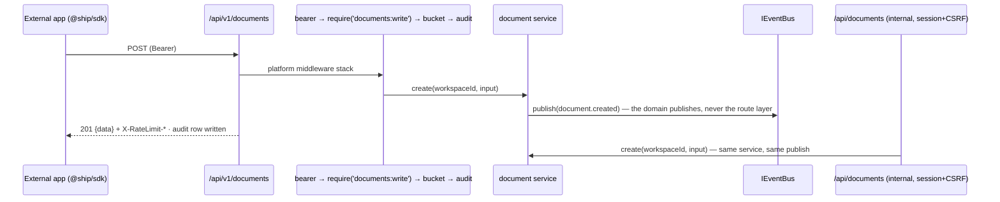

# Ship Platform Architecture — PlugForge (Week 6)

Nine sections, per PRD p.12's Section/Content table, held to p.13's 1–2 page cap. The
reasoning underneath each — rejected alternatives, measured numbers, the five sequence
diagrams — is in [`docs/architecture-appendix.md`](architecture-appendix.md).

## Module Layout

```
api/src/platform/     everything public-facing; imports domain services, never route files
  apps/               oauth_apps registry — secret hashed, raw shown exactly once
  oauth/              RFC 6749 Auth Code + 7636 PKCE + 8628 Device Grant + §4.4 Client
                      Credentials; one-time-use refresh tokens with family revocation
  scopes/             ScopeRegistry — scopes-as-data + require(scope) middleware factory
  ratelimit/          IRateLimiter + token bucket; X-RateLimit-* headers, 429 + Retry-After
  webhooks/           event registry, IEventBus, subscription matcher, HMAC signer,
                      IWebhookDeliverer, retry scheduler, delivery log, DLQ + replay
  api/v1/             the ONLY public router — ApiError envelope, opaque cursor pagination
  openapi/            OpenAPI 3.1 generated from route metadata, served at /api/v1/openapi.json
  audit/              public API call log — timestamp, app client_id, user_id, route, scope, status, latency, request_id; queryable in the dev portal
  clock.ts            Clock / SystemClock / FakeClock — retry, buckets and expiry all read it
sdk/                  @ship/sdk workspace package
integrations/cli/     reference integration; imports ONLY @ship/sdk
api/src/routes/       existing internal surface (/api/*) — session + CSRF, unchanged
agent/                FleetGraph agent — Epic 7 moves its data path onto the SDK
```

The split is enforced mechanically: an ESLint `no-restricted-imports` rule fails the build if
`platform/api/v1/` imports an internal route file, and `integrations/*` may depend only on
`@ship/sdk`.

## SOLID Rationale

- **S** — each platform concern is its own middleware module (authN `oauth/`, authZ
  `scopes/`, throttling `ratelimit/`, recording `audit/`). Domain logic stays where Part 1
  put it; the platform wraps it and never re-implements it.
- **O** — `ScopeRegistry` and the event registry are *data*. Adding `sprints:write` or
  `sprint.completed` is a registration at module load, not a middleware edit.
- **L** — `InProcessEventBus` and a queue-backed bus are substitutes behind `IEventBus`;
  likewise `InMemoryDeliverer` vs. the HTTP deliverer. Tests assert the interface contract.
- **I** — the SDK is resource-segregated (`client.documents`, `.issues`, `.sprints`,
  `.webhooks`), so a CLI that only tails webhooks compiles against exactly that.
- **D** — domain services publish through `IEventBus` and know nothing about HTTP delivery,
  signing or retries. The injected `Clock` is what makes retry tests deterministic rather
  than `setTimeout`-flaky.

## Composition Root

`createApp(deps)` in `api/src/app.ts` is the only place that chooses a concrete
implementation. `productionDeps()` and `testDeps()` live in `api/src/deps.ts`. Everything
else — routers, middleware, services — receives its collaborators and names no concrete.

## Public/Internal Boundary

Both surfaces call the **same domain services**. Auth, scope, rate-limit, audit and webhook
publication attach only at the public layer; internal `/api` keeps its session + CSRF stack
byte-for-byte.



Fitness tests assert over **every** `/api/v1` route: an OpenAPI entry exists, a scope is
declared, failures ship the `ApiError` shape, and list endpoints paginate with opaque base64
cursors over `{id, timestamp}`.

## OAuth Flows

| Client | Grant | Why |
|---|---|---|
| Web app | Auth Code + PKCE (S256) | Public client, cannot hold a secret |
| CLI | Device Grant (RFC 8628) | No redirect URI on a terminal |
| Agent (first-party) | Client Credentials (RFC 6749 §4.4) | Server-side, on a schedule, no user present |

PKCE is validated at the token exchange — `S256(verifier) ≟ stored challenge`, mismatch is
`400 invalid_grant`. Refresh tokens are one-time-use: redemption issues a new pair, and
**replaying a spent token revokes the whole family**, on the assumption that a replay is a
theft signal rather than a race.

Consent is server-rendered at `/oauth/*`, same origin, outside the `ApiError` envelope
(OAuth has its own error shape and RFC 6749 §5.2 wins). The device consent screen prints the
user code back for the human to compare against their terminal — that comparison is the
anti-phishing step. Consent also re-checks tenancy: approving an app registered in another
workspace is refused, because `issueTokenPair` stamps the token with the *app's* workspace.

## Webhook Pipeline

A domain write publishes to `IEventBus`; the matcher selects active subscriptions; the signer
computes `HMAC-SHA256(secret, t + "." + rawBody)` and sends `Ship-Signature: t=<unix>,v1=<hex>`.

- **Signed per attempt, at send time**, with the subscription's current secret. The timestamp
  is what defeats replay; the SDK verifier rejects signatures older than 300 s.
- **Retry ladder** 1s · 4s · 16s · 1m · 5m · 30m with jitter. A permanent 4xx, or the sixth
  failure, moves the delivery to the dead-letter queue, replayable from the portal.
- **Idempotency-Key** is derived from `event_id` **and** `subscription_id` — one event
  legitimately produces N deliveries, and keying on the event alone would hand two unrelated
  apps sharing a target URL the same key. It is persisted on the attempt-1 row and read back
  thereafter, never recomputed, so it survives retries, replay, and any future change to the
  derivation.
- Every attempt lands in the delivery log with status, latency and a body excerpt.

## SDK Surface

`@ship/sdk` exposes four resource clients (`documents`, `issues`, `sprints`, `webhooks`) plus
`deviceLogin()`. Pagination is an async iterator — cursors are handled internally and no
consumer signature mentions one. Errors are a five-member discriminated union
(`auth | rate_limit | not_found | validation | server`) that consumers switch on
exhaustively; no stack trace crosses the boundary. `ITokenStore` is the persistence seam,
with `FileTokenStore` (`~/.ship/credentials.json`, mode 0600) for Node and a browser entry
point that deliberately ships no filesystem store.

## Agent-as-Citizen (Epic 7)

The agent authenticates as a **first-party confidential OAuth app using Client Credentials
(RFC 6749 §4.4)** — chosen over Device Grant and Auth Code because it runs server-side on a
schedule with no user present to consent, and it can keep a secret. Its app row is seeded by
`db:migrate` (`migrate.ts` → `seedPlatformApps`), not by a numbered migration, so a rotated
secret is re-applied on every deploy rather than once per database.

Its scopes are `documents:read`, `issues:read`, `sprints:read` — **read-only** (decision
D5b). The agent's two former write actions became recommendations surfaced through
`fleetgraph_notifications`, its own table. That is what makes the Epic 7 claim literally
true: every action the agent takes against Ship *is* a public API call, so the audit trail
has no holes. One LLM call per agent turn is unchanged; the platform itself does zero AI work.

## Failure Modes

| Scenario | Shipped behaviour |
|---|---|
| **`client_secret` rotated** | **Instant** invalidation — no grace period. A departure from Stripe, which offers one because its customers have live integrations they cannot redeploy at once. We have none, and instant is the only model where responding to a leak is *finished* when you act. Held to the code by `ROTATION_POLICY`, returned on every create and rotate response and rendered by the portal rather than hard-coded. |
| **`client_secret` leaked** | Every verification is recorded to `client_secret_auth_log` with the `client_id`, secret prefix, outcome and source IP — never the secret. Three alertable conditions, each table-tested. Owner rotation and admin force-rotate ship; **automatic rotation does not**, because rotating a credential nobody asked to rotate converts a suspected leak into a certain outage. **Rotation does not revoke tokens already issued** — the response to a confirmed leak is rotate *and* revoke. |
| **Refresh family revoked** | Immediate and total. Every device holding a token from that family is logged out at its next request, because the sweep revokes the live access token alongside the refresh token. |
| **Webhook endpoint down** | Six attempts over ~36 minutes, then the dead-letter queue. Deliveries are replayable from the portal with the original Idempotency-Key. |

**Honest limit:** the leak conditions are queryable and tested, not *paged*. There is no
`/metrics` endpoint and no notifier in this build, so "where does it show up" is answered by
"logs and a query". The missing piece is an alerting surface, not a signal.
