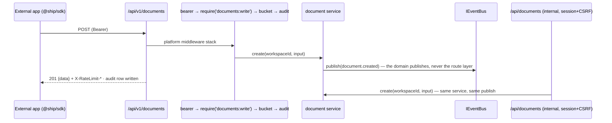
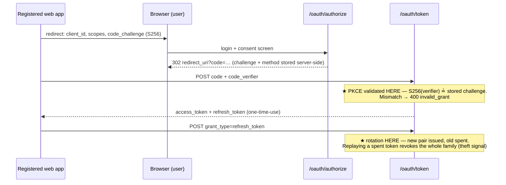
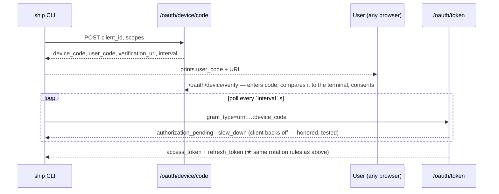
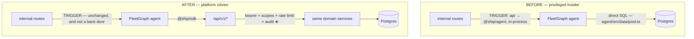

# Ship Platform Architecture — PlugForge (Week 6)

Nine sections, in PRD p.12's order, each carrying the artifact its Section/Content row asks
for. p.13 also caps this file at 1–2 pages; the two cannot both hold and the content contract
wins, so the diagrams, the pseudo-code and the four named failure modes are here rather than
one page away. The reasoning underneath them — rejected alternatives, measured numbers,
decision records — stays in [`docs/architecture-appendix.md`](architecture-appendix.md).

## Module Layout

```
api/src/platform/     everything public-facing; imports domain services, never route files
  apps/               oauth_apps registry — secret hashed, raw shown exactly once
  oauth/              RFC 6749 Auth Code + 7636 PKCE + 8628 Device Grant + §4.4 Client
                      Credentials; one-time-use refresh tokens with family revocation
  scopes/             ScopeRegistry — scopes-as-data + require(scope) middleware factory
  ratelimit/          IRateLimiter + token bucket; X-RateLimit-* headers, 429 + Retry-After
  webhooks/           event registry, IEventBus, subscription matcher, HMAC signer,
                      IWebhookDeliverer, retry scheduler, delivery log, DLQ + replay
  api/v1/             the ONLY public router — ApiError envelope, opaque cursor pagination
  openapi/            OpenAPI 3.1 generated from route metadata, served at /api/v1/openapi.json
  audit/              public API call log — timestamp, app client_id, user_id, route, scope, status, latency, request_id; queryable in the dev portal
  clock.ts            Clock / SystemClock / FakeClock — retry, buckets and expiry all read it
sdk/                  @ship/sdk workspace package
integrations/cli/     reference integration; imports ONLY @ship/sdk
api/src/routes/       existing internal surface (/api/*) — session + CSRF, unchanged
agent/                FleetGraph agent — Epic 7 moves its data path onto the SDK
```

The split is enforced mechanically: an ESLint `no-restricted-imports` rule fails the build if
`platform/api/v1/` imports an internal route file, and `integrations/*` may depend only on
`@ship/sdk`.

## SOLID Rationale

**S — Single Responsibility.** Each platform concern is one middleware module and nothing
else: authN in `api/src/platform/oauth/bearer.ts`, authZ in
`api/src/platform/scopes/require-scope.ts`, throttling in
`api/src/platform/ratelimit/limiter.ts`, recording in `api/src/platform/audit/audit.ts`.
Domain logic stays where Part 1 put it (`api/src/utils/document-crud.ts`); the platform wraps
it and never re-implements it, which is why the internal surface keeps working untouched.

**O — Open/Closed.** `ScopeRegistry` in `api/src/platform/scopes/registry.ts` and the event
registry in `api/src/platform/webhooks/events.ts` are *data*, not switch statements. Adding
`sprints:write` or `sprint.completed` is a registration at module load — no middleware edit
and no route audit — and the 403 handler names the missing scope by reading the registry
rather than carrying a second copy of the list.

**L — Liskov Substitution.** `InProcessEventBus` (`api/src/platform/webhooks/bus.ts`) and a
queue-backed bus are drop-in substitutes behind `IEventBus`; so are `InMemoryDeliverer`
(`api/src/platform/webhooks/deliverer.ts`) and the HTTP deliverer behind `IWebhookDeliverer`.
The shared contract suite in `api/src/platform/webhooks/delivererContract.ts` runs against
every implementation, so substitutability is asserted rather than assumed and swapping in
BullMQ later is a composition-root change.

**I — Interface Segregation.** The SDK is resource-segregated: one class per resource in
`sdk/src/resources/documents.ts`, `issues.ts`, `sprints.ts` and `webhookSubscriptions.ts`,
each hung off `ShipClient` as a `readonly` property that is also non-writable at runtime. A
CLI that only tails webhooks compiles against `WebhooksClient` and nothing else, instead of
against a forty-method god object.

**D — Dependency Inversion.** Domain services publish through `IEventBus` and know nothing
about HTTP delivery, signing or retries. `api/src/app.ts` is the only file that names a
concrete and `api/src/deps.ts` holds the two sets of them; the injected `Clock`
(`api/src/platform/clock.ts`) is what makes retry, bucket and expiry tests deterministic
instead of `setTimeout`-flaky.

## Composition Root

`createApp(deps)` in `api/src/app.ts` is the only place a concrete implementation is chosen.
Everything else — routers, middleware, services — receives its collaborators and names no
concrete:

```ts
// api/src/app.ts — annotated
export function createApp(deps: AppDeps = productionDeps()) {
  registerScopes(scopeRegistry);       // scopes-as-data: adding one is a registration (OCP)
  registerEventTypes(eventRegistry);   // 8 Zod-typed event types, same shape

  deps.bus.subscribe('*', createWebhookPipeline({  // the domain publishes; the pipeline listens
    repo:   deps.subsRepo,                     // PgWebhookSubscriptionRepo(pool, envSecretCipher())
    signer: new SignatureSigner(deps.clock),   // clock is a required ctor arg — no Date.now() here
    queue:  deps.deliveryQueue,                // the seam the retry ladder arrives through;
  }));                                         // the ladder itself is RETRY_SCHEDULE_SECONDS, imported

  app.use('/oauth', oauthRouter(deps));    // RFC 6749/7636/8628 — RFC error shape, IP-throttled
  app.use('/api/v1', createPublicRouter({  // the ONLY public mount; shares NO middleware with /api
    bearerAuth:      deps.bearerAuth,      // 401 + a distinct reason: expired | invalid | missing
    perAppLimiter:   deps.perAppLimiter,   // two separately-configured buckets, not one namespaced
    perTokenLimiter: deps.perTokenLimiter, //   — p.4 asks for per-app AND per-token
    anonLimiter:     deps.anonLimiter,     // IP-keyed backstop mounted above bearer auth, so 401s,
    auditSink:       deps.auditSink,       //   404s and openapi.json carry X-RateLimit-* as well
    openApiDocument: generatePublicOpenAPIDocumentOrDie(),  // throws here ⇒ the process never boots
  }));   // requireScope, apiErrorMiddleware and openapi.json all live INSIDE the router — the spec
         // above bearerAuth, so a grader fetches it with no credentials (F11)
  app.use('/api', internalRouters);        // Part-1 session + CSRF surface, byte-for-byte
  return app;
}
```

Sibling diagram — the in-memory test wiring. Same shape, same call, every concrete swapped
for one with no socket and no wall clock:

```ts
// api/src/deps.ts — the sibling of productionDeps()
export function testDeps(overrides: Partial<AppDeps> = {}): AppDeps {
  const clock = overrides.clock ?? new FakeClock();   // ONE clock, shared by every collaborator
  return {
    bus:       new RecordingEventBus(),   // extends InProcessEventBus: production dispatch + events[]
    deliverer: new InMemoryDeliverer(),   // resolves synchronously, never opens a socket
    perAppLimiter:   new InMemoryTokenBucket(tiny, clock),     // tiny ⇒ a 429 in two requests,
    perTokenLimiter: new InMemoryTokenBucket(tiny, clock),     //   not a hundred
    anonLimiter:     new InMemoryTokenBucket(generous, clock), // charges every request, so it
    appsRepo: new InMemoryOAuthAppRepo(), tokenRepo: new InMemoryTokenRepo(),   // stays generous
    authCodeRepo: new InMemoryAuthCodeRepo(), deviceCodeRepo: new InMemoryDeviceCodeRepo(),
    subsRepo: new InMemoryWebhookSubscriptionRepo(), deliveryQueue: new RecordingDeliveryQueue(),
    auditSink: new InMemoryAuditSink(), clock, db: pool,
    ...overrides,   // one line swaps a Pg* repo back in for an integration suite
  };
}
createApp(testDeps());   // retry and expiry tests advance FakeClock; no setTimeout in any test
```

## Public/Internal Boundary

Both surfaces call the **same domain services**. Auth, scope, rate-limit, audit and webhook
publication attach only at the public layer; internal `/api` keeps its session + CSRF stack
byte-for-byte.



Fitness tests assert over **every** `/api/v1` route: an OpenAPI entry exists, a scope is
declared, failures ship the `ApiError` shape, and list endpoints paginate with opaque base64
cursors over `{id, timestamp, resource}` — the third key binds a cursor to the collection that
minted it, so replaying one against another resource is a `validation_failed`.

## OAuth Flows

| Client | Grant | Why |
|---|---|---|
| Web app | Auth Code + PKCE (S256) | Public client, cannot hold a secret |
| CLI | Device Grant (RFC 8628) | No redirect URI on a terminal |
| Agent (first-party) | Client Credentials (RFC 6749 §4.4) | Server-side, on a schedule, no user present |





Consent is server-rendered at `/oauth/*`, same origin, outside the `ApiError` envelope
(OAuth has its own error shape and RFC 6749 §5.2 wins). The device consent screen prints the
user code back for the human to compare against their terminal — that comparison is the
anti-phishing step. Consent also re-checks tenancy: approving an app registered in another
workspace is refused, because `issueTokenPair` stamps the token with the *app's* workspace.

## Webhook Pipeline

A domain write publishes to `IEventBus`; the matcher selects active subscriptions; the signer
computes `HMAC-SHA256(secret, t + "." + rawBody)` and sends `Ship-Signature: t=<unix>,v1=<hex>`.

- **Signed per attempt, at send time**, with the subscription's current secret. The timestamp
  is what defeats replay; the SDK verifier rejects signatures older than 300 s.
- **Retry ladder** 1s · 4s · 16s · 1m · 5m · 30m with jitter. A permanent 4xx, or the sixth
  failure, moves the delivery to the dead-letter queue, replayable from the portal.
- **Idempotency-Key** is derived from `event_id` **and** `subscription_id` — one event
  legitimately produces N deliveries, and keying on the event alone would hand two unrelated
  apps sharing a target URL the same key. It is persisted on the attempt-1 row and read back
  thereafter, never recomputed, so it survives retries, replay, and any future change to the
  derivation.
- Every attempt lands in the delivery log with status, latency and a body excerpt.

## SDK Surface

`sdk/src/stability.ts` is the authority for the split below: it holds `STABLE_SURFACE` and
`PRE_1_0_SURFACE` as data, and `surfaceStability.test.ts` fails if any published export is in
neither list or in both — and fails again if this section and those lists disagree.

**Stable for the week** — the signature will not change during the submission window, and the
CLI, the portal and the TTFE drill are written against it. `ShipClient`, carrying the four
resource clients `documents`, `issues`, `sprints` and `webhooks` (plus `webhooks.deliveries`
for the delivery log, DLQ and replay). The login helpers `ShipClient.authorizationCodeFlow()`,
`ShipClient.deviceLogin()` and `runClientCredentials()`. Async-iterator pagination —
`for await (const doc of client.documents.iterate())`, whose options type admits no cursor, so
p.4's "consumer code never sees them" is a compile error rather than a convention. The error
union `ShipError`, discriminated on `kind: auth | rate_limit | not_found | validation | server`.
The webhook verifier `verifyWebhook`. And `ITokenStore` with its two default implementations,
`InMemoryTokenStore` and `FileTokenStore` (`~/.ship/credentials.json`, mode 0600, written
atomically) — plus the resource and input types a consumer needs to write a variable down.

**Pre-1.0 — exported, useful, and reserved the right to move.** Transport internals
(`ShipTransport`, `HttpClient`, `SdkClock`, `RETRY_POLICY`), base-URL resolution, the refresh
plumbing, and the PKCE primitives beneath the one-call flow helpers: all of these are the shape
of an implementation, and the implementation is what changes. `LocalStorageTokenStore` with the
store and verifier option bags, because `localStorage` is XSS-readable and a better browser
story would change that shape. And `OPERATION_BINDINGS` with its field tables, a spec-parity
testing seam that happens to be exported rather than a contract. A consumer using one of these
is fine; a consumer building a public API on top of one is on notice.

## Agent-as-Citizen (Epic 7)



★ **The audit-log payoff:** every agent read now lands in `public_api_calls` under the agent
app's own `client_id`, so *"the agent went through the front door"* is one query rather than a
claim. The privilege the rewire removes is the arrow that used to run around the front door
into Postgres; the `api → @ship/agent` edge is Ship invoking its own app and survives unchanged.

The agent authenticates as a **first-party confidential OAuth app using Client Credentials
(RFC 6749 §4.4)** — chosen over Device Grant and Auth Code because it runs server-side on a
schedule with no user present to consent, and it can keep a secret. Its app row is seeded by
`db:migrate` (`migrate.ts` → `seedPlatformApps`) rather than by a numbered migration, so a
rotated secret is re-applied on every deploy instead of once per database.

Its scopes are `documents:read`, `issues:read`, `sprints:read` — **read-only** (decision D5b).
The two former write actions had no public route and no registered scope, so they became
recommendations written to `fleetgraph_notifications`, the agent's own table. **That moves the
agent's trail from `document_history` to `public_api_calls` + `fleetgraph_notifications`: the
query a reader runs changes, and one reader of the old surface loses a view** — the cost of
making the Epic 7 claim literally true. One LLM call per agent turn is unchanged; the platform
itself does zero AI work.

## Failure Modes

**The token store is corrupted.** A client-local event that resolves to logged-out, never to a
retry loop: an `ITokenStore.load()` that throws or returns garbage is read as "no credentials",
the call surfaces `{ kind: 'auth' }` once, and the flow helpers re-authenticate cleanly. Nothing
is written back — **not even `clear()`**, because `clear()` is a write and a credential file the
SDK cannot parse may still be one a human can repair. `FileTokenStore` writes to a temp file and
`rename`s it, so an interrupted write leaves the previous file intact rather than a truncated one.

**A subscriber's signing secret is rotated mid-flight.** Rotation takes effect at the next
attempt, because the signer reads the subscription's *current* secret at send time rather than
at enqueue time. A subscriber that has not yet updated its own environment verifies against the
old secret and fails; the retry ladder's ~36-minute tail is the update window, and the
pathological case parks in the dead-letter queue, replayable from the portal with its original
Idempotency-Key. The symptom is diagnostic: **one** subscription failing is a stale secret,
**all** of them failing at once is server clock drift.

**The queue deliverer crashes.** The contract is at-least-once plus `Idempotency-Key` dedupe,
never silent at-most-once. Every attempt is written to the Postgres delivery log, so an
incomplete delivery is reconstructable from durable state rather than from process memory: on
restart, deliveries left un-terminal in the log and everything in the DLQ are re-driven, and
subscribers dedupe on the key persisted on the attempt-1 row. The in-process deliverer restarts
with the process; a queue-backed drop-in inherits the same recovery through the same log, which
is why the log lives outside the deliverer.

**The OpenAPI generator throws at boot.** Fail fast: `generatePublicOpenAPIDocumentOrDie()` runs
inside `createApp()`, so the throw propagates, the entry point exits non-zero, and no socket is
ever opened. Serving `/api/v1` without its contract is the drift the fitness tests exist to
prevent, and a half-served API is worse than a dead one because the caller cannot see it. In
practice it never reaches production — generation plus 3.1-schema validation runs as a unit test,
and the spec↔route parity test fails the PR first.

**`client_secret` rotated or leaked.** Rotation is **instant**, with no grace period and nowhere
in the schema to hold a second live hash — a deliberate departure from Stripe, which offers one
because its customers have integrations they cannot all redeploy at once. We have none, and
instant is the only model where responding to a leak is *finished* when you act.
`ROTATION_POLICY` is the constant holding this paragraph to the code, returned on every create
and rotate response. Detection is `client_secret_auth_log` — client_id, secret prefix, outcome,
source IP, never the secret — with three alertable conditions, each table-tested. Owner rotation
and admin force-rotate ship; automatic rotation does not, because rotating a credential nobody
asked to rotate turns a suspected leak into a certain outage. And rotation
**does not revoke tokens already issued**, so a confirmed leak is answered by rotate *and*
revoke.

**A refresh-token family is revoked.** Immediate and total — every device holding a token from
that family is logged out at its next request, because the sweep takes the live access token
alongside the refresh token. The 401 carries `details.reason: 'invalid'`, never `'expired'`,
which would tell the SDK to refresh; recovery is re-authentication, not repair.

**Honest limit:** the leak conditions are queryable and tested, not *paged*. There is no
`/metrics` endpoint and no notifier in this build, so "where does it show up" is answered by
"logs and a query". The missing piece is an alerting surface, not a signal.
