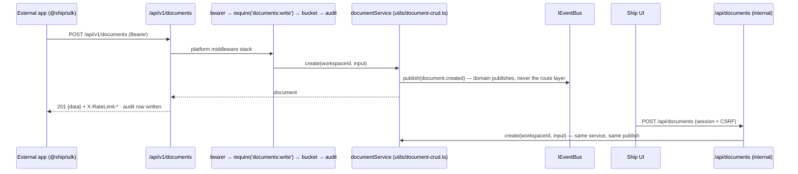
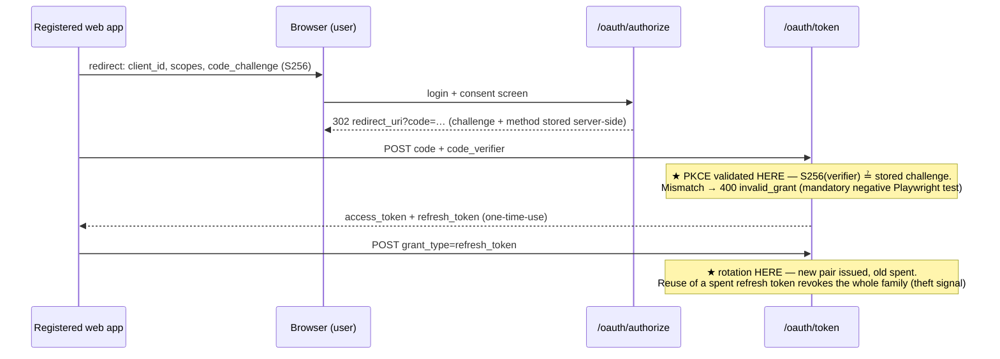
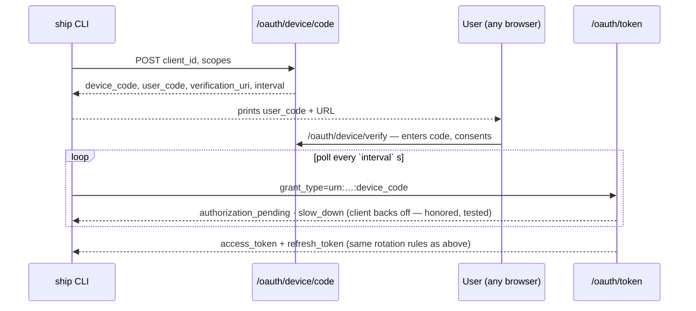
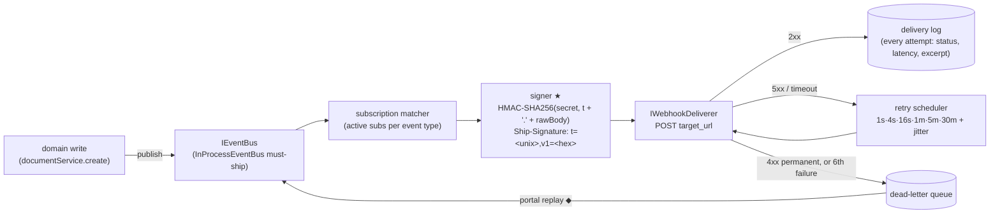
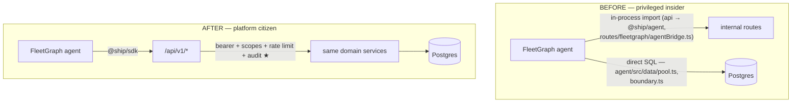

# Ship Platform Architecture — PlugForge (Week 6)

**Scope.** Ship (Part 1/2) becomes a platform: a versioned public API at `/api/v1/`, OAuth 2.0 (Authorization Code + PKCE, Device Grant), Stripe-style signed webhooks, a typed SDK (`@ship/sdk`), and the FleetGraph agent rewired from privileged insider to platform citizen. Modules marked **(new)** ship this week; unmarked paths exist today.

## Module Layout

```
api/src/platform/            (new) everything public-facing; imports domain services, never route files
  apps/                      oauth_apps registry — create/rotate/list; client_secret hashed (SHA-256, high-entropy), raw shown exactly once
  oauth/                     RFC 6749 Auth Code + 7636 PKCE + 8628 Device Grant; token issuance; one-time-use refresh tokens with family revocation
  scopes/                    ScopeRegistry — scopes-as-data (documents/issues/sprints × read/write, webhooks:manage) + require(scope) middleware factory
                             (public `sprints` maps onto Ship's internal `weeks` model at this layer — the contract name, not the table name)
  ratelimit/                 IRateLimiter + in-memory token bucket (per-app and per-token); emits X-RateLimit-* headers, 429 + Retry-After
  webhooks/                  event registry (Zod-typed, 8 types), IEventBus + InProcessEventBus, subscription matcher, HMAC signer,
                             IWebhookDeliverer, retry scheduler, delivery log, DLQ + replay
  api/v1/                    the ONLY public router — fresh middleware stack, ApiError envelope, opaque cursor pagination ({data, next_cursor})
  openapi/                   public OpenAPI 3.1 registry; generated from route metadata, served at /api/v1/openapi.json
  audit/                     public API call log — timestamp, app client_id, user_id, route, scope, status, latency; queryable in the dev portal
  clock.ts                   Clock / SystemClock / FakeClock — a file, not a module; the retry scheduler, the token bucket and OAuth expiry all read it
sdk/                         (new) @ship/sdk workspace package — see SDK Surface
integrations/cli/            (new) must-ship reference integration (ship login / docs / webhooks tail); imports ONLY @ship/sdk (workspace dep rule)
api/src/routes/, utils/      existing internal surface (/api/*) — session+CSRF auth, unchanged; domain logic in utils/document-crud.ts et al.
web/src/                     existing React UI; the (new) developer portal pages consume /api/v1 like any external client
agent/                       existing FleetGraph agent (LangGraph) — Epic 7 swaps its data path onto the SDK
```

The public/internal split is enforced mechanically, not by convention: an ESLint `no-restricted-imports` boundary rule fails the build if `api/src/platform/api/v1/` imports from internal route files, and `integrations/*` may depend only on `@ship/sdk`.

## SOLID Rationale

- **S — Single Responsibility.** Each platform concern is its own middleware module under `api/src/platform/` (authN in `oauth/`, authZ in `scopes/`, throttling in `ratelimit/`, recording in `audit/`). Domain logic stays where Part 1 put it (`api/src/utils/document-crud.ts`); the platform layer wraps it and never re-implements it.
- **O — Open/Closed.** `ScopeRegistry` (`platform/scopes/registry.ts`) and the event registry (`platform/webhooks/events.ts`) are data. Adding `sprints:write` or `sprint.completed` is a registration at module load — no middleware edit, no route audit. The 403 handler reads the registry to name the missing scope.
- **L — Liskov Substitution.** `InProcessEventBus` (must-ship) and a queue-backed bus are drop-in substitutes behind `IEventBus`; likewise `InMemoryDeliverer` (synchronous, for tests) vs. the HTTP deliverer behind `IWebhookDeliverer`. Tests assert against the interface contract, so swapping in BullMQ later is a composition-root change only.
- **I — Interface Segregation.** The SDK is resource-segregated: `client.documents`, `client.issues`, `client.sprints`, `client.webhooks` (`sdk/src/resources/`). A CLI that only tails webhooks compiles against exactly that client — not a 40-method god object.
- **D — Dependency Inversion.** Domain services publish through `IEventBus` and know nothing about HTTP delivery, signing, or retries; `app.ts` injects concretes. Same for `IRateLimiter`, `ITokenStore` (SDK side), and the clock the retry scheduler reads — which is what makes retry tests deterministic instead of `setTimeout`-flaky.

## Composition Root

`createApp()` in `api/src/app.ts` is today the single place the app is assembled (helmet → rate limit → session/CSRF → ~30 internal routers). PlugForge extends the same function — it stays the only file that chooses concretes:

```ts
export function createApp(deps = productionDeps()) {
  const { bus, deliverer, limiter, clock, db } = deps;         // injected concretes

  registerScopes(scopeRegistry);                               // scopes-as-data (OCP)
  registerEventTypes(eventRegistry);                           // 8 Zod-typed event types

  const signer   = new HmacSigner();                           // Ship-Signature: t=<unix>,v1=<hex-hmac>
  const retries  = new RetryScheduler(clock, [1, 4, 16, 60, 300, 1800]);  // seconds, + jitter
  const pipeline = new WebhookPipeline(bus, subsRepo(db), signer, deliverer, retries, deliveryLog(db));

  const v1 = createPublicRouter({                              // fresh router — shares NO middleware with /api
    auth:  bearerTokenMiddleware(tokenRepo(db)),               // invalid/missing/expired → 401, distinct codes
    scope: requireScope(scopeRegistry),                        // insufficient → 403 naming the missing scope
    limit: rateLimitMiddleware(limiter),                       // 429 + Retry-After; X-RateLimit-* on every response
    audit: publicAuditMiddleware(auditRepo(db)),
    error: apiErrorMiddleware(),                               // every failure → { code, message, details?, request_id }
  });

  app.use('/oauth', oauthRouter(appsRepo(db), tokenRepo(db), clock));  // concrete flows: authorize, token, device
  app.use('/api/v1', v1);                                      // public, versioned contract
  app.use('/api', internalRouters);                            // Part-1 surface, untouched
  app.get('/api/v1/openapi.json', serveGeneratedSpec());       // generation failure = boot failure (see Failure Modes)
  return app;
}
```

Sibling test wiring — same shape, in-memory concretes, no network and no clock:

```ts
// api/src/deps.ts — the sibling of productionDeps(), same shape, in-memory concretes
export const testDeps = (overrides: Partial<AppDeps> = {}): AppDeps => ({
  bus: new InProcessEventBus(),      deliverer: new InMemoryDeliverer(),   // resolves synchronously
  limiter: new InMemoryTokenBucket({ capacity: 100, refillPerSecond: 100 / 60 }),
  clock: new FakeClock(),  db: pool,  corsOrigin: 'http://localhost:5173',
  ...overrides,
});
createApp(testDeps());   // retry-schedule tests advance FakeClock; no setTimeout anywhere in tests
```

## Public/Internal Boundary

Both surfaces call the **same domain services**; auth/scope/rate-limit/audit/webhook concerns attach only at the public layer. Internal `/api` keeps its session+CSRF stack (`api/src/middleware/auth.ts`) byte-for-byte.



Contract details asserted by fitness tests over every `/api/v1` route: OpenAPI entry exists, a scope is declared, failures ship the `ApiError` shape (`unauthorized | forbidden | not_found | validation_failed | rate_limited | server_error`), list endpoints paginate with opaque base64 cursors over `{id, timestamp}`.

## OAuth Flows





Access tokens are opaque high-entropy strings stored hashed (same discipline as the existing `api_tokens` table); the bearer middleware resolves token → app + user + granted scopes on every `/api/v1/*` request.

## Webhook Pipeline



★ **Signature is computed at send time, per attempt**, with the subscription's secret (hashed at rest, shown once on creation) — the timestamp in the signed payload is what defeats replay; the SDK verifier rejects signatures older than 300 s by default. ◆ **Idempotency-Key originates at the event's first delivery** (derived from `event_id`), and is carried unchanged through every retry and portal replay — that key is the subscriber's dedupe contract.

## SDK Surface

`@ship/sdk` (new workspace package). **Stable for the week:** `ShipClient` with resource clients (`documents`, `issues`, `sprints`, `webhooks` — method signatures fitness-tested against the OpenAPI spec, drift fails CI); `ShipClient.authorizationCodeFlow()` and `ShipClient.deviceLogin()`; async-iterator pagination (`for await (const doc of client.documents.iterate())` — consumers never see cursors); `verifyWebhook(headers, rawBody, secret, toleranceSec = 300)` → boolean in one call; typed error union discriminated on `kind: 'auth' | 'rate_limit' | 'not_found' | 'validation' | 'server'`. **Pre-1.0 (may move):** `ITokenStore` implementations beyond in-memory/file, OAuth helper option bags, CLI internals. Install footprint budget: < 250 KB min+gzip, production deps only, enforced in CI.

## Agent-as-Citizen (Epic 7)

Today FleetGraph is a privileged insider by construction — two separate back doors:



The agent authenticates as a first-party OAuth app (seeded by migration, so it provably exists in deployed environments), requesting only the scopes its detectors and actions need — least privilege, not `*`. The swap lives behind a feature flag; CI runs the Part 2 regression suite with the flag **on and off**, which is what makes the rewire a refactor rather than a rewrite. ★ **The payoff is the audit trail:** every agent action now lands in the public audit log under the agent app's `client_id` — "the agent went through the front door" is provable with one query, not a claim. One LLM call per agent turn is unchanged; the platform itself does zero AI work.

## Failure Modes

**Token store corrupted (SDK side).** `ITokenStore` reads that fail or return garbage are treated as logged-out, never as a retry loop: the next call surfaces `{ kind: 'auth' }` and the helper flows re-authenticate cleanly. Corruption is a client-local event — the server sees at worst a 401'd request, and no partial credential is ever written back.

**Signing secret rotated mid-flight.** Rotation takes effect at the next delivery attempt: the signer reads the subscription's current secret at send time, so in-flight failures re-sign with the new secret on retry. A subscriber that hasn't updated its env verifies against the old secret, fails, and the retry ladder (30 min tail) covers the update window; the pathological case parks in the DLQ, replayable from the portal with the original Idempotency-Key.

**Queue deliverer crashes.** The contract is at-least-once + Idempotency-Key dedupe — never silent at-most-once. Undelivered attempts are reconstructable because the delivery log (durable, Postgres) records every attempt; on restart, incomplete deliveries are re-driven from the log/DLQ and subscribers dedupe on the key. The in-process must-ship deliverer restarts with the process; the queue-backed drop-in inherits the same recovery semantics through the log.

**OpenAPI generator throws at boot.** Fail fast: the process refuses to start. The spec is the contract artifact — serving traffic without it is exactly the drift the fitness test exists to prevent. In practice this never reaches production: spec generation + validation against the OpenAPI 3.1 schema runs as a unit test, and the spec↔route parity fitness test fails the PR first.

## Deployment Topology (Terraform)

Live topology is `terraform/render/main.tf` (pinned `render-oss/render` provider + lock file): one web service (Docker, health-checked at `/health`), managed Postgres, env groups, and the FleetGraph cron. **PlugForge adds zero new infrastructure resources in must-ship form** — OAuth apps, tokens, subscriptions, delivery log, and audit rows are Postgres tables inside the existing database, and the deliverer runs in-process. The Terraform delta is env-group entries only, so the destroy-redeploy drill's blast radius is unchanged: web service + database + cron, re-creatable from config alone (annotated plan: `terraform/render/PLAN-ANNOTATED.md`).
